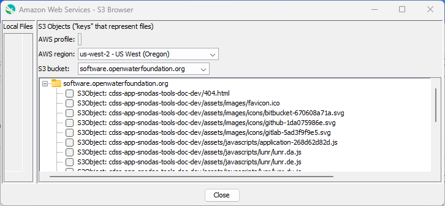
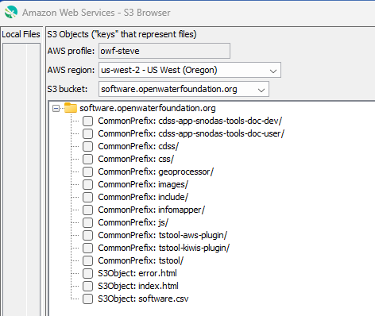
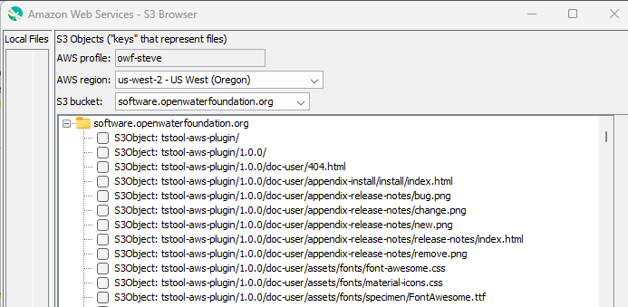
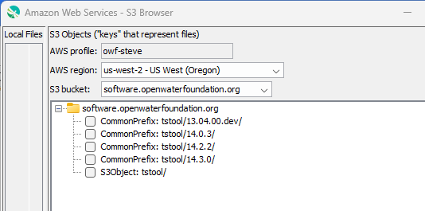
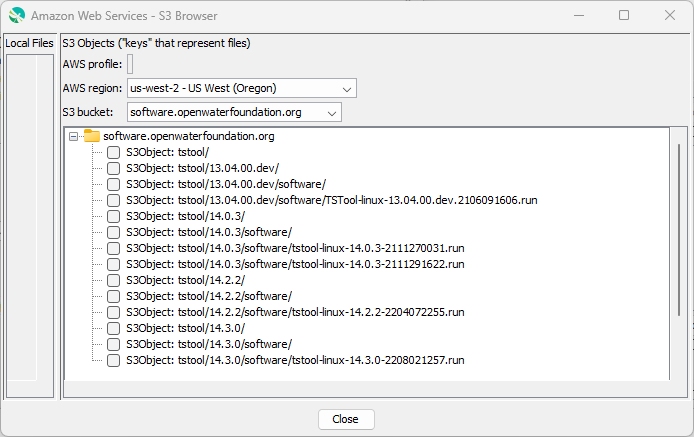
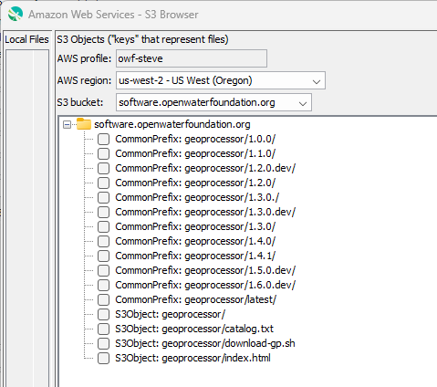

# AWS / S3 / Java SDK #

This documentation provides information about using the S3 Java SDK.

*   [Introduction](#introduction)
*   [Listing Bucket Objects](#listing-bucket-objects)

---------------

## Introduction ##

The S3 Java SDK provides Java packages to integrate Java software with S3.

*   See the [AWS S3 Java SDK](https://aws.amazon.com/sdk-for-java/) documentation

## Listing Bucket Objects ##

There is a need to list bucket objects several ways, including:

*   all bucket objects
*   contents of the bucket root
*   objects in a folder

This documentation uses the Java SDK (`software.amazon.awssdk.services.s3.model.ListObjectsV2Request`, version 2.18.19 via Maven pom)
to list S3 bucket objects, in order to build a tree-based browser for a Java application.
See the [`S3JTree`](https://github.com/OpenWaterFoundation/owf-tstool-aws-plugin/blob/main/owf-tstool-aws-plugin/src/main/java/org/openwaterfoundation/tstool/plugin/aws/ui/S3JTree.java) class,
which is used in the [TSTool S3 Browser](https://software.openwaterfoundation.org/tstool-aws-plugin/latest/doc-user/app-ref/S3Browser/S3Browser.md).

Images shown below were generated during development and illustrate experiments to understand the S3 SDK.
The browser tool is intended to browse a bucket or a folder within a bucket while
achieving good performance and minimizing S3 API requests and fees.  Two main approaches are:

1.  List all the files in the bucket up front and then:
    1.  Fill out the entire tree up front.  This may be slow and may take a lot of memory resources.
        This is "up front loading".
    2.  Or, fill out the folders as they are expanded, using the S3Object instances from the request.
        This is "partial lazy loading".
2.  List only the top-level folders (or a specific starting folder) in a bucket
    and then make additional requests as the folders are expanded.  This is "lazy loading".

Option 1.a may work well for small buckets but will be problematic for buckets that have many files.
Option 2 will work well if each S3 request returns quickly and the number of requests
is not large (otherwise a high request count may incur more fees).
Option 1.b is a compromise but may have issues if the list of objects is very large.

Any option that queries many objects must contend with the limit on max keys and may
need to make multiple requests but this is handled in code.
Optimizing the max keys may need to occur.

### AWS CLI ###

It is useful to try to accomplish the desired outcome using the AWS CLI.
The AWS CLI tool works as shown in the following examples.
The bucket and prefix are determined from the command line path, and the delimiter defaults to `/`.

The following example shows that top-level bucket objects can be listed.
Apparently, the `ls` command is smart enough to match the empty
prefix and only list objects that match up to the trailing `/` delimiter.
This would support lazy-loading, for example in a Bash script.

```
aws s3 ls s3://software.openwaterfoundation.org --profile default
                           PRE cdss-app-snodas-tools-doc-dev/
                           PRE cdss-app-snodas-tools-doc-user/
                           PRE cdss/
                           PRE css/
                           PRE geoprocessor/
                           PRE images/
                           PRE include/
                           PRE infomapper/
                           PRE js/
                           PRE tstool-aws-plugin/
                           PRE tstool-kiwis-plugin/
                           PRE tstool/
2022-06-09 09:30:28       1422 error.html
2022-06-09 09:30:27       9162 index.html
2022-06-09 09:30:30       5042 software.csv
```

If used on a subfolder, the behavior is similar but need to be careful to include the slash when listing a folder.
For example, the following does not include the slash.
This lists all the software products that have names starting with `tstool`,
of which there are 3 matching products.

```
$ aws s3 ls s3://software.openwaterfoundation.org/tstool --profile default
                           PRE tstool-aws-plugin/
                           PRE tstool-kiwis-plugin/
                           PRE tstool/
```

The following does include the trailing slash.
This lists all the software versions for the `tstool/` software product folder.
Note that the `tstool/` folder is not itself listed,
which is different from some of the Java SDK examples shown in a later section.

```
$ aws s3 ls s3://software.openwaterfoundation.org/tstool/ --profile default
                           PRE 13.04.00.dev/
                           PRE 14.0.3/
                           PRE 14.2.2/
                           PRE 14.3.0/
```

The other extreme is to list all files recursively, for example as shown below.
Again, neglecting to including the trailing slash will list multiple software products
but in the following example the trailing slash is included in the command.
Note that in this case the `tstool/` folder is included in the result
because of the recursive listing.

```
 $ aws s3 ls s3://software.openwaterfoundation.org/tstool/ --recursive --profile default
2021-06-09 16:52:15          0 tstool/
2021-06-09 16:52:42          0 tstool/13.04.00.dev/
2021-06-09 16:56:13          0 tstool/13.04.00.dev/software/
2021-06-09 16:56:43   60920719 tstool/13.04.00.dev/software/TSTool-linux-13.04.00.dev.2106091606.run
2021-11-27 01:08:57          0 tstool/14.0.3/
2021-11-27 01:09:17          0 tstool/14.0.3/software/
2021-11-27 01:10:05   62927075 tstool/14.0.3/software/tstool-linux-14.0.3-2111270031.run
2021-11-29 16:47:44   62926814 tstool/14.0.3/software/tstool-linux-14.0.3-2111291622.run
2022-04-07 23:31:10          0 tstool/14.2.2/
2022-04-07 23:31:20          0 tstool/14.2.2/software/
2022-04-07 23:31:52   60842118 tstool/14.2.2/software/tstool-linux-14.2.2-2204072255.run
2022-08-02 13:21:02          0 tstool/14.3.0/
2022-08-02 13:21:17          0 tstool/14.3.0/software/
2022-08-02 13:21:48   64297447 tstool/14.3.0/software/tstool-linux-14.3.0-2208021257.run
```

In summary, for `aws s3 ls`:

*   if a trailing slash is added to the requested object path,
    the default behavior is to list objects in that virtual folder, but do not recursively list sub-folders
*   the `--recursive` parameter is necessary to list all virtual sub-folders and their files
*   the CLI command does not support `*` wildcarding or other regular expression matching
    (using `*` tries to match a prefix containing the literal `*` character and nothing will be returned)

## Java SDK

This section evaluates how to achieve similar results to the above section using the Java SDK.

The [`S3Client` `listObjectsV2`](https://sdk.amazonaws.com/java/api/latest/software/amazon/awssdk/services/s3/S3Client.html#listObjectsV2(software.amazon.awssdk.services.s3.model.ListObjectsV2Request))
method to list objects given a bucket, prefix, and delimiter.
Using the prefix and delimiter require using the `CommonPrefix` in the response
whereas getting a full list of files uses the `S3Object` list from the response.
There are some nuances to the behavior, as illustrated in the following examples.

The [`ListObjectsV2`](https://docs.aws.amazon.com/AmazonS3/latest/API/API_ListObjectsV2.html)
documentation says the following about the delimiter in one of the examples:

    The element is a substring that starts at the beginning of these keys and
    ends at the first occurrence of the specified delimiter.

Consequently, when the delimiter is specified, the returned result should be those
that match the prefix and the result will include strings up to and inclusive of the delimiter.
The documentation could be more explicit about being inclusive of the delimiter.

### Top-level bucket folder ###

Below is a table with results using different input to list the top level bucket folder.
This is using the `software.openwaterfoundation.org` bucket,
which is somewhat large, to get an idea about performance.
Images are included to illustrate the responses.

| Case | `prefix` | `delimiter` | Results |
| -- | -- | -- | -- |
| 1 | default | default | <ul><li>`S3Object`: 5891 objects returned.</li><li>`CommonPrefix`: 0 returned</li></ul> **Contains file and folder objects that were created with `/` at the end of the name.  Folders must be determined from file keys.**|
| 2 | default | `/` |  <ul><li>`S3Object`: 3 files returned, which are the only files at the top level.</li><li>`CommonPrefix`: 12 folders returned, with trailing `/`. </li></ul> **This is a solution for determining top-level files and folders.** |
| 3 | empty string | default |  Same as case 1. |
| 4 | empty string | `/` | Same as case 2. |

**<p style="text-align: center;">

</p>**

**<p style="text-align: center;">
Case 1 (<a href="../bucket-top-1.png">see also the full-size image)</a>
</p>**

**<p style="text-align: center;">

</p>**

**<p style="text-align: center;">
Case 2 (<a href="../bucket-top-2.png">see also the full-size image)</a>
</p>**

A summary is:

*   The delimiter does not default to `/`.
    This is different from the CLI behavior and is obvious from the SDK results.
*   The tests show that recursion is the default unless the delimiter is specified.
    This is opposite of the CLI default.
*   Case 2 or 4 can be used to list top-level folders and files in a bucket.
    The `S3Object` and `CommonPrefix` results are mutually exclusive with the former
    representing files and the latter representing folders.

### Bucket sub-folder ###

If the S3 tree is going to be lazy-loaded, list requests will be made whenever a folder is expanded.
Therefore, the following experiments list a bucket sub-folder.

| Case | `prefix` | `delimiter` | Results |
| -- | -- | -- | -- |
| 1 | `tstool` | default |  <ul><li>`S3Object`: 442 objects returned matching top-level `tstool-aws-plugin/`, `tstool-kiwis-plugin/`, and `tstool/` virtual folders, all are files.</li><li>`CommonPrefix`: 0 returned</li></ul> |
| 2 | `tstool` | `/` | <ul><li>`S3Object`: 0 objects returned since no files exist at the requested level.</li><li>`CommonPrefix`: 3 folders are returned.  **This is not a solution for listing a subfolder because extra matches may occur.** |
| 3 | `tstool/` | default | <ul><li>`S3Object`: All 14 file and sub-folder objects inclusive of and under `tstool/` are returned.</li><li> `CommonPrefix`: 0 returned</li></ul> **This is a solution if the full tree is to be populated starting at a specific folder, but is not suitable for lazy loading.**|
| 4 | `tstool/` | `/` | <ul><li>`S3Object`:  1 object is returned for `tstool/` for the virtual folder.</li><li>`CommonPrefix`: Sub-folder paths with trailing `/` are returned</li></ul>  This example does not include any files but a similar test listed `geoprocessor/` files with `S3Object` as in case 4b image below.  **This is the solution for listing files and sub-folders in a folder, used with lazy loading.** |

**<p style="text-align: center;">

</p>**

**<p style="text-align: center;">
Case 1 (<a href="../folder-1.png">see also the full-size image)</a>
</p>**

**<p style="text-align: center;">

</p>**

**<p style="text-align: center;">
Case 2 (<a href="../folder-2.png">see also the full-size image)</a>
</p>**

**<p style="text-align: center;">

</p>**

**<p style="text-align: center;">
Case 3 (<a href="../folder-3.png">see also the full-size image)</a>
</p>**

**<p style="text-align: center;">

</p>**

**<p style="text-align: center;">
Case 4a (<a href="../folder-4a.png">see also the full-size image)</a>
</p>**

**<p style="text-align: center;">

</p>**

**<p style="text-align: center;">
Case 4b (<a href="../folder-4b.png">see also the full-size image)</a>
</p>**

A summary is:

*   Case 4 provides an example of how to list files and sub-folders for a folder,
    Recursion does not occur on sub-folders.
*   The prefix (parent folder) is returned for all results and must be ignored when creating nodes in the tree.
