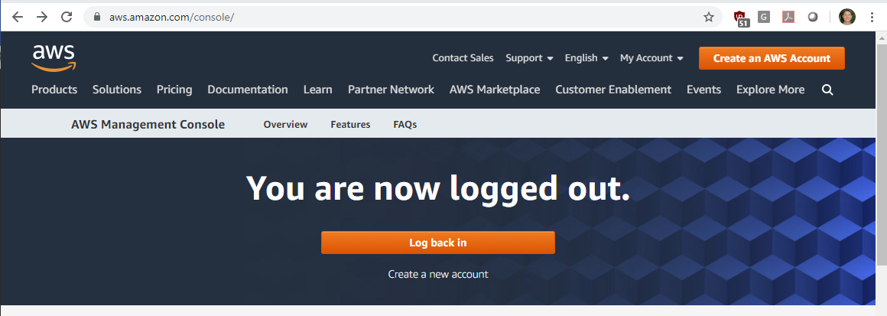

# AWS / Account #

This documentation provides information about AWS accounts.

* [Introduction](#introduction)
* [Signing Up for an AWS Account](#signing-up-for-an-aws-account)

------------

## Introduction ##

An AWS account is necessary for an organization to use specific AWS services.

The organization root account should be associated with an organization and provides access for billing and other administrative actions. 
Other non-root users can be added to the account, for example staff that work for an organization.
Similar to any computer, it is best to not perform normal tasks as the root user.
Consequently users can be defined on the account and can be assigned roles and permissions that make sense.

Similar to other cloud services, the root account is tied to a person's email and it is possible to
have multiple AWS accounts, for example for personal email and emails for different businesses.

Based on experience, [multi-factor authentication](aws.amazon.com/iam/features/mfa/) requires a unique
association of email account and phone number.
For example the same phone number **cannot** be used with more than one AWS account.
However, options such as mobile phone app are available to overcome this limitation (see the above link).

The [AWS IAM service](../iam/iam.md) handles users and authentication.

## Signing Up for an AWS Account ##

To use AWS for an organization, first sign up for an Amazon account.

* [Create Account](https://aws.amazon.com/resources/create-account/)

The following illustrates the ***AWS Console*** website, which also provides a ***Create an AWS Account*** button (upper right)
that can be used to create a new account.

**

**

**

AWS Console Login (<a href="../images/aws-console-login.png">see full-size image</a>)

**

See also:

* [AWS Login](../aws-login/aws-login.md)
