## CloudFront / Lambda Function to Append `index.html` to URL

**This documentation was updated on 2020-04-19 and has been integrated into current documentation.**

The main CloudFront configuration settings allows setting the ***Default Root Object*** to `index.html`.
However, this setting does not apply to other folders.
This is different from an S3 bucket that is configured as a public static website.
If the CloudFront distribution ***Origin Domain Name*** setting points to an S3 public static website then this is not an issue.
However, if the CloudFront distribution uses an S3 bucket directly,
for example to create an authenticated private website,
many URLs will not work as expected because `index.html` is not the global default file when URLs ending in `/` are requested,
and errors like the following will be shown.

```
<Error>
<Code>AccessDenied</Code>
<Message>Access Denied</Message>
<RequestId>722DC56945FBAF4C</RequestId>
<HostId>
EGzX7VEX90fxzuSQxXwhHcYDvclo1PQEdYOU+zczR0UtjYJzMDCGKdzIU3XAQ96MnMQdfMVc7To=
</HostId>
</Error>
```

The following URL pattern works:

* `/test-folder/index.html` - works because full path to file is specified, but is inconvenient

The following URL patterns don't work:

* `/test-folder` - does not work because `index.html` is not the default
* `/test-folder/` - does not work because `index.html` is not the default


See the following solution, which involves defining a lambda function:

* [Stack Overflow "Serve index file instead of download prompt"](https://stackoverflow.com/questions/54164128/serve-index-file-instead-of-download-prompt) - **this worked and is used for both examples below**
* [Implementing Default Directory Indexes in Amazon S3-backed Amazon CloudFront Origins Using Lambada@Edge](https://aws.amazon.com/blogs/compute/implementing-default-directory-indexes-in-amazon-s3-backed-amazon-cloudfront-origins-using-lambdaedge/) - **this did not work, and resulted in download of empty files for folders ending in `/`** (for example Chrome created files named `download *` and Microsoft Edge created files named `test-folder *`)

The solution defines a trigger on the CloudFront distribution
to detect when a page is accessed with URL ending in `/`, and modifies the URL to append `index.html`.

#### Example 1 for CloudFront Website Authenticated with Lambda Function ####

For this example, assume that another Lambda function has already been defined,
such as the example to support authentication (see the example for
[Authenticated Website using a private S3 bucket and Lambda Function](authenticated-website-using-a-private-s3-bucket-and-lambda-function)).
Define the Lambda function in the same region and use the existing execution role.
Before completing the following, review the details of the previous function that was defined and determine the execution role.

Therefore, define a Lambda function from the AWS Console for Lambda, as follows.
Select the ***Create New Function*** button and ***Author from Scratch***.
Then enter information similar to the following:

**<p style="text-align: center;">
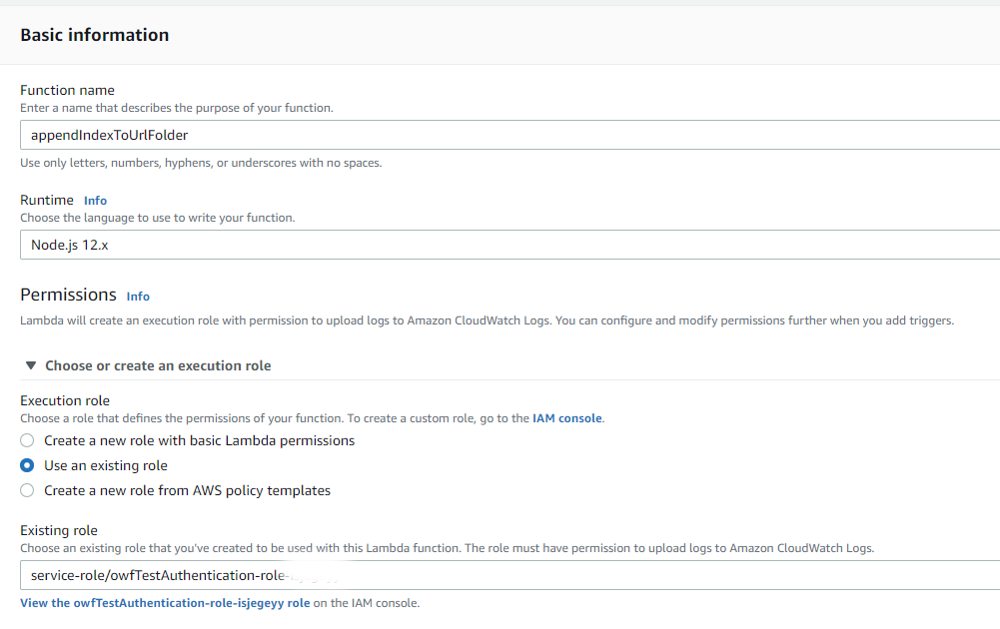
</p>**

**<p style="text-align: center;">
Lambda Function to Append `index.html`(<a href="../images/cloudfront-append-index-1.png">see full-size image</a>)
</p>**

Press ***Create function***.  In the ***Function code*** editor, replace the code with he following,
taken from the above article:

```
'use strict';

// combination origin-request, origin-response trigger to emulate the S3
// website hosting index document functionality, while using the REST
// endpoint for the bucket

// https://stackoverflow.com/a/54263794/1695906

const INDEX_DOCUMENT = 'index.html'; // do not prepend a slash to this value

const HTTP_REDIRECT_CODE = '302'; // or use 301 or another code if desired
const HTTP_REDIRECT_MESSAGE = 'Found'; 

exports.handler = (event, context, callback) => {
    const cf = event.Records[0].cf;

    if(cf.config.eventType === 'origin-request')
    {
        // if path ends with '/' then append INDEX_DOCUMENT before sending to S3
        if(cf.request.uri.endsWith('/'))
        {
            cf.request.uri = cf.request.uri + INDEX_DOCUMENT;
        }
        // return control to CloudFront, to send request to S3, whether or not
        // we modified it; if we did, the modified URI will be requested.
        return callback(null, cf.request);
    }
    else if(cf.config.eventType === 'origin-response')
    {
        // is the response 403 or 404?  If not, we will return it unchanged.
        if(cf.response.status.match(/^40[34]$/))
        {
            // it's an error.

            // we're handling a response, but Lambda@Edge can still see the attributes of the request that generated this response; so, we
            // check whether this is a page that should be redirected with a trailing slash appended.  If it doesn't look like an index
            // document request, already, and it doesn't end in a slash, and doesn't look like a filename with an extension... we'll try that.

            // This is essentially what the S3 web site endpoint does if you hit a nonexistent key, so that the browser requests
            // the index with the correct relative path, except that S3 checks whether it will actually work.  We are using heuristics,
            // rather than checking the bucket, but checking is an alternative.

            if(!cf.request.uri.endsWith('/' + INDEX_DOCUMENT) && // not a failed request for an index document
               !cf.request.uri.endsWith('/') && // unlikely, unless this code is modified to pass other things through on the request side
               !cf.request.uri.match(/[^\/]+\.[^\/]+$/)) // doesn't look like a filename  with an extension
            {
                // add the original error to the response headers, for reference/troubleshooting
                cf.response.headers['x-redirect-reason'] = [{ key: 'X-Redirect-Reason', value: cf.response.status + ' ' + cf.response.statusDescription }];
                // set the redirect code
                cf.response.status = HTTP_REDIRECT_CODE;
                cf.response.statusDescription = HTTP_REDIRECT_MESSAGE;
                // set the Location header with the modified URI
                // just append the '/', not the "index.html" -- the next request will trigger
                // this function again, and it will be added without appearing in the
                // browser's address bar.
                cf.response.headers['location'] = [{ key: 'Location', value: cf.request.uri + '/' }];
                // not strictly necessary, since browsers don't display it, but remove the response body with the S3 error XML in it
                cf.response.body = '';
            }
        }

        // return control to CloudFront, with either the original response, or
        // the modified response, if we modified it.

        return callback(null, cf.response);

    }
    else // this is not intended as a viewer-side trigger.  Throw an exception, visible only in the Lambda CloudWatch logs and a 502 to the browser.
    {
        return callback(`Lambda function is incorrectly configured; triggered on '${cf.config.eventType}' but expected 'origin-request' or 'origin-response'`);
    }

};
```

Save using the ***Save*** button.
Then press the ***+ Add trigger*** button to add a trigger (can't complete this step until the function has been saved).
Select ***CloutFront*** from the list as shown below and then press the ***Deploy to Lambda@Edge*** button.

**<p style="text-align: center;">
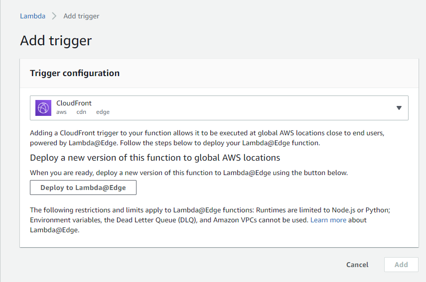
</p>**

**<p style="text-align: center;">
Lambda Function Trigger (<a href="../images/cloudfront-append-index-2.png">see full-size image</a>)
</p>**

A form similar to the following will be displayed.
Accept the defaults as shown and press ***Deploy***.
When creating this example the window did not automatically close and ***X*** had to be used.

**<p style="text-align: center;">

</p>**

**<p style="text-align: center;">
Lambda Function Trigger (<a href="../images/cloudfront-append-index-3.png">see full-size image</a>)
</p>**

The Lambda function ***Designer*** will then display similar to the following,
indicating that a ***CloudFront*** trigger has been added.

**<p style="text-align: center;">
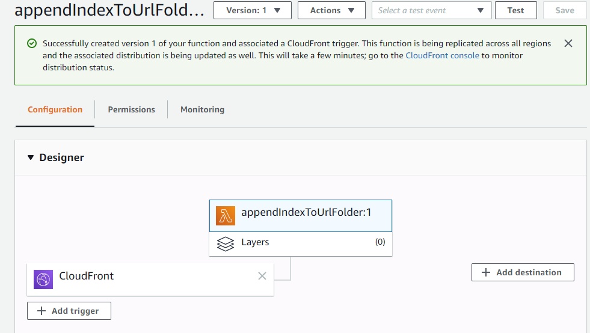
</p>**

**<p style="text-align: center;">
Lambda Function after Trigger is Created (<a href="../images/cloudfront-append-index-4.png">see full-size image</a>)
</p>**

Add another trigger similarly, but specify the ***Event type*** as ***Origin Response***.

The following URL patterns then display the `index.html` file content as expected.
The third case may be an issue if files without extensions are served, but hopefully this can be avoided.

```
* `/test-folder/`
* `/test-folder/index.html`
* `/test-folder`
```

**The following behavior was seen before the proper Lambda function code was determined.
If the following symptoms occur, then evaluate whether the Lambda function code is correct,
perhaps by trying something like Example 2 below.**

For `/test-folder/` with Chrome, an `AccessDenied` error is shown and the browser downloads
an empty file named `download` (or `download(1)` etc. on subsequent attempts) in the user's `Downloads` folder.

**<p style="text-align: center;">
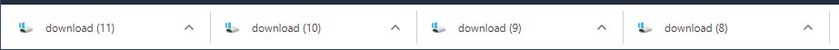
</p>**

**<p style="text-align: center;">
Chrome Message Attempting to Open Folder (<a href="../images/cloudfront-append-index-chrome-1.png">see full-size image</a>)
</p>**

For Microsoft Edge, after providing authentication information,
the following is shown and pressing ***Open*** resets the URL to the main page and shows the main page.
The buttons may be shown in either form depending on he width of the browser window.

**<p style="text-align: center;">
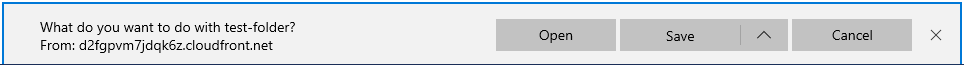
</p>**

**<p style="text-align: center;">
Microsoft Edge Message Attempting to Open Folder (<a href="../images/cloudfront-append-index-edge-1.png">see full-size image</a>)
</p>**

**<p style="text-align: center;">
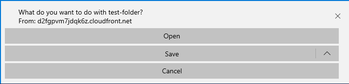
</p>**

**<p style="text-align: center;">
Microsoft Edge Message Attempting to Open Folder (<a href="../images/cloudfront-append-index-edge-2.png">see full-size image</a>)
</p>**

If ***Save*** is selected in the above, the following is shown:

**<p style="text-align: center;">
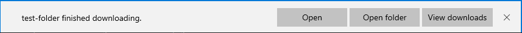
</p>**

**<p style="text-align: center;">
Microsoft Edge Message Attempting to Open Folder (<a href="../images/cloudfront-append-index-edge-3.png">see full-size image</a>)
</p>**

Selecting the ***Open folder*** button shows the following.
In this case, Edge, has created an empty file `test-folder` (or `test-folder(1)`, etc. on subsequent tries), whereas Chrome created `download*` files.

**<p style="text-align: center;">
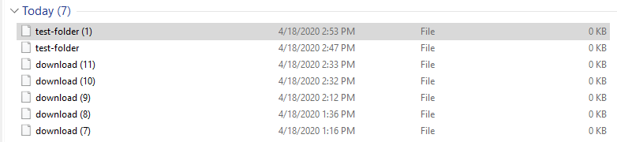
</p>**

**<p style="text-align: center;">
Download Files Resulting from Visiting Website Folder (<a href="../images/cloudfront-append-index-edge-4.png">see full-size image</a>)
</p>**

In this case, the Lambda function is either not getting executed as a CloudFront trigger,
or a download is attempted instead of view.
This issue was resolved by using the Lambda function code shown in this Example 1 and the following Example 2.

#### Example 2 for S3 Static Public Website ####

The previous Example 1 initially had issues and this second example was implemented as a test.  It worked.

The following attempt implements a CloudFront distribution for the `learn.openwaterfoundation.org` S3 bucket public static website,
and therefore no authentication to deal with.
Note that this example uses the origin content of the S3 bucket, not the served static website.
This is done on purpose to illustrate how to resolve the issue with `index.html` not being the default file in a folder when using CloudFront.

A Lambda function must be defined in the ***N. Virginia*** region using the
AWS Console for Lambda.  Click the ***Create function*** button.
Use the ***Author from Scratch*** approach and define a function as follows.

* the function name is `appendIndexToUrlFolder2` to different from previous function attempt
* Node.js.12.x is used because that is the latest available
* An existing execution role is used (the same as used for another example).

**<p style="text-align: center;">
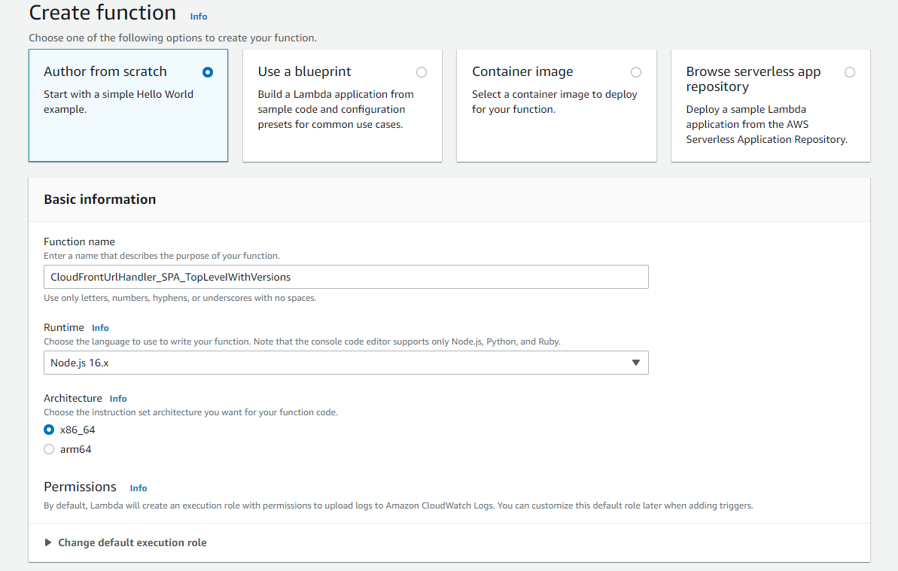
</p>**

**<p style="text-align: center;">
Create Lambda Function to Append `index.html` to Folder (<a href="../images/cloudfront-append-index2-1.png">see full-size image</a>)
</p>**

Press ***Create function*** to create the function.  Use the code from:

* [Stack Overflow "Serve index file instead of download prompt"](https://stackoverflow.com/questions/54164128/serve-index-file-instead-of-download-prompt)

```
'use strict';

// combination origin-request, origin-response trigger to emulate the S3
// website hosting index document functionality, while using the REST
// endpoint for the bucket

// https://stackoverflow.com/a/54263794/1695906

const INDEX_DOCUMENT = 'index.html'; // do not prepend a slash to this value

const HTTP_REDIRECT_CODE = '302'; // or use 301 or another code if desired
const HTTP_REDIRECT_MESSAGE = 'Found'; 

exports.handler = (event, context, callback) => {
    const cf = event.Records[0].cf;

    if(cf.config.eventType === 'origin-request')
    {
        // if path ends with '/' then append INDEX_DOCUMENT before sending to S3
        if(cf.request.uri.endsWith('/'))
        {
            cf.request.uri = cf.request.uri + INDEX_DOCUMENT;
        }
        // return control to CloudFront, to send request to S3, whether or not
        // we modified it; if we did, the modified URI will be requested.
        return callback(null, cf.request);
    }
    else if(cf.config.eventType === 'origin-response')
    {
        // is the response 403 or 404?  If not, we will return it unchanged.
        if(cf.response.status.match(/^40[34]$/))
        {
            // it's an error.

            // we're handling a response, but Lambda@Edge can still see the attributes of the request that generated this response; so, we
            // check whether this is a page that should be redirected with a trailing slash appended.  If it doesn't look like an index
            // document request, already, and it doesn't end in a slash, and doesn't look like a filename with an extension... we'll try that.

            // This is essentially what the S3 web site endpoint does if you hit a nonexistent key, so that the browser requests
            // the index with the correct relative path, except that S3 checks whether it will actually work.  We are using heuristics,
            // rather than checking the bucket, but checking is an alternative.

            if(!cf.request.uri.endsWith('/' + INDEX_DOCUMENT) && // not a failed request for an index document
               !cf.request.uri.endsWith('/') && // unlikely, unless this code is modified to pass other things through on the request side
               !cf.request.uri.match(/[^\/]+\.[^\/]+$/)) // doesn't look like a filename  with an extension
            {
                // add the original error to the response headers, for reference/troubleshooting
                cf.response.headers['x-redirect-reason'] = [{ key: 'X-Redirect-Reason', value: cf.response.status + ' ' + cf.response.statusDescription }];
                // set the redirect code
                cf.response.status = HTTP_REDIRECT_CODE;
                cf.response.statusDescription = HTTP_REDIRECT_MESSAGE;
                // set the Location header with the modified URI
                // just append the '/', not the "index.html" -- the next request will trigger
                // this function again, and it will be added without appearing in the
                // browser's address bar.
                cf.response.headers['location'] = [{ key: 'Location', value: cf.request.uri + '/' }];
                // not strictly necessary, since browsers don't display it, but remove the response body with the S3 error XML in it
                cf.response.body = '';
            }
        }

        // return control to CloudFront, with either the original response, or
        // the modified response, if we modified it.

        return callback(null, cf.response);

    }
    else // this is not intended as a viewer-side trigger.  Throw an exception, visible only in the Lambda CloudWatch logs and a 502 to the browser.
    {
        return callback(`Lambda function is incorrectly configured; triggered on '${cf.config.eventType}' but expected 'origin-request' or 'origin-response'`);
    }

};
```

Use the ***Save*** button to save the function code.  Then use ***+ Add trigger*** to add a CloudFront  trigger.
Use information similar to the following information to configure the trigger.
Note that the ***Distribution*** will auto-populate using the first distribution and it may be necessary to
copy and past the correct distribution.  Otherwise, deploying the trigger may complain that the event
type is already used by another distribution (if this is the case).
It is not clear if ***Include body*** should be checked in some cases, but this example was successful without selecting.
The following selects the ***CloudFront event*** as ***Origin request***.

**<p style="text-align: center;">
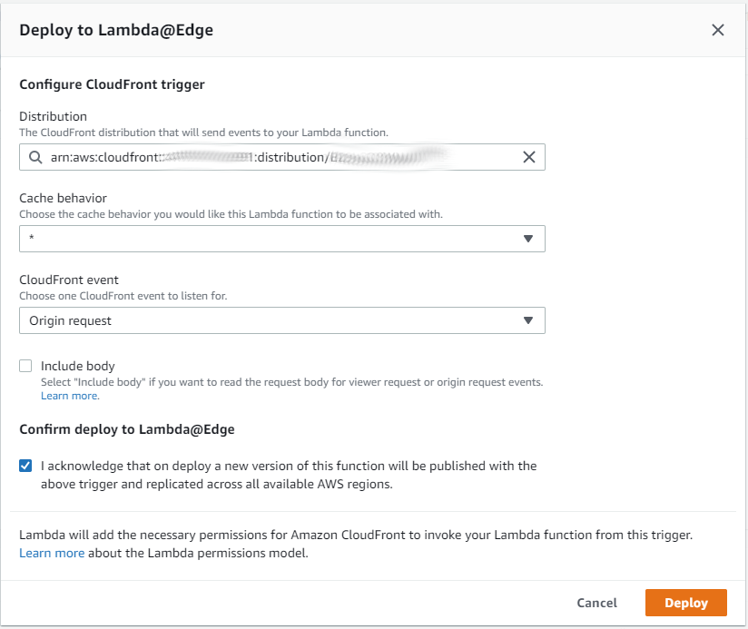
</p>**

**<p style="text-align: center;">
Lambda Function CloudFront Trigger Configuration (<a href="../images/cloudfront-append-index2-2.png">see full-size image</a>)
</p>**

Press ***Deploy*** to deploy the trigger.
The window may not automatically close so press ***X*** if necessary.
The trigger will then be indicated in the Lambda function editor:

**<p style="text-align: center;">
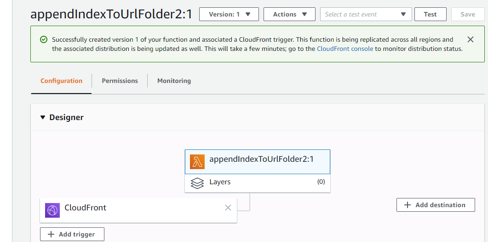
</p>**

**<p style="text-align: center;">
Lambda Function Trigger has been Created (<a href="../images/cloudfront-append-index2-3.png">see full-size image</a>)
</p>**

Repeat ***+ Add trigger*** but for event type ***Origin Response***.
Again, make sure that the distribution identifier is correct because the form is auto-populated with the first available distribution.

**<p style="text-align: center;">

</p>**

**<p style="text-align: center;">
Lambda Function CloudFront Second Trigger Configuration (<a href="../images/cloudfront-append-index2-4.png">see full-size image</a>)
</p>**

The following confirms that two triggers have been created (note the `(2)` in the ***CloudFront*** box):

**<p style="text-align: center;">

</p>**

**<p style="text-align: center;">
Lambda Function Second Trigger has been Created (<a href="../images/cloudfront-append-index2-5.png">see full-size image</a>)
</p>**

Attempting to access a CloudFront URL, for example `https://d19yzyd6ao34tq.cloudfront.net/owf-learn-aws/` or any
links on this page that refer to its folders now works correctly,
without attempting to download empty files when URLs ending in `/` are encountered,
and the web browser shows the URL as requested (addition of `index.html` is done behind the scenes).
