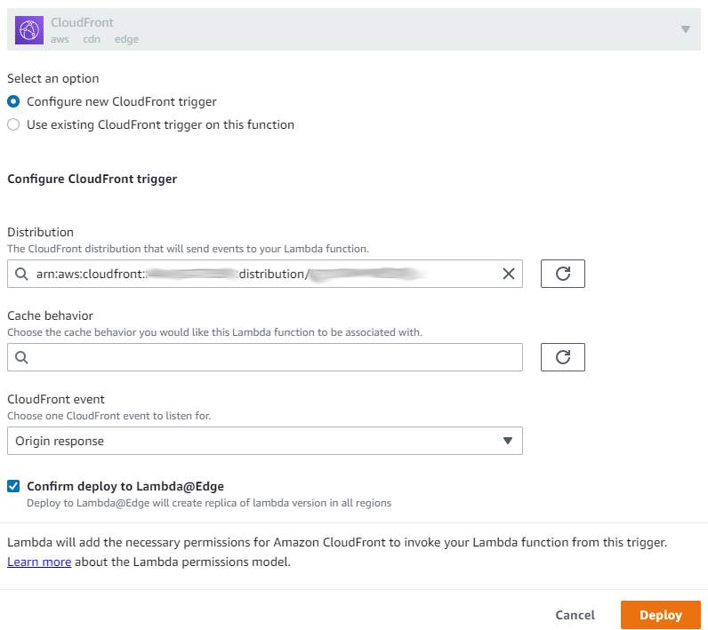
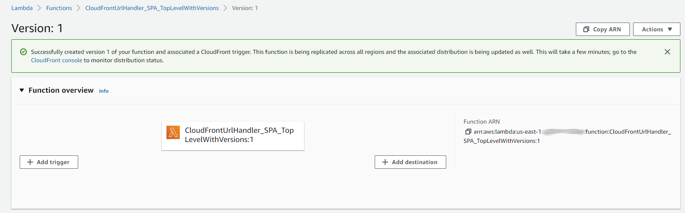

# CloudFront / Lambda Function to Append `index.html` to URL

* [Introduction](#introduction)
* [Append `index.html` to URL using a Lambda Function](#append-indexhtml-to-url-using-a-lambda-function)
    + [Current Production Lambda Function](#current-production-lambda-function)
* [Configuring the Lambda Function for a CloudFront Distribution](#configuring-the-lambda-function-for-a-cloudfront-distribution)

--------------

## Introduction ##

Many websites use a convention that
if the URL is specified as a folder with or without a trailing `/`,
an `index.html` file should be returned by default.
The goal is that `index.html` should not need to be explicitly included in the URL,
allowing for nicer-looking URLs.

Implementing a website using S3+CloudFront requires implementing a solution
to append `index.html` to folder URLs if not explicitly included in the URL.
This allows any of the following variations of the URL to be requested:

* `https://domain/somefolder`
* `https://domain/somefolder/`
* `https://domain/somefolder/index.html`

The fundamental issue is that S3 does not manage its objects using folders
and therefore does not know when a served resource is a folder.
All S3 objects are identified with a "key" string, which happens to default to using `/`
as a visual separator similar to folders, but folders do not exist.

The following articles provide background on this issue:

* [Stack Overflow: Redirect to index.html for S3 subfolder](https://stackoverflow.com/questions/49082709/redirect-to-index-html-for-s3-subfolder) - appending `index.html` to folder URLs
* [Using Lambda@Edge to handle Angular client-side routing with S3 and CloudFront](https://andrewlock.net/using-lambda-at-edge-to-handle-angular-client-side-routing-with-s3-and-cloudfront/)

An old version of [this documentation from 2020-04-19](lambda-to-append-index-2020-04-19.md)
has been archived and will be removed in the future.

## Append `index.html` to URL using a Lambda Function

A solution that has been demonstrated to work
involves defining an AWS Lambda function for the CloudFront distribution.
The function modifies the requested URL and appends `index.html` (or `/index.html`)
if it is not already included in the URL.

The Lambda function currently used in production at the Open Water Foundation
(for example on `learn.openwaterfoundation.org`) as of 2022-09-29 can be found below.

Note that attempting to use a "CloudFront function" or the answer to the Stack
Overflow question from above as the solution does not provide enough capabilities
and therefore a Lambda function is required. Keep in mind that these might be enough
to solve other issues when dealing with non Single Page Applications.

### Current Production Lambda Function ###

The newest version of the Lambda function performs the following:

1. If a requested URL **does not** end in a file (e.g., `/index.html` or `somefile.ext`),
   assume that the resource is a folder and append `/index.html` to the URL:
    + file resources served from the site must have an extension because no extension is assumed to be a folder
    + folders at the end of the URL that include a period are checked for whether they adhere to a
      version naming convention
      described in the next item (this is an Open Water Foundation convention implemented based on experience)
2. It is possible that a versioned folder is used to manage releases
   (e.g., `https://someapplication/1.2.3`),
   in which case the folder might be assumed to be a file with an extension and `/index.html` would not being appended,
   based on the logic for item 1 above.
   Additional logic is therefore included to allow such URLs to be handled as folders even though
   the period is included in the name.
3. Single page web applications such as Angular applications are designed to have a "base href" URL,
   followed by additional URL parts that specify the resources within the application.
   Such applications "route" the URLs.
   Because the full URL does exist on the server, the content of the "base href" plus `/index.html` must be returned
   as the payload, even when a longer URL is actually requested.
   The use of "base href", as shown in the example below, allows the web browser and web server to communicate
   and enable single page applications with application-routed URLs.
4. Returns a 200 OK response along with the changes to indicate that the updated URL is a valid request.

For example, `https://poudre.openwaterfoundation.org/3.0.0` is recognized as a versioned folder (item 2 above).
It does not end in `/index.html` and therefore this is appended to the URL (item 1 above).
This is a single page website built with Angular and therefore is deployed by setting the
`<base href="/3.0.0/">` in the application's `index.html` file,
consistent with Angular applications (item 3 above).

The code uses the `Node.js 16.x` runtime and is as follows.
Copy this code into a lambda function when following the instructions below.

```javascript
/**
 * This CloudFrontUrlHandler_SPA_TopLevelWithVersions lambda function deals with
 * server side routing for top-level Single Page Applications so the correct
 * path is displayed.
 * 
 * This function performs three major tasks:
 * 
 * 1. Intercepts a 403 or 404 error when a file in a subfolder is requested.
 *    This is because subfolders in S3 don't exist. More information can be found in
 *    this blog where the basis for this function's code was found:
 * 
 *    https://andrewlock.net/using-lambda-at-edge-to-handle-angular-client-side-routing-with-s3-and-cloudfront/
 * 
 * 2. Determines what the version is ('latest', '3.0.0') of the SPA in the URI,
 *    and if the request does not end in a file, makes a request back to the
 *    origin (S3) server for the SPA's index.html page. For example '/latest/index.html'
 *    or '/4.1.0/index.html'. If the request does end in a fileIn this case the URI is not changed.
 * 
 * 3. Returns a 200 OK response to the CloudFront server from the origin (S3) server.
 */

// For the HTTPS Node.js module for using HTTP protocol over TLS/SSL.
const http = require('https');

/**
 * 
 */
exports.handler = async (event, context, callback) => {
    /**
     * The following constants and variables are objects and strings obtained
     * from the origin-response object.
     * 
     * cf: The main CloudFront object that contains the config, request, and response objects.
     * request: The entire incoming request object.
     * uri: The incoming URI in the request, e.g. /0.7.0.dev.
     * host: The host being requested, e.g. poudre.openwaterfoundation.org.
     * response: The entire response object.
     * statusCode: The status of the resonse, e.g. 200.
     * indexPage: The new URI to be appended to the domain request.
     */
    const cf = event.Records[0].cf;
    const request = cf.request;
    var uri = request.uri;
    const host = request.headers.host[0].value;
    const response = cf.response;
    const statusCode = response.status;
    var indexPage = '';
    
    console.log('Initial request object:', request);
    console.log('Initial URI:           ', uri);

    // Determine whether to perform the replacement in the uri. Only perform if
    // the response is a 403 or 404 error. This is a CloudFront/S3 issue with subfolders.
    var doReplace = (request.method === 'GET') && ((statusCode == '403') || (statusCode == '404'));
    
    // Check for the pattern that matches a versioned file, including:
    //   /some/path/1.4.5
    //   /some/path/1.4.5/
    //   /some/path/1.4.5.dev
    //   /some/path/1.4.5.dev/
    // Regular expression to match a version at the end:
    // - see:  https://developer.mozilla.org/en-US/docs/Web/JavaScript/Guide/Regular_Expressions/Quantifiers
    // - regular expressions are similar to linux 'sed'
    // - * at the front is apparently not required
    //                        +---- start of regular expression
    //                        | +---- match a literal slash
    //                        | |  +---- match a digit
    //                        | |  |  +---- match preceding item (a digit) 1 or more times
    //                        | |  |  | +---- match a literal decimal point
    //                        | |  |  | |  +---- match second digit in semantic version
    //                        | |  |  | |  |       +---- match third digit in semantic version
    //                        | |  |  | |  |       |     +---- match the preceding item 0 or 1 times to support a 4th version part
    //                        | |  |  | |  |       |     |     must use a "0 or 1" match
    //                        | |  |  | |  |       |     |  +---- this sequence matches a lowercase letter, uppercase letter, or digit
    //                        | |  |  | |  |       |     |  |          +---- match the preceding character 0 or more times
    //                        | |  |  | |  |       |     |  |          |  +---- match 0 or 1 slash at the end (so trailing slash or not)
    //                        | |  |  | |  |       |     |  |          |  |
    //                        | |  |  | |  |       |     |  |          |  |+---- end of regular expression (no trailing 'g' so must match exactly)
    //                        | |  |  | |  |       |     |  |          |  ||
    //                        v v  v  v v  v       v     v  v          v  vv
    const versionExpression = /\/[0-9]+\.[0-9]+\.[0-9]+\.?([a-zA-Z0-9])*\/?/;
    // Is set to true if the uri matches the versionExpression, false if not.
    const hasVersion = versionExpression.test(uri);
    // Also test for file at the end that has an extension:
    // - must not end in /
    // - includes . in the file
    //                             +---- main part of filename can contain characters and digits
    //                             |            + required period to separate file and extension
    //                             |            |  +---- file extension can contain characters and digits
    //                             |            |  |           +---- match the end of string (don't allow match in the middle of the string)
    //                             |            |  |           |     No trailing slash.
    //                             v            v  v           v
    const fileAtEndExpression = /([a-zA-Z0-9])*\.([a-zA-Z0-9])*$/;
    // True if the uri matches the versionExpression, false if not.
    const fileAtEnd = fileAtEndExpression.test(uri);

    if (hasVersion) {
        var version = uri.split('/')[1];
        indexPage = `/${version}/index.html`;
    }
    else if (uri.includes('/latest')) {
        indexPage = '/latest/index.html';
    }
    else if (fileAtEnd) {
        // URI does not have version at the end but does seem to end in a file name.
        // Use the URI as is.
        indexPage = uri;
        doReplace = false;
    }
    else if (uri.endsWith('/')) {
        // A folder is at the end of the URL with trailing /, so just append index.html.
        indexPage = uri + 'index.html';
    }
    else {
        // A folder is at the end of the URL without trailing /, so just append /index.html.
        indexPage = uri + '/index.html';
    }
    // For debugging and testing. Will print when locally tested using the built
    // in testing for Lambda functions, and will also be printed in a Log Group
    // in CloudWatch.
    console.log('cf object:           ', cf);
    console.log('response status:     ', response.status);
    console.log('response description:', response.statusDescription);
    console.log('uri:                 ', uri);
    console.log('host:                ', host);
    console.log('domain:              ', cf.config.distributionDomainName);
    console.log('indexPage:           ', indexPage);
    console.log('doReplace:           ', doReplace);

    const result = doReplace
        ? await generateResponseAndLog(cf, request, indexPage, response.headers)
        : response;

    callback(null, result);
};

/**
 * 
 */
async function generateResponseAndLog(cf, request, indexPage, headers) {
    const domain = cf.config.distributionDomainName;
    const response = await generateResponse(domain, indexPage, headers);

    return response;
}

/**
 * 
 */
async function generateResponse(domain, path, headers) {
    try {
        // load HTML index from the CloudFront cache
        const s3Response = await httpGet({ hostname: domain, path: path });

        const outHeaders = {};

        // https://docs.aws.amazon.com/AmazonCloudFront/latest/DeveloperGuide/lambda-requirements-limits.html
        for (var propName in headers) {
            var header = headers[propName];

            if ((propName === "transfer-encoding") || (propName === "via")) {
                // just here to make sure we don't change the read-onlys
            }
            else if (s3Response.headers[propName] != null) {
                header = s3Response.headers[propName];
            }

            if (Array.isArray(header)) {
                outHeaders[propName] = header;
            }
            else {
                outHeaders[propName] = [{ value: header }];
            }
        }
        
        return {
            status: '200',
            headers: outHeaders,
            body: s3Response.body
        };
    } catch (error) {
        return {
            status: '500',
            headers: {
                'content-type': [{ value: 'text/plain' }]
            },
            body: 'An error occurred loading the page'
        };
    }
}

/**
 * 
 */
function httpGet(params) {
    return new Promise((resolve, reject) => {
        http.get(params, (resp) => {
            console.log(`Fetching ${params.hostname}${params.path}, status code: ${resp.statusCode}`);
            let result = {
                headers: resp.headers,
                body: ''
            };
            resp.on('data', (chunk) => { result.body += chunk; });
            resp.on('end', () => { resolve(result); });
        }).on('error', (err) => {
            console.log(`Couldn't fetch ${params.hostname}${params.path} : ${err.message}`);
            reject(err, null);
        });
    });
}
```

## Configuring the Lambda Function for a CloudFront Distribution

The main CloudFront configuration settings allow setting the ***Default Root Object*** to `index.html`.
However, this setting does not apply to other folders.
This is different from an S3 bucket that is configured as a public static website.
If the CloudFront distribution ***Origin Domain Name*** setting points to an S3 public static website then this is not an issue.
However, if the CloudFront distribution uses an S3 bucket directly,
for example to create an authenticated private website,
many URLs will not work as expected because `index.html` is not the global default file when URLs ending in `/`
or the URL may be a folder without trailing `/`,
and errors like the following will be shown.

```
<Error>
<Code>AccessDenied</Code>
<Message>Access Denied</Message>
<RequestId>722DC56945FBAF4C</RequestId>
<HostId>
EGzX7VEX90fxzuSQxXwhHcYDvclo1PQEdYOU+zczR0UtjYJzMDCGKdzIU3XAQ96MnMQdfMVc7To=
</HostId>
</Error>
```

The following URL pattern works:

* `/test-folder/index.html` - works because full path to file is specified, but is inconvenient

The following URL patterns don't work:

* `/test-folder` - does not work because `index.html` is not the default
* `/test-folder/` - does not work because `index.html` is not the default


See the following solution, which involves defining a lambda function:

* [Using Lambda@Edge to handle Angular client-side routing with S3 and CloudFront](https://andrewlock.net/using-lambda-at-edge-to-handle-angular-client-side-routing-with-s3-and-cloudfront/) - **this worked as the basis of the final solution**
* [Stack Overflow "Serve index file instead of download prompt"](https://stackoverflow.com/questions/54164128/serve-index-file-instead-of-download-prompt) - **this worked and was used in an initial experiment, can be used if single page applications are not involved**
* [Implementing Default Directory Indexes in Amazon S3-backed Amazon CloudFront Origins Using Lambada@Edge](https://aws.amazon.com/blogs/compute/implementing-default-directory-indexes-in-amazon-s3-backed-amazon-cloudfront-origins-using-lambdaedge/) - **this did not work, and resulted in download of empty files for folders ending in `/`** (for example Chrome created files named `download *` and Microsoft Edge created files named `test-folder *`)

The solution defines a trigger on the CloudFront distribution
to detect when a page is accessed with URL ending in `/` or otherwise matches a folder,
and modifies the URL to append `index.html`.

#### Example for S3 Static Public Website ####

The following implements a CloudFront distribution for the `learn.openwaterfoundation.org` S3 bucket public static website,
which is a public site with no authentication.

A Lambda function must be defined in the ***N. Virginia*** region using the AWS Console for Lambda.
Click the ***Create function*** button.
Use the ***Author from Scratch*** approach and define a function as follows.

* The function name CloudFrontUrlHandler_SPA_TopLevelWithVersions` 
  is verbose so that its functionality can be determined at a glance.
  In this case `SPA` is used because it is used with Angular single page applications
  and `TopLevelWithVersions` indicates that it handles versioned folders.
* `Node.js 16.x` is used because that is the latest available.
* An existing execution role is used (the same as used for other configuration settings).

**<p style="text-align: center;">

</p>**

**<p style="text-align: center;">
Create Lambda Function to Append `index.html` to Folder (<a href="../images/cloudfront-append-index2-1.png">see full-size image</a>)
</p>**

Press ***Create function*** to create the function.  Use the code editor and copy from:

* [Current Production Lambda Function](#current-production-lambda-function) section above
* or, if a simpler function is OK, see:
  [Stack Overflow "Serve index file instead of download prompt"](https://stackoverflow.com/questions/54164128/serve-index-file-instead-of-download-prompt)

When the function contents are ready to be published, click the ***Actions*** dropdown
on the upper right part of the page, then ***Deploy to Lambda@Edge***.
Note that the Distribution will auto-populate using the first distribution and it
may be necessary to copy and paste the correct distribution. Otherwise, deploying
the trigger may complain that the event type is already used by another distribution
(if this is the case). It is not clear if Include body should be checked in some
cases, but this example was successful without selecting. The following selects the
***CloudFront event*** as `Origin response`.

**<p style="text-align: center;">

</p>**

**<p style="text-align: center;">
Lambda Function CloudFront Second Trigger Configuration (<a href="../images/cloudfront-append-index2-4.png">see full-size image</a>)
</p>**

Press ***Deploy*** to deploy the function.
The following confirms that the trigger has been successfully created:

**<p style="text-align: center;">

</p>**

**<p style="text-align: center;">
Lambda Function Second Trigger has been Created (<a href="../images/cloudfront-append-index2-5.png">see full-size image</a>)
</p>**

Attempting to access a CloudFront URL, for example `https://d19yzyd6ao34tq.cloudfront.net/owf-learn-aws/` or any
links on this page that refer to its folders now works correctly,
without attempting to download empty files when URLs ending in `/` are encountered,
and the web browser shows the URL as requested (addition of `index.html` is done behind the scenes).

Similarly, attempting to access a Single Page Application such as an Angular project
using a versioned folder such as `https://infomapper.openwaterfoundation.org/1.4.0` correctly
appends the necessary string to the URL so the application home page for the specific version is shown.
