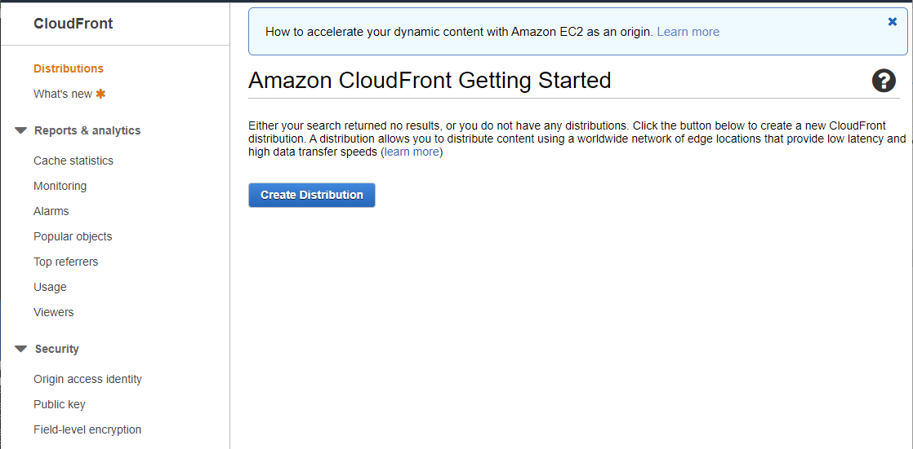
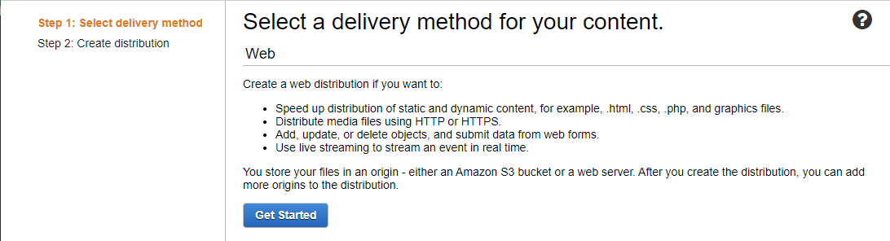
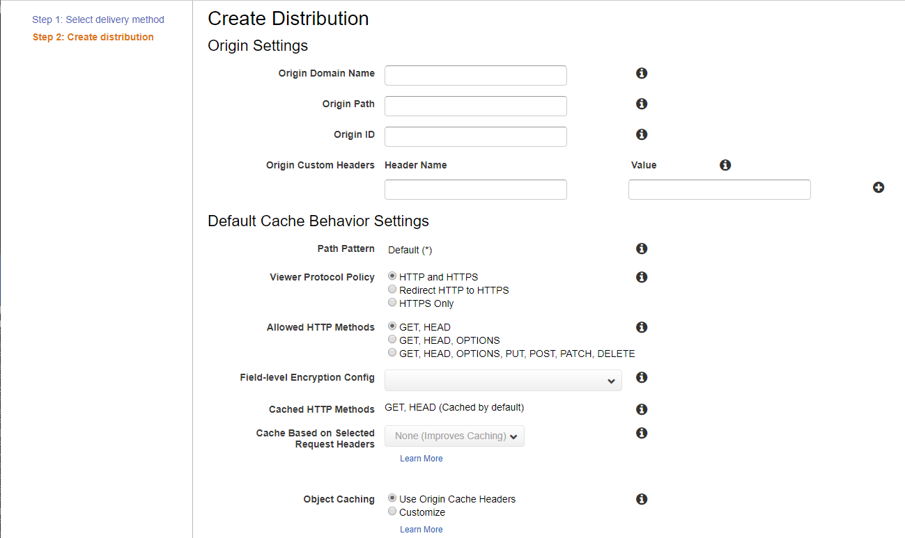
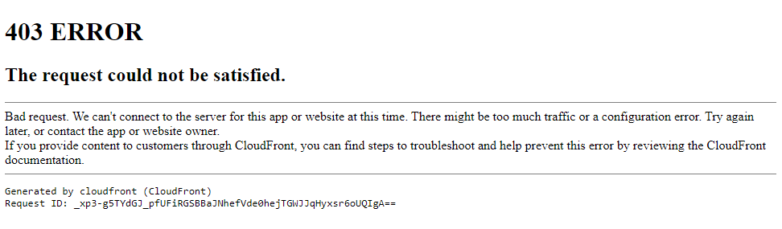

# AWS / CDN / CloudFront / Authentication Using Lambda Function #

This documentation explains how to use AWS CloudFront to create a private, authenticated
content delivery network (CDN) using a Lambda function.

* [Introduction](#introduction)
* [Step 1: Create an S3 Bucket](#step-1-create-an-s3-bucket)
* [Step 2: Create Lambda@Edge Function to Authenticate User](#step-2-create-lambdaedge-function-to-authenticate-user)
* [Step 3: Create CloudFront Distribution](#step-3-create-cloudfront-distribution)
* [Step 4: Upload Content to S3 Bucket](#step-4-upload-content-to-s3-bucket)
* [Step 5: Test CloudFront Distribution](#step-5-test-cloudfront-distribution)
* [Step 6: Additional CloudFront Configuration](#step-6-additional-cloudfront-configuration)
* [Step 7: Define CNAME DNS Record](#step-7-define-cname-dns-record)
* [Step 8: Define SSL Certificate](#step-8-define-ssl-certificate)

---------------

## Introduction ##

This documentation was prepared on 2020-04-09.

This section describes how to to create a static website using CloudFront and
a private S3 bucket, with authentication provided using a Lambda function.
The hierarchy of services is as follows:

```
CloudFront
  CloudFront uses: S3
  CloudFront uses: Lambda
```

This approach **does not** use signed URLs or signed cookies but demonstrated how to use a distribution.
The following are articles that were used for guidance to create this documentation.

* [A Step-by-step Guide to Creating a Password Protected S3 bucket](http://kynatro.com/blog/2018/01/03/a-step-by-step-guide-to-creating-a-password-protected-s3-bucket/) - used to a large degree for creating the example in this documentation
* [Serving Private Content Using Amazon CloudFront and AWS Lambda@Edge](https://aws.amazon.com/blogs/networking-and-content-delivery/serving-private-content-using-amazon-cloudfront-aws-lambdaedge/) - useful but uses Nginx server for content

It is assumed that an AWS account and suitable user are available.

## Step 1: Create an S3 Bucket ##

If an S3 bucket does not already exist for the CloudFront content, create it, as follows.
The bucket can be in any AWS region.

Use the AWS Console for S3 to create a bucket that will serve as the static website.
The bucket **will not** be configured as a public static website because the
point of the CloudFront implementation is to require authentication to access the content stored on S3.

**<p style="text-align: center;">

</p>**

**<p style="text-align: center;">
Create S3 Bucket - General Configuration (<a href="../images/cloudfront-s3-1.png">see full-size image</a>)
</p>**

No other configuration is necessary.  Press ***Create Bucket***.
The following (or similar) indicates success.

**<p style="text-align: center;">

</p>**

**<p style="text-align: center;">
Create Bucket - Success (<a href="../images/cloudfront-s3-2.png">see full-size image</a>)
</p>**

## Step 2: Create Lambda@Edge Function to Authenticate User ##

Step 3 (next section) will define a CloudFront distribution.
Before doing so, it is necessary to create a Lambda@Edge function,
which will be referenced in the distribution
***Default Cache Behavior Settings / Lambda Funcation Assocations*** setting.

AWS Lambda allows functions written in various languages to be executed as computation units,
integrating with other AWS services as appropriate.
Similar to other "Edge" services, Lambda@Edge allows functions to be distributed to regions to increase performance.
It is also necessary to configure a role to run the Lambda function - this will occur through the configuration process below.

From experience, it was determined that the Lambda function needs to be defined in AWS region `us-east-1`.
Otherwise, a warning will be generated when creating the CloudFront distribution.
Use the AWS Console for Lambda, which will display a page similar to the following:

**<p style="text-align: center;">

</p>**

**<p style="text-align: center;">
Lambda Function - Initial Page (<a href="../images/cloudfront-lambda-1.png">see full-size image</a>)
</p>**

If necessary, change the region in the upper right of the console to use ***N. Virginia***, which
corresponds to region `us-east-1`:

**<p style="text-align: center;">

</p>**

**<p style="text-align: center;">
Lambda Funcation - Setting the AWS Region(<a href="../images/cloudfront-lambda-1b.png">see full-size image</a>)
</p>**

Press the ***Create Function*** button, which will display a page similar to the following:

**<p style="text-align: center;">

</p>**

**<p style="text-align: center;">
Create Lambda Function - Initial Page (<a href="../images/cloudfront-lambda-2.png">see full-size image</a>)
</p>**

For this example, a function will be created from scratch.
Make the following changes to settings.
The ***Set*** column has "Yes" if a value is set to other than the default.

| **Setting** | **Set** | **Setting Value**&nbsp;&nbsp;&nbsp;&nbsp;&nbsp;&nbsp;&nbsp;&nbsp;&nbsp;&nbsp;&nbsp;&nbsp;&nbsp;&nbsp;&nbsp;&nbsp;&nbsp;&nbsp;&nbsp;&nbsp;&nbsp;&nbsp;&nbsp;&nbsp;&nbsp;&nbsp;&nbsp;&nbsp;&nbsp;&nbsp;&nbsp;&nbsp;&nbsp;&nbsp;&nbsp;&nbsp;&nbsp;&nbsp;&nbsp;&nbsp;&nbsp;&nbsp;&nbsp;&nbsp;&nbsp; | **Comments** |
| -- | -- | -- | -- |
| ========== | ===== | ======================== | **Basic Information** |
| ***Function Name*** | Yes | `owfTestAuthentication` | Specify a function name that follows Node.js conventions because Node.js is going to be used to implement the function.  Other languages can also be used. |
| ***Runtime*** | | `Node.js 12.x` | Use the default.  This example used another Node.js example. |
| ========== | ===== | ======================== | **Permissions** |
| ***Execution Role*** | Yes | `Create a new role with basic Lambda permissions` | Creating a new role seems reasonable for this CloudFront authentication example, although an existing role can be used.  For example, if many Lambda functions are defined, a general role can be defined to run the functions. |

After changing settings, the page is similar to the following.
Note that AWS will automatically create a role with part of the name having random characters.

**<p style="text-align: center;">

</p>**

**<p style="text-align: center;">
Create Lambda Function - Initial Page (<a href="../images/cloudfront-lambda-3.png">see full-size image</a>)
</p>**

Press the ***Create Funcation*** button.  A page with many parts, similar to the following, will be shown.
The ***ARN*** for the function is show in the upper right and for this example is in region `us-east-1
(this is not the default region used for the account so need to figure out if this matters and if it can be changed).

**<p style="text-align: center;">

</p>**

**<p style="text-align: center;">
Create Lambda Function - Initial Page (<a href="../images/cloudfront-lambda-4.png">see full-size image</a>)
</p>**

The initial ***Function code*** section is similar to the following:

**<p style="text-align: center;">

</p>**

**<p style="text-align: center;">
Create Lambda Function - Initial Function Code (<a href="../images/cloudfront-lambda-5.png">see full-size image</a>)
</p>**

Replace the initial code with that pasted in from the article
["A Step-by-step Guide to Creating a Password Protected S3 bucket"](http://kynatro.com/blog/2018/01/03/a-step-by-step-guide-to-creating-a-password-protected-s3-bucket/).
The code is repeated below for reference.
Change the `authUser` and `authPass` to desired values and otherwise update the code, such as the comments,
for the specific application.

```
/**
 * BASIC Authentication
 *
 * Simple authentication script intended to be run by Amazon Lambda to
 * provide Basic HTTP Authentication for a static website hosted in an
 * Amazon S3 bucket through CloudFront.
 *
 * https://hackernoon.com/serverless-password-protecting-a-static-website-in-an-aws-s3-bucket-bfaaa01b8666
 */

'use strict';

exports.handler = (event, context, callback) => {

    // Get request and request headers
    const request = event.Records[0].cf.request;
    const headers = request.headers;

    // Configure authentication
    const authUser = 'YOUR USERNAME';
    const authPass = 'YOUR PASWORD';

    // Construct the Basic Auth string
    const authString = 'Basic ' + new Buffer(authUser + ':' + authPass).toString('base64');

    // Require Basic authentication
    if (typeof headers.authorization == 'undefined' || headers.authorization[0].value != authString) {
        const body = 'Unauthorized';
        const response = {
            status: '401',
            statusDescription: 'Unauthorized',
            body: body,
            headers: {
                'www-authenticate': [{key: 'WWW-Authenticate', value:'Basic'}]
            },
        };
        callback(null, response);
    }

    // Continue request processing if authentication passed
    callback(null, request);
};
```

Press the ***Save*** button to save the function code.
No additional settings are changed from the defaults.

In the ***Actions*** dropdown at the top of the page, select ***Publish new version***.
Then enter an appropriate version description such as the following.

**<p style="text-align: center;">

</p>**

**<p style="text-align: center;">
Create Lambda Function - Publish New Version (<a href="../images/cloudfront-lambda-6.png">see full-size image</a>)
</p>**

The page should update to indicate success similar to the following:

**<p style="text-align: center;">

</p>**

**<p style="text-align: center;">
Create Lambda Function - Publish New Version Successful (<a href="../images/cloudfront-lambda-7.png">see full-size image</a>)
</p>**

From experience, an error will likely result when creating the CloudFront distribution in the next step, similar to:

```
com.amazonaws.services.cloudfront.model.InvalidLambdaFunctionAssociationException: The function execution role must be assumable with edgelambda.amazonaws.com as well as lambda.amazonaws.com principals. Update the IAM role and try again. Role: arn:aws:iam::XXXXXXXXXXXX:role/service-role/owfTestAuthentication-role-XXXXXXXX (Service: AmazonCloudFront; Status Code: 400; Error Code: InvalidLambdaFunctionAssociation; Request ID: f8369ee4-22a9-4c98-aa54-8395241ce7a7)
```

To avoid this error, fix the function properties.  Research found the following information:

* Stack overflow article ["cannot create aws lambda function due to some cryptic error message"](https://stackoverflow.com/questions/53796032/cannot-create-aws-lamda-function-due-to-some-cryptic-error-message)
* AWS article ["Setting IAM Permissions and Roles for Lambda@Edge"](https://docs.aws.amazon.com/AmazonCloudFront/latest/DeveloperGuide/lambda-edge-permissions.html)
* AWS article ["Using Resource-Based Policies for AWS Lambda"](https://docs.aws.amazon.com/lambda/latest/dg/access-control-resource-based.html)

Use the AWS Console for Lambda to edit the function.  Under the ***Permissions*** tab, click on the ***Execution Role / Role Name*** link.
In the ***Trust relationships*** tab, press ***Edit trust relationship***.
The `Service` did not include `edgelambda.amazonaws.com` so add that similar to Stack Overflow article from above,
and as shown below, and save.

```
{
  "Version": "2012-10-17",
  "Statement": [
    {
      "Effect": "Allow",
      "Principal": {
        "Service": [
          "edgelambda.amazonaws.com",
          "lambda.amazonaws.com"
        ]
      },
      "Action": "sts:AssumeRole"
    }
  ]
}
```

The lambda function should now be ready to associate with the CloudFront distribution,
as discussed in the next step.
If additional changes to the function are made, save and publish again.
The function ***ARN*** shown in the upper right will be needed.
Use the copy to clipboard icon when needed to fill out the CloudFront distribution settings in the next section.

## Step 3: Create CloudFront Distribution ##

Access to CloudFront CDN websites are configured as "distributions".

Use the AWS Console for CloudFront - open in a separate tab so that it is easy to access the Lambda page at the same time.
If the first time, the page will be similar to the following.

**<p style="text-align: center;">

</p>**

**<p style="text-align: center;">
CloudFront Getting Started (<a href="../images/cloudfront-1.png">see full-size image</a>)
</p>**

Press the ***Create Distribution*** button.
A page similar to the following will be shown.

**<p style="text-align: center;">

</p>**

**<p style="text-align: center;">
CloudFront - Select Deliver Method (<a href="../images/cloudfront-2.png">see full-size image</a>)
</p>**

Press the ***Get Started*** button.  A page similar to the following will be shown,
with many configuration settings.

**<p style="text-align: center;">

</p>**

**<p style="text-align: center;">
CloudFront - Create Distribution (<a href="../images/cloudfront-3.png">see full-size image</a>)
</p>**

The following table lists configuration settings that were changed for this example.
The ***Set*** column has "Yes" if a value is set to other than the default.

**<p style="text-align: center;">
CloudFront Distribution Example Settings
</p>**

| **Setting** | **Set** | **Setting Value**&nbsp;&nbsp;&nbsp;&nbsp;&nbsp;&nbsp;&nbsp;&nbsp;&nbsp;&nbsp;&nbsp;&nbsp;&nbsp;&nbsp;&nbsp;&nbsp;&nbsp;&nbsp;&nbsp;&nbsp;&nbsp;&nbsp;&nbsp;&nbsp;&nbsp;&nbsp;&nbsp;&nbsp;&nbsp;&nbsp;&nbsp;&nbsp;&nbsp;&nbsp;&nbsp;&nbsp;&nbsp;&nbsp;&nbsp;&nbsp;&nbsp;&nbsp;&nbsp;&nbsp;&nbsp; | **Comments** |
| -- | -- | -- | -- |
| ========== | ===== | ======================== | **Origin Settings** |
| ***Origin Domain Name*** | Yes | `owf-test.s3.amazonaws.com` | A list of available buckets and other sources for the AWS account will be provided.  In this case, pick the S3 bucket to use. |
| ***Origin Path*** | | | Use the default. Can leave this blank.  If the content originates from a bucket folder, specify the folder name here, with leading `/` but no trailing `/`. |
| ***Origin ID*** | Yes | `s3-owf-test` | Enter a description for the origin.  An auto-generated value may be shown and is OK to use.  | 
| ***Restrict Bucket Access*** | Yes | `Yes` | Specify ***Yes*** to ensure that users must use CloudFront URLs to access the bucket, not S3 URLs that could bypass CloudFront.  **Note that command line tools can still access the S3 bucket directly to upload and download bucket content**.  Specifying `Yes` displays ***Origin Access Identity***, ***Comment***, and ***Grant Read Permissions on Bucket*** settings. |
| ***Origin Access Identify*** | | `Create a New Identity` | Setting is visible if ***Restrict Bucket Access*** is `Yes`.  Use the default.  However, an AWS account is limited to 100 origin access identities (OAIs) so if defining multiple Cloudfront distributions, one or more OAIs should be reused. |
| ***Comment *** | Yes | Enter a comment. | Setting is visible if ***Restrict Bucket Access*** is `Yes`.  Enter a comment to describe the new origin access identity, such as `Static content for CloudFront documentation example.` |
| ***Grant Read Permissions on Bucket *** | Yes | `Yes, Update Bucket Policy` | Setting is visible if ***Restrict Bucket Access*** is `Yes`. This allows CloudFront to automatically grant read permissions on the bucket.  It is recommended to review the permissions after the distribution is created. |
| ***Origin Custom Headers*** | | | Use the default. Leave blank.  Custom headers might be useful for some websites. |
| ========== | ===== | ======================== | **Default Cache Behavior Settings** |
| ***Path Pattern*** | | `Default (*)` | Use the default. Can change after creating the distribution. |
| ***Viewer Protocol Policy*** | Yes | `HTTPS Only` | The point of this example is to add authentication for secure access, so only allow HTTPS.  Alternatively, can use ***Redirect HTTP to HTTPS*** to accommodate users that may try either protocols. |
| ***Allowed HTTP Methods*** | ? | `GET, HEAD`| Use the default. Should be enough for read-only access, and can enable others if necessary, such if code depends on `OPTIONS`. |
| ***Field Level Encryption Config*** | | | Use the default. Not sure what this is. |
| ***Cached HTTP Methods*** | | `Get, Head (Cached by default)` | Use the default. Cannot change here (maybe can change after initial setup). |
| ***Cached Based on Selected Request Headers*** | | `None (Improves Caching)` | Use the default. |
| ***Object Caching*** | | `Use Origin Cache Headers` | Use the default.  May need to change later if web content caching is problematic, but content can bust the cache itself. |
| ***Minimum TTL*** | | `0` | Use the default.  May need to change if caching is problematic. |
| ***Maximum TTL*** | | `31536000` | Use the default.  May need to change if caching is problematic. |
| ***Default TTL*** | | `86400` | Use the default.  May need to change if caching is problematic. |
| ***Forward Cookies*** | | `None (Improves Caching)` | Use the default.  May need to change if caching is problematic. |
| ***Query String Formatting and Caching*** | | `None (Improves Caching)` | Use the default.  May need to change if caching is problematic. |
| ***Smooth Streaming*** | | `No` | Use the default.  May need to change if live event content is streamed. |
| ***Restrict View Access (Use Signed URLs or Signed Cookies)*** | ? | `No` | Use the default.  This example uses a Lambda@Edge approach to restrict access rather than signed URLs or signed cookies so leave as the default. |
| ***Compress Objects Automatically*** | ? | `No` | Use the default.  However, this may be a setting that is easy to change to improve performance.  See [Serving Compressed Files](https://docs.aws.amazon.com/AmazonCloudFront/latest/DeveloperGuide/ServingCompressedFiles.html). |
| ***Lambda Function Associations*** | Yes | ***CloudFront Event***: `Origin Request` | Select ***CloudFront Event:*** `Origin Request` (`View a Request` is also used in other examples).  Specify the ***Lambda Function ARN*** to be the ARN from the lambda function (Step 2 above), which has a copy to clipboard feature.  It is not clear what the ***Include Body*** checkbox is used for so leave as the default unchecked. |
| ========== | ===== | ======================== | **Distribution Settings** |
| ***Price Class*** | Yes | `Use Only U.S., Canada and Europe` | Use a setting that makes sense for users that will access the site.  The site will always be accessible but will be slower if locations are not enabled in a user's region. |
| ***AWS WAF Web ACL*** | | `None` | Use the default. |
| ***Alternate Domain Names (CNAMEs)*** | ? | | Use default unless a ***SSL Certificate*** can be provided.  If used, specify the custom domain name that is configured in the organization's DNS (e.g., `owf-test.openwaterfoundation.org`). **However, this complicates SSL certificate configuration (see below).** |
| ***SSL Certificate*** | ? | `Default CloudFront Certificate (*.cloudfront.net)` | Use the default.  This will allow using CloudFront URL to access the page.  If the CNAME custom domain is used, then need to create a custom SSL certificate in IAM or ACM (see Steps 7-8 below).  CloudFront URL's can be used even if CNAME is defined. |
| ***Supported HTTP Versions*** | | `HTTP/2, HTTP/1.1, HTTP/1.0` | Use the default. |
| ***Default Root Object*** | Yes | `index.html` | Specify `index.html`, which is the standard landing page HTML file. |
| ***Logging*** | | `Off` | Use the default.  This can be turned on if interested in traffic but since a private it should be obvious if specific users are using services. |
| ***Bucket for Logs*** | | | Use the default.  If ***Logging*** is turned on, a bucket can be specified. |
| ***Log Prefix*** | | | Use the default.  If ***Logging*** is turned on, a prefix can be specified. |
| ***Cookie Logging*** | | | Use the default.  This appears to be disabled? |
| ***Enable IPv6*** | | Selected | Use the default.  If signed URLs or signed cookes are used then need to follow additional instructions by following help link. |
| ***Comment*** | Yes | Enter a comment. | Enter a relevant comment to describe the distribution. |
| ***Distribution State*** | | `Enabled`. | Use the default. The distribution can be disabled later if necessary. |

Press the ***Create Distribution*** button.

The following error results:

```
com.amazonaws.services.cloudfront.model.InvalidViewerCertificateException: To add an alternate domain name (CNAME) to a CloudFront distribution, you must attach a trusted certificate that validates your authorization to use the domain name. For more details, see: https://docs.aws.amazon.com/AmazonCloudFront/latest/DeveloperGuide/CNAMEs.html#alternate-domain-names-requirements (Service: AmazonCloudFront; Status Code: 400; Error Code: InvalidViewerCertificate; Request ID: e380bacf-cc64-4f86-a463-ba215aec3534)
```

Apparently the alternate CNAME cannot be specified without also providing a SSL certificate,
even if not yet used.  So, blank out the ***Alternate Domain Names (CNAMEs)*** setting for now.
Pressing ***Create Distribution*** now displays:

**<p style="text-align: center;">

</p>**

**<p style="text-align: center;">
CloudFront - Success Creating Distribution (<a href="../images/cloudfront-4.png">see full-size image</a>)
</p>**

The CloudFront ***Distributions*** item on the left of the webpage can then be selected,
which displays a list of distributions similar to the following.

**<p style="text-align: center;">

</p>**

**<p style="text-align: center;">
CloudFront Distribution List (<a href="../images/cloudfront-5.png">see full-size image</a>)
</p>**

## Step 4: Upload Content to S3 Bucket ##

Content can be uploaded to the S3 bucket using AWS Console for S3
or command line interface.
For example, upload a simple `index.html` file to the root folder of the S3 bucket:

```
<html>
<!-- Test index.html page -->
<head>
<title>index.html</title>
</head>
<body>

Test index.html page.

</body>
</html>
```

## Step 5: Test CloudFront Distribution ##

Test the CloudFront website using the URL indicated under the ***Domain Name*** column in the CloudFront
distributions list.  This is an ugly URL but will work until CNAME and SSL are defined.

The following error is indicative of using an `http` address rather than `https`.

**<p style="text-align: center;">

</p>**

**<p style="text-align: center;">
CloudFront Error (<a href="../images/cloudfront-test-error-1.png">see full-size image</a>)
</p>**

If the URL is correct, the following login dialog should be shown:

**<p style="text-align: center;">

</p>**

**<p style="text-align: center;">
CloudFront Website Login (<a href="../images/cloudfront-login.png">see full-size image</a>)
</p>**

If the login is successful, the website `index.html` page should be shown.

## Step 6: Additional CloudFront Configuration ##

Additional CloudFront configuration may be required.  See:

* [CloudFront Distribution Configuration](cloudfront.md#cloudfront-distribution-configuration)
* [Additional CloudFront Website Configuration](cloudfront.md#additional-cloudfront-website-configuration)

## Step 7: Define CNAME DNS Record ##

If custom domain will be used for URLs rather than CloudFront URLs, a CNAME DNS record must be defined.
The CNAME domain is specified as the ***Alternate Domain Names (CNAMEs)*** setting when configuring the CloudFront distribution.

Need to complete this section.

## Step 8: Define SSL Certificate ##

If `https` is used, a SSL certificate must be created and uploaded.
The SSL certificate is specified using as the ***SSL Certificate*** setting when configuring the CloudFront distribution.

Need to complete this section.
