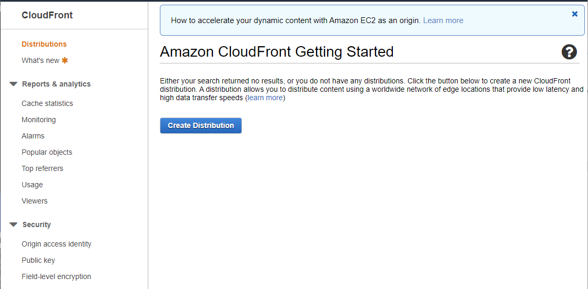
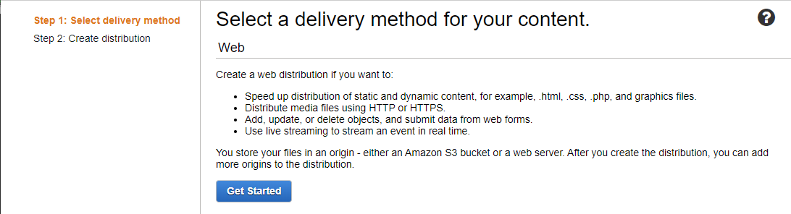
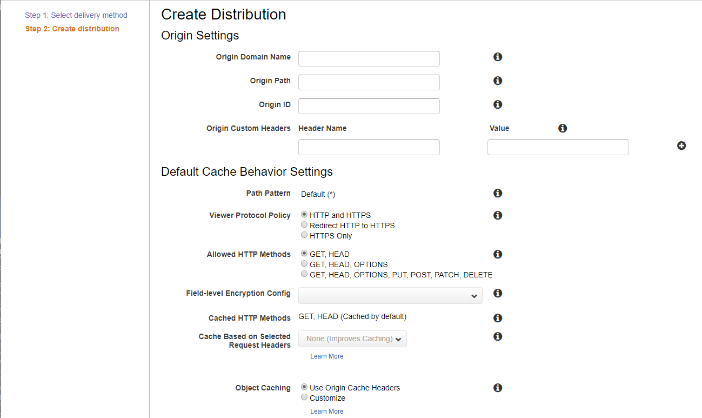
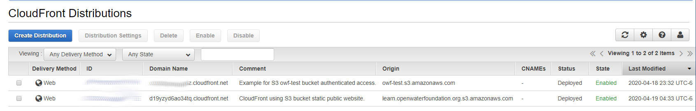
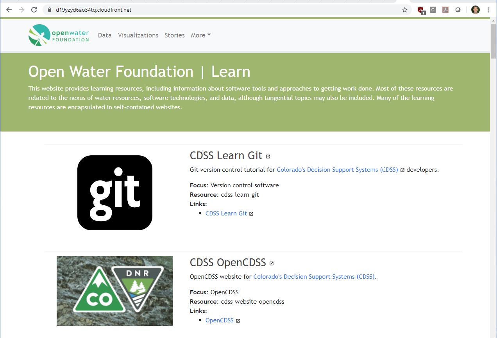

# AWS / CDN / CloudFront / Public Static Website Using S3 Bucket #

This documentation explains how to use AWS CloudFront and S3 to create a public static website
content delivery network (CDN).

* [Introduction](#introduction)
* [Step 1: Create a Public Static Website using S3](#step-1-create-a-public-static-website-using-s3)
* [Step 2: Create CloudFront Distribution](#step-2-create-cloudfront-distribution)
* [Step 3: Upload Content to S3 Bucket](#step-3-upload-content-to-s3-bucket)
* [Step 4: Test CloudFront Distribution](#step-4-test-cloudfront-distribution)
* [Step 5: Additional CloudFront Configuration](#step-5-additional-cloudfront-configuration)
* [Step 6: Define CNAME DNS Record](#step-6-define-cname-dns-record)
* [Step 7: Define SSL Certificate](#step-7-define-ssl-certificate)

---------------

## Introduction ##

This documentation was prepared on 2020-04-19.

This section describes how to to create a public static website using CloudFront
and content provided by a public static website using an S3 bucket.
This example will use the S3 bucket address and **not** the S3 public static website URL.

```
CloudFront
  CloudFront uses: S3
```

It is assumed that an AWS account and suitable user are available.

## Step 1: Create a Public Static Website using S3 ##

This example uses a public static website to provide the content.

See [Hosting a Public Static Website on S3](../../storage/s3/s3.md#hosting-a-public-static-website-on-s3)
for instructions about creating an S3 public static website.
For this example, the existing [learn.openwaterfoundation.org](http://learn.openwaterfoundation.org) website will be used.
This website and associated S3 bucket contain numerous "mini websites" with documentation for various topics.
Consequently, it will be possible to test functionality of the CloudFront website in various ways.

## Step 2: Create CloudFront Distribution ##

This documentation was updated 2022-01-11.

Access to CloudFront CDN websites are configured as "distributions".

Use the AWS Console for CloudFront - open in a separate tab so that S3 and CloudFront console
pages can be viewed at the same time.
If the first time, the page will be similar to the following.

**<p style="text-align: center;">

</p>**

**<p style="text-align: center;">
CloudFront Getting Started (<a href="../images/cloudfront-1.png">see full-size image</a>)
</p>**

Press the ***Create Distribution*** button.
A page similar to the following will be shown.

**<p style="text-align: center;">

</p>**

**<p style="text-align: center;">
CloudFront - Select Deliver Method (<a href="../images/cloudfront-2.png">see full-size image</a>)
</p>**

Press the ***Get Started*** button.  A page similar to the following will be shown,
with many configuration settings.

**<p style="text-align: center;">

</p>**

**<p style="text-align: center;">
CloudFront - Create Distribution (<a href="../images/cloudfront-3.png">see full-size image</a>)
</p>**

The following table lists configuration settings that were changed for this example.
The ***Set*** column has "Yes" if a value is set to other than the default.

**<p style="text-align: center;">
CloudFront Distribution Example Settings
</p>**

| **Setting** | **Set** | **Setting Value**&nbsp;&nbsp;&nbsp;&nbsp;&nbsp;&nbsp;&nbsp;&nbsp;&nbsp;&nbsp;&nbsp;&nbsp;&nbsp;&nbsp;&nbsp;&nbsp;&nbsp;&nbsp;&nbsp;&nbsp;&nbsp;&nbsp;&nbsp;&nbsp;&nbsp;&nbsp;&nbsp;&nbsp;&nbsp;&nbsp;&nbsp;&nbsp;&nbsp;&nbsp;&nbsp;&nbsp;&nbsp;&nbsp;&nbsp;&nbsp;&nbsp;&nbsp;&nbsp;&nbsp;&nbsp; | **Comments** |
| -- | -- | -- | -- |
| ========== | ===== | ======================== | **Origin Settings** |
| ***Origin Domain*** | Yes | `learn.`<br>`openwaterfoundation.`<br>`org.s3.amazonaws.com` | A list of available buckets and other sources for the AWS account will be provided.  In this case, pick the S3 bucket to use. **Important:**  if redirects are used on the website, such as from top-level folder to a subfolder, use a domain that follows the pattern `bucket-name.s3-website-region.amazonaws.com`.  See the [Troubleshooting](../../troubleshooting/troubleshooting.md) for more information.  An example is the `poudre.openwaterfoundation.org.s3-website-us-west-2.amazonaws.com` domain used with the [poudre.openwaterfoundation.org](https://poudre.openwaterfoundation.org) website. |
| ***Origin Name*** | Yes | This is the S3 website endpoint.  This will auto-populate when setting ***Origin Domain***. |
| ***Origin Path*** | | | Use the default. Can leave this blank.  If the content originates from a bucket folder, specify the folder name here, with leading `/` but no trailing `/`. |
| ***Origin ID*** | Yes | `s3-learn.`<br>`openwaterfoundation.org` | Use the default provided.  Enter a description for the origin.  An auto-generated value may be shown and is OK to use.  | 
| ***Restrict Bucket Access*** | | `No` | Use the default.  Users will be able to access S3 URLs (such as static public website URLs) in addition to new CloudFront URLs. |
| ***Origin Custom Headers*** | | | Use the default. Leave blank.  Custom headers might be useful for some websites. |
| ========== | ===== | ======================== | **Default Cache Behavior Settings** |
| ***Path Pattern*** | | `Default (*)` | Use the default. Can change after creating the distribution. |
| ***Viewer Protocol Policy*** | | `Redirect HTTP` to `HTTPS` | Use the default. This will allow users to access the website using `http://` or `https://` at the front of URLs. |
| ***Allowed HTTP Methods*** | ? | `GET, HEAD`| Use the default. Should be enough for read-only access, and can enable others if necessary, such if code depends on `OPTIONS`. |
| ***Field Level Encryption Config*** | | | Use the default. Not sure what this is. |
| ***Cached HTTP Methods*** | | `Get, Head (Cached by default)` | Use the default. Cannot change here (maybe can change after initial setup). |
| ***Cached Based on Selected Request Headers*** | | `None (Improves Caching)` | Use the default. |
| ***Object Caching*** | | `Use Origin Cache Headers` | Use the default.  May need to change later if web content caching is problematic, but content can bust the cache itself. |
| ***Minimum TTL*** | | `0` | Use the default.  May need to change if caching is problematic. |
| ***Maximum TTL*** | | `31536000` | Use the default.  May need to change if caching is problematic. |
| ***Default TTL*** | | `86400` | Use the default.  May need to change if caching is problematic. |
| ***Forward Cookies*** | | `None (Improves Caching)` | Use the default.  May need to change if caching is problematic. |
| ***Query String Formatting and Caching*** | | `None (Improves Caching)` | Use the default.  May need to change if caching is problematic. |
| ***Smooth Streaming*** | | `No` | Use the default.  May need to change if live event content is streamed. |
| ***Restrict View Access (Use Signed URLs or Signed Cookies)*** | | `No` | Use the default.  A public website has no view restrictions. |
| ***Compress Objects Automatically*** | ? | `No` | Use the default.  However, this may be a setting that is easy to change to improve performance.  See [Serving Compressed Files](https://docs.aws.amazon.com/AmazonCloudFront/latest/DeveloperGuide/ServingCompressedFiles.html). |
| ***Lambda Function Associations*** | | | Use the default - no Lambda function. |
| ========== | ===== | ======================== | **Distribution Settings** |
| ***Price Class*** | | `Use All Edge Locations (Best Performance)` | Use the default.  Alternate values can be chosen based on the likely users. |
| ***AWS WAF Web ACL*** | | `None` | Use the default. |
| ***Alternate Domain Names (CNAMEs)*** | ? | | Use default unless a ***SSL Certificate*** can be provided.  If used, specify the custom domain name that is configured in the organization's DNS (e.g., `owf-test.openwaterfoundation.org`). **However, this complicates SSL certificate configuration (see below).** |
| ***SSL Certificate*** | ? | `Default CloudFront Certificate (*.cloudfront.net)` | Use the default.  This will allow using CloudFront URL to access the page.  If the CNAME custom domain is used, then need to create a custom SSL certificate in IAM or ACM (see Steps 7-8 below).  CloudFront URL's can be used even if CNAME is defined. |
| ***Supported HTTP Versions*** | | `HTTP/2, HTTP/1.1, HTTP/1.0` | Use the default. |
| ***Default Root Object*** | Yes | `index.html` | Specify `index.html`, which is the standard landing page HTML file. |
| ***Logging*** | | `Off` | Use the default.  This can be turned on if interested in traffic. |
| ***Bucket for Logs*** | | | Use the default.  If ***Logging*** is turned on, a bucket can be specified. |
| ***Log Prefix*** | | | Use the default.  If ***Logging*** is turned on, a prefix can be specified. |
| ***Cookie Logging*** | | | Use the default.  This appears to be disabled? |
| ***Enable IPv6*** | | Selected | Use the default.  If signed URLs or signed cookes are used then need to follow additional instructions by following help link. |
| ***Comment*** | Yes | `CloudFront using S3 bucket static public website.` | Enter a relevant comment to describe the distribution. |
| ***Distribution State*** | | `Enabled`. | Use the default. The distribution can be disabled later if necessary. |

Press the ***Create Distribution*** button.

The distribution should be listed along with others if any have been previously created.

**<p style="text-align: center;">

</p>**

**<p style="text-align: center;">
CloudFront Distribution List (<a href="../images/cloudfront-public-s3-bucket-1.png">see full-size image</a>)
</p>**

## Step 3: Upload Content to S3 Bucket ##

Content can be uploaded to the S3 bucket using AWS Console for S3
or command line interface.
Because this example uses the existing `learn.openwaterfoundation.org` website,
no additional content needs to be uploaded.

## Step 4: Test CloudFront Distribution ##

Test the CloudFront website using the URL indicated under the ***Domain Name*** column in the ***CloudFront
Distributions*** list.  This is an ugly URL but will work until CNAME and SSL are defined.

**<p style="text-align: center;">

</p>**

**<p style="text-align: center;">
S3 Bucket Public Static Website Accessed via CloudFront (<a href="../images/cloudfront-public-s3-bucket-2.png">see full-size image</a>)
</p>**

## Step 5: Additional CloudFront Configuration ##

Additional CloudFront configuration may be required.  See:

* [CloudFront Distribution Configuration](cloudfront.md#cloudfront-distribution-configuration)
* [Additional CloudFront Website Configuration](cloudfront.md#additional-cloudfront-website-configuration)

In particular, a known issue with CloudFront is that URLs that end in `/` do not default to `index.html`.
Only the root level default content can be set to `index.html`.
For example, trying to use the URL `https://d19yzyd6ao34tq.cloudfront.net/owf-learn-aws/` displays an error similar to the following:

```
<Error>
    <Code>AccessDenied</Code>
    <Message>Access Denied</Message>
    <RequestId>F2B3500821FBA192</RequestId>
    <HostId>
        HiUIKvs8IhrJ9QtzOp8/TZU66DrKML6UFSXJ7g9iuTh/82Njy79rCZgtFqmqO1K6c1tMqzawSLM=
    </HostId>
</Error>
```

However, accessing the URL `https://d19yzyd6ao34tq.cloudfront.net/owf-learn-aws/index.html` works OK.
For this example website, much of the content is individual static websites created by MkDocs software,
which relies on URLs ending in `/` and assumes that `index.html` files exist in those folders.
Therefore, basic navigation of such sites will break unless `index.html` is included,
which results in ugly URLs and is likely impossible for many cases.
See the following to fix this issue:

* [AWS / CDN / CloudFront / Set `index.html` as the Default for all Folders](cloudfront.md#set-indexhtml-as-the-default-for-all-folders)

## Step 6: Define CNAME DNS Record ##

If custom domain will be used for URLs rather than CloudFront URLs, a CNAME DNS record must be defined.
The CNAME domain is specified as the ***Alternate Domain Names (CNAMEs)*** setting when configuring the CloudFront distribution.

For this example, no CNAME record is defined for CloudFront domain because the `learn.openwaterfoundation.org` website is served
OK directly from S3 as a public static website.
This may change if `https` or better performance is needed.

## Step 7: Define SSL Certificate ##

If `https` is used, a SSL certificate must be created and uploaded.
The SSL certificate is specified using as the ***SSL Certificate*** setting when configuring the CloudFront distribution.

For this example, no SSL certificate is defined because `http` access is OK for a public static website.
This may be changed in the future.
