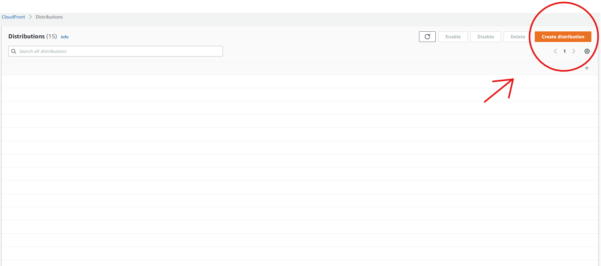
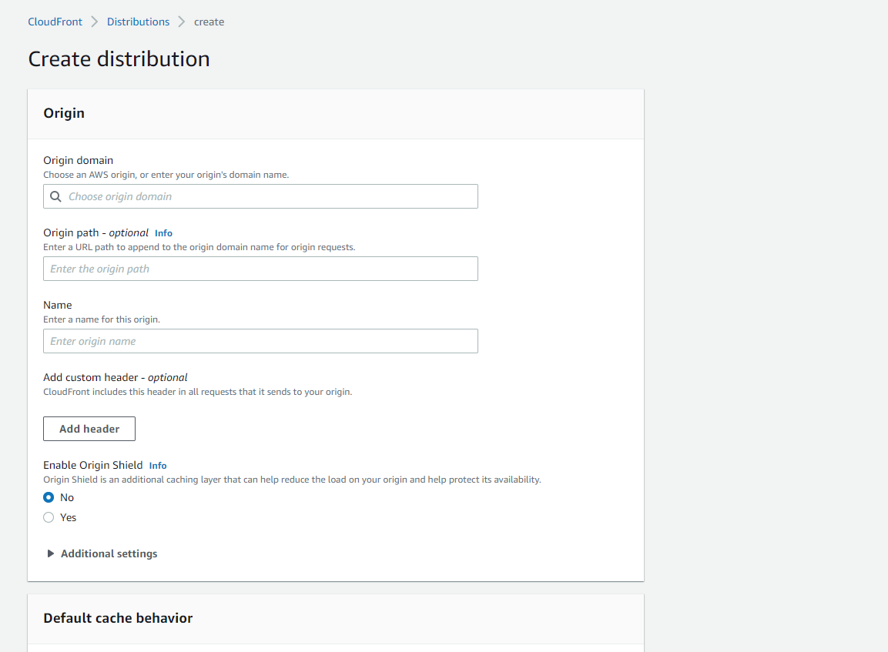
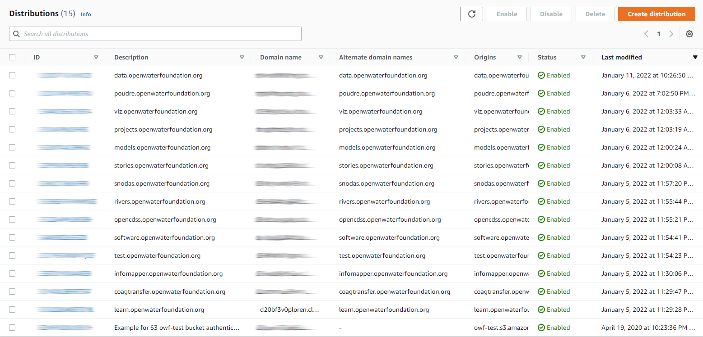
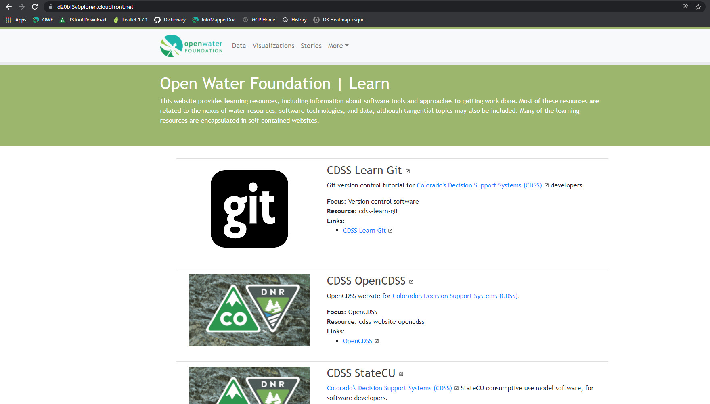
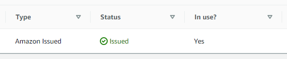

# AWS / CDN / CloudFront / Public Static Website Using S3 Bucket #

This documentation explains how to use AWS CloudFront and S3 to create a public static website
content delivery network (CDN).

* [Introduction](#introduction)
* [Step 1: Create a Public Static Website using S3](#step-1-create-a-public-static-website-using-s3)
* [Step 2: Create CloudFront Distribution](#step-2-create-cloudfront-distribution)
* [Step 3: Upload Content to S3 Bucket](#step-3-upload-content-to-s3-bucket)
* [Step 4: Test CloudFront Distribution](#step-4-test-cloudfront-distribution)
* [Step 5: Additional CloudFront Configuration](#step-5-additional-cloudfront-configuration)
* [Step 6: Define CNAME DNS Record](#step-6-define-cname-dns-record)
* [Step 7: Adding Certificate to Distribution](#adding-certificate-to-distribution)
* [Requesting a SSL Certificate](#requesting-a-ssl-certificate)

---------------

## Introduction ##

This documentation was prepared on 2022-01-20.

This section describes how to to create a public static website using CloudFront
and content provided by a public static website using an S3 bucket.
This example will use the S3 public static website URL and **not** the S3 bucket address.

```
CloudFront
  CloudFront uses: S3
```

It is assumed that an AWS account and suitable user are available with the correct permissions.

## Step 1: Create a Public Static Website using S3 ##

This example uses a public static website to provide the content.

See [Hosting a Public Static Website on S3](../../storage/s3/s3.md#hosting-a-public-static-website-on-s3)
for instructions about creating an S3 public static website.
This website and associated S3 bucket contain numerous "mini websites" with documentation for various topics.
Consequently, it will be possible to test functionality of the CloudFront website in various ways.

## Step 2: Create CloudFront Distribution ##

Access to CloudFront CDN websites are configured as "distributions".

Use the AWS Console for CloudFront - open in a separate tab so that S3 and CloudFront console
pages can be viewed at the same time.
If the first time, the page will be similar to the following. Note that the new UI displays the
**Create Distribution** button in the upper right in orange.

**<p style="text-align: center;">

</p>**

**<p style="text-align: center;">
CloudFront Getting Started (<a href="../images/cloudfront-create-distribution-button.png">see full-size image</a>)
</p>**

A page similar to the following will be shown, with many configuration settings.

**<p style="text-align: center;">

</p>**

**<p style="text-align: center;">
CloudFront - Create Distribution (<a href="../images/cloudfront-create-distribution.png">see full-size image</a>)
</p>**

The following table lists configuration settings that were changed for this example.

**<p style="text-align: center;">
CloudFront Distribution Example Settings
</p>**

| **Setting** | **Set** | **Setting Value** | **Comments** |
| ---- | ---- | ---- | ---- |
| ======== | ==== | ======================== | **Origin Settings** |
| **Origin domain** | Yes | `learn.openwaterfoundation.org.s3-website-us-west-2.amazonaws.com` | This is a very important field. AWS will show a dropdown of available domains, but do **not** choose from the list. To be able to perform redirects using S3 and CloudFront, a custom origin must be used. Provide the S3 bucket static website endpoint, which will look something like bucket-name.s3-website-region.amazonaws.com. More information can be found in the [Troubleshooting](../../troubleshooting/troubleshooting.md#general-aws-help) section. |
| **Origin name** | Yes | `learn.openwaterfoundation.org.s3-website-us-west-2.amazonaws.com` | Also a very important field. Similar to the the **Origin domain** above, the Origin name field needs to be the S3 website endpoint. This will auto-populate when filling out the **Origin domain** field, and nothing else needs to be done. |
| **Enable Origin Shield** | No | `No` | CloudFront adds an additional layer of caching that helps minimize the origin's load and improve performance. Additional charges are incurred for using Origin Shield. |
| ======== | ==== | ======================== | **Additional Settings** |
| **Connection attempts** | No | `3` | The number of times CloudFront attempts to connect to the origin. Use the default. |
| **Connection timeout** | No | `10` | The number of seconds that CloudFront waits for a response from the origin. Use the default. |
| ======== | ==== | ======================== | **Default cache behavior** |
| **Compress objects automatically** | No | `Yes` | CloudFront can automatically compress certain files that it receives from the origin before delivering them to the viewer. Use the default. |
| **Restrict viewer access** | No | `No` | Viewers must use CloudFront signed URLs or signed cookies to access your content. |
| ======== | ==== | ======================== | **Cache key and origin requests** |
| **Cache policy and origin request policy (recommended)** | No |  | This is the default, and the two following dropdowns under `Legacy cache settings` are meant for creating each policy. It seems like they are part of the legacy radio button, when in fact they belong to the default cache policy choice. This is confusing, and more details are explained in the [Troubleshooting](../../troubleshooting/troubleshooting.md#cache-key-and-origin-requests-help) section. |
| **Cache policy** | No | `CachingOptimized` (Recommended for S3 origins) | Click the refresh button next to the dropdown to display commonly used. This will be the default. Not sure exactly what is does. |
| **Origin request policy** | No |  | Default is none. |
| **Response headers policy** | No |  | Optional, default is to not use. |
| **Enable real-time logs** | No | `No` | Get information about the requests that your distribution receives, delivered within seconds of CloudFront receiving them. Use the default. |
| ======== | ==== | ======================== | **Settings** |
| **Price class** | Yes | `Use only North America and Europe` | The price class associated with the maximum price paid. Default is `Use all edge locations (best performance)`. For the current domain, which is accessed in the U.S., worldwide speed is not necessary. |
| **Alternate domain name (CNAME)** | Yes | `learn.openwaterfoundation.org` | The custom domain names that used in URLs for the files served by this distribution. Test could be substituted with another subdomain if desired. **This can only be done after the custom SSL certificate has been requested and validated. Skip on distribution creation.** |
| **Custom SSL certificate** | Yes | Domain name given to the certificate, e.g. `learn.openwaterfoundation.org` or `*.openwaterfoundation.org` | Refresh the certificate list, then choose it for the distribution. **This is done separately from the distribution creation. Click the Request Certificate link to begin. See the [Requesting a SSL Certificate](#requesting-a-ssl-certificate) section below for help.** |

Press the ***Create Distribution*** button.

The distribution should be listed along with others if any have been previously created.

**<p style="text-align: center;">

</p>**

**<p style="text-align: center;">
CloudFront Distribution List (<a href="../images/cloudfront-list-distributions.png">see full-size image</a>)
</p>**

[Requesting the SSL Certificate](#requesting-a-ssl-certificate) can now be done.

## Step 3: Upload Content to S3 Bucket ##

Content can be uploaded to the S3 bucket using AWS Console for S3
or command line interface.

## Step 4: Test CloudFront Distribution ##

Test the CloudFront website using the URL indicated under the ***Domain Name*** column in the ***CloudFront
Distributions*** list.  This is an ugly URL but will work until CNAME and SSL are defined.

**<p style="text-align: center;">

</p>**

**<p style="text-align: center;">
S3 Bucket Public Static Website Accessed via CloudFront (<a href="../images/cloudfront-learn-alternate.png">see full-size image</a>)
</p>**

## Step 5: Additional CloudFront Configuration ##

Additional CloudFront configuration may be required.  See:

* [CloudFront Distribution Configuration](cloudfront.md#cloudfront-distribution-configuration)
* [Additional CloudFront Website Configuration](cloudfront.md#additional-cloudfront-website-configuration)

In particular, a known issue with CloudFront is that URLs that end in `/` do not default to `index.html`.
Only the root level default content can be set to `index.html`.
For example, trying to use the URL `https://d20bf3v0ploren.cloudfront.net/owf-learn-aws/` displays an error similar to the following:

```
<Error>
    <Code>AccessDenied</Code>
    <Message>Access Denied</Message>
    <RequestId>F2B3500821FBA192</RequestId>
    <HostId>
        HiUIKvs8IhrJ9QtzOp8/TZU66DrKML6UFSXJ7g9iuTh/82Njy79rCZgtFqmqO1K6c1tMqzawSLM=
    </HostId>
</Error>
```

However, accessing the URL `https://d20bf3v0ploren.cloudfront.net/owf-learn-aws/index.html` works OK.
For this example website, much of the content is individual static websites created by MkDocs software,
which relies on URLs ending in `/` and assumes that `index.html` files exist in those folders.
Therefore, basic navigation of such sites will break unless `index.html` is included,
which results in ugly URLs and is likely impossible for many cases.
See the following to fix this issue:

* [AWS / CDN / CloudFront / Set `index.html` as the Default for all Folders](cloudfront.md#set-indexhtml-as-the-default-for-all-folders)

## Step 6: Define CNAME DNS Record ##

The requested certificate status for the CloudFront distribution
should be pending validation at this point. It is waiting to be added in
a provider (Bluehost in this case) so it can be verified. The following
will add both the distribution and certificate data to Bluehost.

### Distribution data ###

On the distribution detail page, copy the `Distribution domain name` to the
clipboard. Change what the appropriate CNAME Host Record points to by replacing
the old `Points To` section to the copied distribution domain name.

| **CNAME** |  |
| ---- | ---- |
| **Host Record** | **Points To** | **TTL** |
| test | abcdef01234.cloudfront.net |

### Certificate Data ###

The certificate data can be found in the AWS Certificate Manager. Click on **List Certificates**
on the left sidebar, and choose the desired certificate. On the detail page, the `CNAME name`
and `CNAME value` will be used. Similar to the distribution data, the name will be used as the
CNAME `Host Record`, and the value will be used as the `Points To` field on Bluehost.

| **CNAME** |  |
| ---- | ---- |
| **Host Record** | **Points To** | **TTL** |
| _345334e3f4aaf30 | _5323345e32a4689f765a76.alsdfxv.acm-validations.aws |

The certificate should be validated after 5 minutes. Not sure how long it could
take.

## Step 7: Adding Certificate to Distribution ##

Confirm the certificate has been successfully issued on the **List Certificates**
page on AWS Certificate Manager.

**<p style="text-align: center;">

</p>**

Now that the certificate has be issued, back on the distribution General page,
click `Edit`. The alternate domain
name and custom SSL certificate can now be added. Enter in the alternate domain
name (test.openwaterfoundation.org for example), then click the refresh
button next to the certificate field. Clicking the dropdown will show the one
verified and validated certificate. Add it, and save the distribution.

Allow 5-10 minutes for the new CloudFront distribution to be deployed, and
HTTPS (and HTTP to HTTPS redirection) should be enabled.

## Requesting a SSL Certificate ##

From the **List Certificate** section on AWS Certificate Manager, click on the orange
**Request** button in the top right.

* Confirm the `Request a public certificate` radio button is selected and click
Next.

The following table describes the few choices when creating a request for a
certificate.

| **Setting** | **Set** | **Setting Value** | **Comments** |
| ---- | ---- | ---- | ---- |
| ======== | ==== | ======================== | **Domain names** |
| **Fully qualified domain name** | Yes | `test.openwaterfoundation.org` or `*.openwaterfoundation.org` to cover multiple subdomains. | The FQDN is the unique name of an organization or individual on the Internet. It must end in a top-level domain extension such as .com or .org. |
| ======== | ==== | ======================== | **Select validation method** |
| **DNS validation - recommended** | No |  | Choose this if authorized to modify the DNS configuration for the domains in the certificate request. |
| ======== | ==== | ======================== | **Tags** |
| **Tag key**<br>**Tag value** | No |  | Manage different certificates by assigning metadata to each resource in the form of tags. This is optional, and user must have the correct permissions. |