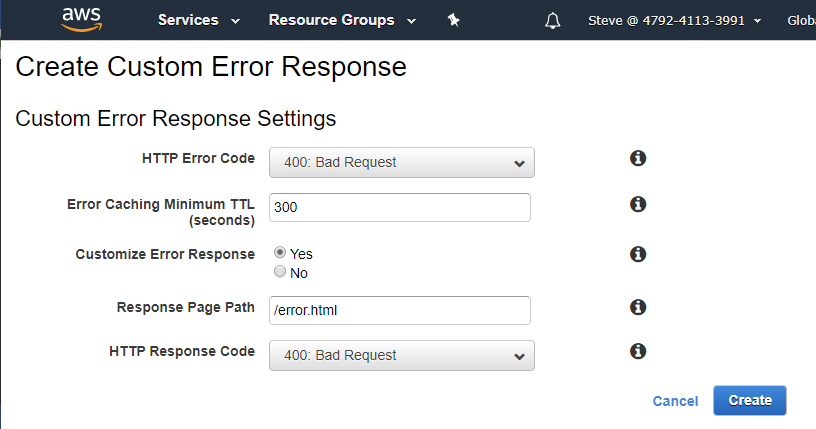

# AWS / CloudFront #

This documentation explains how to use AWS CloudFront to create a private,
authenticated content delivery network (CDN).

* [Introduction](#introduction)
* [Authenticated website using a private S3 bucket and AWS Lambda Function](#authenticated-website-using-a-private-s3-bucket-and-lambda-function)
* [Authenticated website using a private S3 bucket and Signed URLs and Signed Cookies](#authenticated-website-using-a-private-s3-bucket-and-signed-urls-and-signed-cookies)
* [CloudFront Distribution Configuration](#cloudfront-distribution-configuration)

---------------

## Introduction ##

CloudFront is used to configure and maintain a content delivery network (CDN).
For example, a read-only, authenticated website can be implemented that provides
access to [S3 storage](../s3/s3.md) files.
The S3 files can be managed using command line interface and other tools.
A CDN front end to the files is helpful when the amount of files is large and continues to grow over time.

The following are cases where CloudFront could be used.
**Currently this documentation focuses on experients with CloudFront, not authoritative documentation.
If experiments work, then this documentation will evolve into a reference to streamline future configurations.**
The following are questions to answer, with the primary goal being to provide an authenticated `https` website using
S3 bucket for content.

1. How to use CloudFront to provide authentication and `https` for an S3 bucket that is otherwise private,
using a general login.
2. How to use CloudFront to provide authentication and `https` for an S3 bucket that is otherwise private,
using multiple logins, with access granted to specific folders in the bucket.

In all cases, it is desirable that:

* DNS alias maps to a "nice" URL
* the website behaves similar to S3 static website, with ability to automate uploads and access the site
via web browser and programatically via command line interface (CLI)

## Authenticated website using a private S3 bucket and Lambda Function ##

Authentication for a Cloudfront distribution can be implemented using a Lambda function.
This simple approach is appropriate in cases where one or a small number of users needs
to access content.

* See the [AWS / Cloudfront / Authentication Using Lambda Function](auth-lambda.md) documentation.

## Authenticated website using a private S3 bucket and Signed URLs and Signed Cookies ##

This documentation needs to be completed.  Using a Lanmbda function for authentication was the first example to be documented.

## CloudFront Distribution Configuration ##

Additional configuration is often needed after a distribution has been created,
as described below.

### Custom Error Response ###

The initial setup did not prompt for an error page.  To define, edit the distribution properties and then ***Error Pages***.
Use the ***Create Custom Error Response*** button to edit.
The HTTP error codes generated by CloudFront can be mapped to a specifed error page.
The following indicates that a general error page should be used.

**

**

**

CloudFront Custom Error Response Setting (<a href="../images/cloudfront-error-page.png">see full-size image</a>)

**
