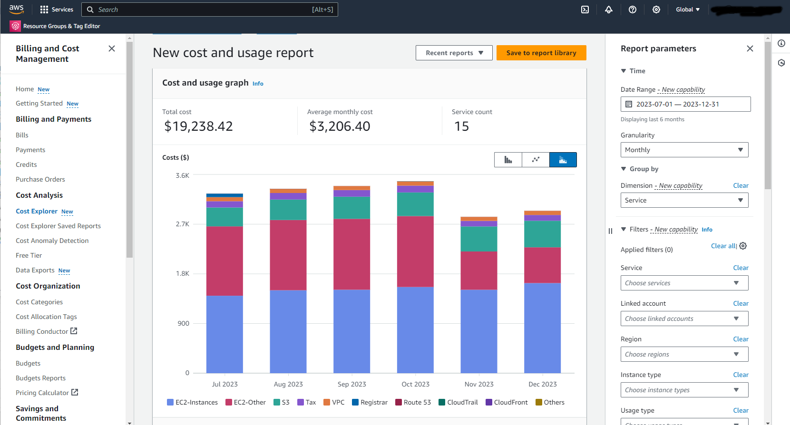
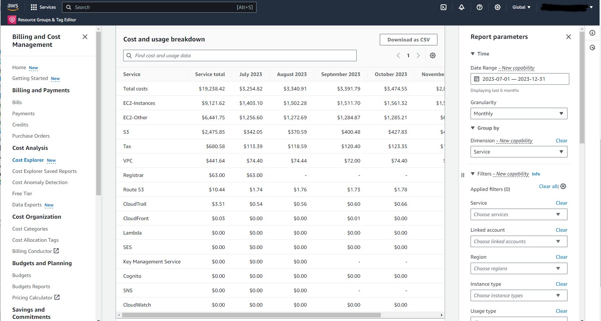
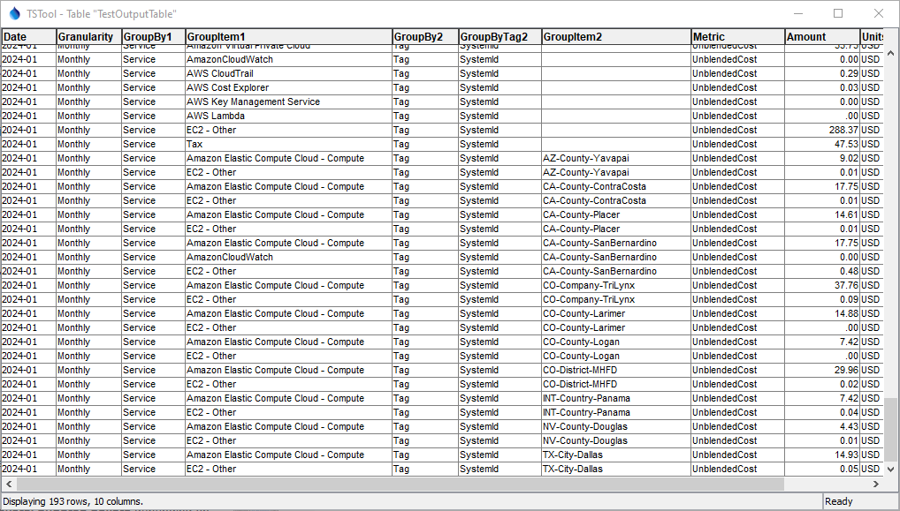

# AWS / Billing and Cost Management / Cost Explorer #

This documentation provides an overview of the AWS ***Billing and Cost Management / Cost Explorer***.

*   [Introduction](#introduction)
*   [Service Costs](#service-costs)
*   [Report Parameters](#report-parameters)
*   [Using the API to Overcome Website Limitations](#using-the-api-to-overcome-website-limitations)

---------------

## Introduction ##

The AWS ***Billing and Cost Management / Cost Explorer*** is an interactive tool that can be used to query cost data.
The following default view shows monthly costs grouped by services.
A graph and table are shown.
Note that the AWS region (upper right of window) is ***Global***,
which corresponds to the `aws-global` region.
Billing and Cost Management data are global to AWS,
even though specific services are associated with a region. 

**

**

**

Cost Explorer Graph (<a href="../cost-explorer-graph.png">see full-size image</a>)

**

**

**

**

Cost Explorer Table (<a href="../cost-explorer-table.png">see full-size image</a>)

**

## Service Costs ##

The ***Cost Explorer***, when grouping costs by services, will list all services that have been used in the requested period.
Costs are recorded as database records based on the service and are queried by the ***Cost Explorer***.
For example, S3 storage usage is recorded as the amount of storage on a date
whereas the cost for CloudFront invalidations is based on the number of invalidations.
The pricing documentation for each service describes the pricing model.
Some services are always completely free,
typically because they have zero or low cost to Amazon and lead to the use of other services, which have a cost.
Services typically have a tiered rate structure, with low-volume use being free,
a tier-1 price, and costs typically decrease as more of a services is used.

The table in the previous section illustrates the relative cost of services.
It is important to understand the highest-cost services,
which will impact an organization the most.

The following table summarizes services from high to low cost using the example in the previous section,
with links to the pricing documentation.
The API Service column shows the service name when using the Cost Explorer API.

**

AWS Service in Order of High to Low Cost

**

| **Cost Explorer Service** | **API Service** | **Description** |
| -- | -- | -- |
| Total costs | | Total cost of all services, which should match the invoice total for past invoices. |
| [EC2-Instances](https://aws.amazon.com/ec2/pricing/) | `Amazon Elastic Compute Cloud - Compute` | Virtual machine in the cloud. |
| [EC2-Other](https://aws.amazon.com/ebs/pricing/) | `EC2-Other` | Other costs including the EC2 instance hard drive storage, Amazon Block Store (EBS). |
| [S3](https://aws.amazon.com/s3/pricing/) | `Amazon Simple Storage Service` | Cloud storage. |
| Tax | `Tax` | Taxes paid by Amazon to the appropriate taxing authority.  See the [AWS Tax Help](https://aws.amazon.com/tax-help/united-states/) documentation. |
| [VPC](https://aws.amazon.com/vpc/pricing/) | `Amazon Virtual Private Cloud` | Used with EC2 for additional security. |
| Registrar | `Amazon Registrar` | Domain name service (DNS) registration fee. |
| [Route 53](https://aws.amazon.com/route53/pricing/) | `Amazon Route 53` | Hosted DNS service and queries. |
| [CloudTrail](https://aws.amazon.com/cloudtrail/pricing/) | `Amazon CloudTrail` | Logging for services, for example to debug Lambda. |
| [CloudFront](https://aws.amazon.com/cloudfront/pricing/) | `Amazon CloudFront` | Content delivery network (CDN) for cloud-hosted content. |
| [Lambda](https://aws.amazon.com/lambda/pricing/) | `AWS Lambda` | Serverless computing. |
| [SES](https://aws.amazon.com/ses/pricing/) | `Amazon Simple Email Service` | Email service. |
| [Key Management Service](https://aws.amazon.com/ses/pricing/) | `AWS Key Management Service` | Used with SSH keys. |
| [Cognito](https://aws.amazon.com/cognito/pricing/) | `Amazon Cognito` | Manage users for web applications. |
| [SNS](https://aws.amazon.com/sns/pricing/) | `Amazon Simple Notification Service` | Application to application (A2A) and application-to-person (A2P, e.g., text message) notifications. |
| [CloudWatch](https://aws.amazon.com/cloudwatch/pricing/) | `AmazonCloudWatch` | Monitor metrics for cloud services. |

## Report Parameters ##

The ***Cost Explorer*** queries the database of costs and creates output information products.
The ***Report Parameters*** on the right side of the ***Cost Explorer*** allow the cost data to be processed into desired output reports.

*   ***Date Range*** - specify the start and end dates to process data:
    +   The calendar controls can behave weirdly so entering the dates in the text fields may be required.
    +   The date range is limited by the ***Granularity***:
        -    By default up to 14 months of history (to allow processing a year of data).
        -    Can enable up to 38 months of historicaly data (see
             [Configuring multi-year and granular data](https://docs.aws.amazon.com/cost-management/latest/userguide/ce-configuring-data.html)
             and note that there may be a delay in enabling historical data, and access to the data will revert if not used).
*   ***Granularity*** - specify the interval for output aggregations:
    +   Monthly allows the longest period to be processed.
    +   Daily and hourly data are only available up to 14 days.
    +   Using the `Unblended Costs` (the default) shows actual invoiced costs.
    +   Reserved instance and savings plan costs are applied on the first day of a month.
    +   Some charges occur daily, other cumulative costs may occur at the end of the month.
*   ***Group by*** - used to group the output (graph legend and first column of the tabular output):
    +   Can only group by one ***Dimension***.
    +   If the ***Tag*** is selected, must select a single cost allocation tag,
        and all untagged items are lumped together (e.g., EC2 instances that do not have a tag).
*   ***Filters*** - used to limit the output to a specific property (e.g., service or tag)
*   ***Advanced Options*** - used to control the cost metric being output
    +   `Unblended costs` is the default and will match invoice items
    +   See the [Overview / Service costs](../overview.md) section for general cost information.

## Using the API to Overcome Website Limitations ##

The Cost Explorer API provides access to additional functionality that can be used to understand costs.
For example, see the [Java API](https://sdk.amazonaws.com/java/api/latest/software/amazon/awssdk/services/costexplorer/package-summary.html),
which is used with the [TSTool AWS Plugin](https://software.openwaterfoundation.org/tstool-aws-plugin)
software provided by the Open Water Foundation.

One benefit of the API is that more complex queries can be processed,
including multiple ***Group by*** parameters.
For example, the following image shows cost data that groups by service and a tag with key `SystemId` to show costs for deployed cloud systems.
The data can then be processed into time series for visualization and analysis.
It is often desirable to use cost allocation tags to allow granular representation of costs,
which can then be totaled as needed.

**

**

**

Example API Output using TSTool AWS Plugin (<a href="../tstool-example-table.png">see full-size image</a>)

**
