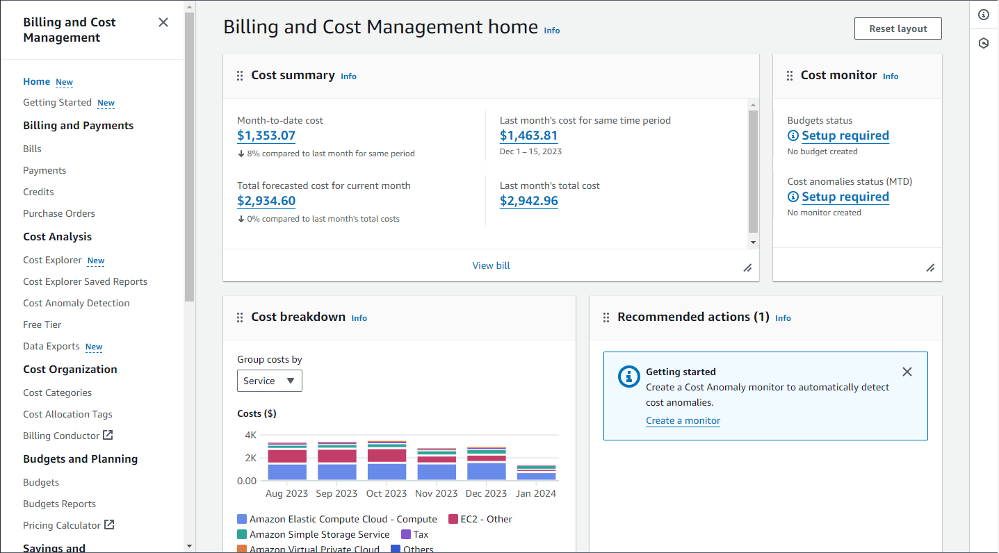

# AWS / Billing and Cost Management / Overview #

This documentation provides an overview of AWS costs.

*   [Introduction](#introduction)
*   [Billing and Cost Management Console](#billing-and-cost-management-console)
*   [Cost Explorer](#cost-explorer)
*   [Cost Allocation Tags](#cost-allocation-tags)

---------------

## Introduction ##

AWS costs are, on the one hand, often minimal when compared to alternatives,
but can balloon if not managed.

If AWS is used only to support an organizations operations,
then the main considerations is minimizing the costs for those purposes.
If AWS is used to provide services for others,
with costs invoiced, then it is important to understand all costs so that they can be recovered.

Although AWS provides ways to track costs, it can be complicated.
This documentation provides an introduction to AWS billing and management tools
as applied to operations for a small organization.

See also:

*   [Understanding your AWS Cost Datasets: A Cheat Sheet](https://aws.amazon.com/blogs/aws-cloud-financial-management/understanding-your-aws-cost-datasets-a-cheat-sheet/)

## Billing and Cost Management Console ##

The AWS ***Billing and Cost Management*** console provides tools for viewing billing and payments to Amazon (monthly invoices)
and tools to view historical, current, and forecasted costs.

**

**

**

Billing and Management Console (<a href="../billing-and-cost-management.png">see full-size image</a>)

**

The console can be used to access useful information including past invoices as PDFs and to gain an understanding of current costs
and trends.

## Cost Explorer ##

The ***Cost Explorer*** web site is available as a link on the ***Billing and Management*** console and provides a way to
interactively query the AWS cost data.

See the [Cost Explorer](cost-explorer/cost-explorer.md) documentation.

## Cost Allocation Tags ##

AWS costs are tracked using a number of properties, including the service, region, availability zone, etc.
The [Cost Explorer](cost-explorer/cost-explorer.md) can be used to summarize costs by grouping for one or more of these properties.
However, for granular cost information, it is often necessary to define cost allocation tags on services,
for example a system identifier that can be used in invoicing.

See the [Cost Allocation Tags](tags/tags.md) documentation.
