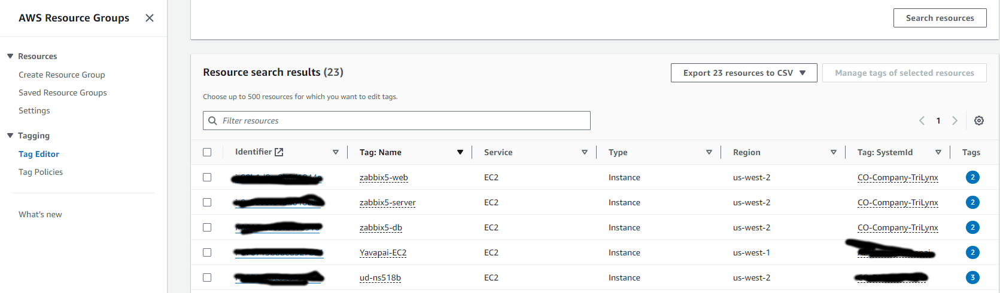

# AWS / Billing and Cost Management / Cost Allocation Tags #

This documentation provides an overview of the AWS ***Billing and Cost Management / Cost Allocation Tags***.

*   [Introduction](#introduction)
*   [Services with Tags](#services-with-tags)
*   [Activating Cost Allocation Tags](#activating-cost-allocation-tags)
*   [Tag Editor](#tag-editor)
     +   [Listing Services that Support Tags](#listing-services-that-support-tags)

---------------

## Introduction ##

AWS service costs are tracked using properties for each service,
including service name, region, availability zone, etc.
These properties allow for a course understanding of costs.

However, more granular detail is often needed, for example to understand the costs for a specific EC2 instance.
This can be accomplished using "cost allocation tags".

## Services with Tags ##

Some AWS services provide a ***Tag*** feature, which allows defining `Key=Value` pairs.
The following table lists common services that can have tags defined.
Once a tag is defined, it may take a day or more for the tag to be shown in other tools and the tag will not be
added to historical cost data.

**

AWS Services with Tags

**

| **Type** | **Service** | **Comments** |
| -- | -- | -- |
| **Compute** | EC2 | Instances, volumes, snapshots, AMIs.  The tag with key of `Name` is typically set to the instance name. |
| | ECS | Clusters, tasks, services. |
| | Lambda | | Functions. |
| | Elastic Beanstock | Environments. |
| **Storage** | S3 | Buckets, objects, but not folders. |
| | EBS | EC2 volumes, snapshots. |
| | Glacier | Vaults. |
| **Database** | RDS | Instances, snapshots, read replicas. |
| | DynamoDB | Tables. |
| **Networking** | VPC | VPCs, subnets, route tables. |
| | Route53 | Hosted Zones, Records. |
| **Application Integration** | SNS | Topics. |
| | SQS | Queues. |
| **Management and Governance** | CloudFormation | Stacks. |
| | CloudTrail | Trails, insights. |
| | Config | Rules, aggregations. |
| | Organizations | Accounts, organization units. |
| **Monitoring and Analytics** | CloudWatch | Alarms, dashboards, log groups. |

## Activating Cost Allocation Tags ##

Once a tag is defined, use the ***Billing and Cost Managerment / Cost Allocation Tags*** link to manage tags for billing.
It may take a while (day or more) to see the tag listed.
Not all tags need to be activated for cost tracking.
For example, in the following, `Name` is the name of EC2 instances and `SystemId` indicates a client to be invoiced.

**

**

**

Cost Allocation Tags (<a href="../cost-allocation-tags.png">see full-size image</a>)

**

## Tag Editor ##

The ***Resource Groups and Tag Editor*** tool can be used to search and edit tags.
See the [Resource Groups and Tag Editor](https://us-east-2.console.aws.amazon.com/resource-groups/home?region=us-east-2) link,
which may be shown as a tool at the top of the AWS console, as shown below.

**

**

**

Resource Groups & Tag Editor Link on the AWS Console (<a href="../tag-editor-link.png">see full-size image</a>)

**

### Listing Services that Support Tags ###

It is useful to understand which resources in an account can be tagged (and which have no tags)
so that costs can be understood and properly handled.

1.  Use the ***Tagging / Tag Editor*** to link to display the tag editor.
2.  Select ***Regions***:
    *   For example select `All regions` to review all resources.
3.  Select ***Resource types***:
    *   For example select `All supported resource types` to review all resources.
4.  Select ***Tags***:
    *   Leave blank to list all resources that could be tagged.
5.  Select ***Search resources*** to list matching data:
    *   The results will show `(not tagged)` if no tags have been defined.

Note that the tag key `Name` is used by default in the second column to help understand the resource.
Therefore, every resource should either have a default `Name` (assigned by AWS when the resource is created)
or `Name` should be defined after the resource is created.
The name should be unique within the type of service, for example the EC2 instance name, S3 bucket name, etc.

**

**

**

Tag Editor Search Results (<a href="../tag-editor-search-results.png">see full-size image</a>)

**
