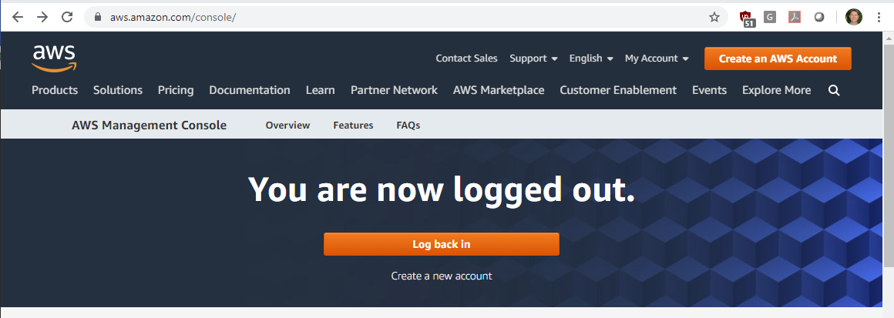
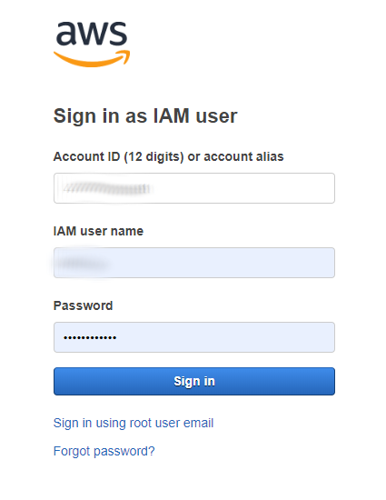

# AWS / Login #

This documentation provides information about logging into AWS.

*   [Introduction](#introduction)
*   [Login to AWS Console Web Application](#login-to-aws-console-web-application)
*   [CLI User Authentication](#cli-user-authentication)

------------

## Introduction ##

There are multiple reasons to login to to AWS services and different ways to authenticate as a user, including:

*   Logging into AWS Console root account, for example to change which services are being used, payment method, etc.
    **This approach should be used infrequently by a small number of people.**
*   Logging in to AWS Console to manage various services, either as an administrator or other type of user.
    This approach is common in order to use the AWS Console for ad hoc tasks and general management of services and resources.
*   Logging into cloud virtual machines such as [EC2](../vm/ec2/ec2.md),
    for example to perform system administrator or other tasks on the computer.
    This appproach is typical when an organization is supporting "heavy computing" on custom-configured virtual machines.
*   Logging in via command line interface ([CLI](../cli/cli.md)) for automated processing.
    This approach is common for tasks such uploading and downloading data files on [S3](../storage/s3/s3.md).

Additional information about specific cases is provided in the following sections.

## Login to AWS Console Web Application ##

Login to the AWS Console using the following link:

*   [AWS Console](https://aws.amazon.com/console/)

The webpage will be similar to the following:

**

**

**

AWS Console Prior to Logging In (<a href="../images/aws-console-0.png">see full-size image</a>)

**

In this case the user is logged out of AWS.
Press the ***Log back in*** button to log in.

If the user has previously logged in, then the website may remember information about the user's login and
display a page similar to the following.

**

**

**

AWS Console Login (<a href="../images/aws-console-login.png">see full-size image</a>)

**

In the above, the ***IAM user name*** is the user name within the AWS organization account
that has been assigned by the administrator.
This is the login that grants specific user permissions and should typically be used rather than root account.

See also:

*   [How Users Sign in to Your Account](https://docs.aws.amazon.com/IAM/latest/UserGuide/getting-started_how-users-sign-in.html)

The login page also includes a link at the bottom to login as root, should that be necessary to perform administrative actions
that cannot be accomplished as another user.

## CLI User Authentication ##

The [AWS CLI (command line interface)](../cli/cli.md) software provides a command line interface to access specific AWS services.
For example, CLI can be used to automate uploading files on the local computer to [S3](../storage/s3/s3.md) storage.

*   See the [CLI / User Authentication](../cli/cli.md#user-authentication) documentation
