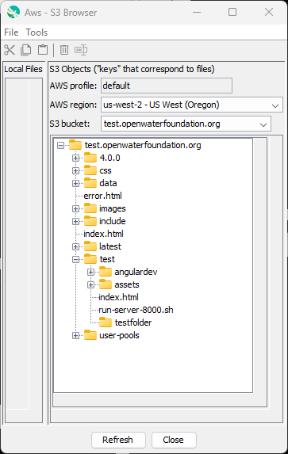
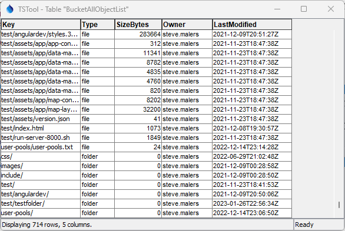

# AWS / Storage / S3

This documentation describes how to use [AWS S3](https://aws.amazon.com/s3/) cloud storage,

*   [Introduction](#itroduction)
*   [S3 Bucket and Object Concepts](#s3-bucket-and-object-concepts)
    +   [S3 Buckets](#s3-buckets)
    +   [S3 Objects](#s3-objects)
    +   [S3 Folders](#s3-folders)
*   [Effectively Using S3](#effectively-using-s3):
    +   [Using S3 as Shared Network Storage](#using-S3-ss-shared-network-storage)
    +   [Using S3 for Backups](#using-s3-for-backups)
    +   [Using S3 to Transfer Data](#using-s3-to-transfer-data)
    +   [Hosting a Public Static Website on S3](#hosting-a-public-static-website-on-s3)
    +   [Hosting a Content Delivery Network](#hosting-a-content-delivery-network)

-------------

## Introduction ##

[AWS S3](https://aws.amazon.com/s3/) provides cloud storage at costs that are generally low compared to other options,
pennies or dollars a month for small implementations.
S3 is useful because it provides an off-site, cloud-hosted, redundant copy of files
that can be accessed by multiple users and applications on multiple devices via Amazon's industry-strength cloud infrastructure.
Uses of S3 include:

*   folder-based cloud storage for an organization's files
*   access via AWS console web application, command line tools, and web services
*   can serve as backups (see also [Amazon S3 Glacier](https://aws.amazon.com/glacier/) for long-term storage)
*   ability to create content delivery networks (CDNs) using static websites and services such
    as [Cloudfront](../../cdn/cloudfront/cloudfront.md)

The hierarchy of services is:

```
CloudFront
  uses:  S3
```

See the following S3 resources:

*   [Amazon S3](https://aws.amazon.com/s3/) webpage

## S3 Bucket and Object Concepts ##

The S3 design is conceptually simple and is similar to storage for other cloud vendors.
However, there are nuances that can cause confusion.
The following documentation attempts to summarize important concepts and point out complexities.

### S3 Buckets ###

S3 is organized by buckets (see [AWS Buckets Overview](https://docs.aws.amazon.com/AmazonS3/latest/userguide/UsingBucket.html)).

*   Bucket names are unique across the entire AWS environment.
    This may seem limiting but actually works well.
*   Any organization with an AWS account can define a bucket as long as the name has not been used by someone else.
*   AWS accounts are by default
    [limited to 100 buckets](https://docs.aws.amazon.com/AmazonS3/latest/userguide/BucketRestrictions.html),
    which helps to limit "squatting" on bucket names so that other entities can't use the bucket name.
*   Bucket names can be defined to match an organization's internet domain name
    to create storage for sub-domain content.
    For example, the Open Water Foundation uses buckets that match [`https://data.openwaterfoundation.org`](https://data.openwaterfoundation.org)
    and other sub-domains.
*   Buckets are conceptually similar to a storage device such as a USB drive with a unique name.

### S3 Objects ###

Within a bucket, S3 stores files as objects
(see the [Amazon S3 Objects Overview](https://docs.aws.amazon.com/AmazonS3/latest/userguide/UsingObjects.html)):

*   Conceptually, S3 can be thought of as a large hash table (see [Hash table on Wikipedia](https://en.wikipedia.org/wiki/Hash_table))
    that stores objects that have a value that is the file content.
*   Each object has a unique human-readable identifier called a "key":
    +   Keys are conceptually similar to paths used to manage files within folders,
        with `/` as a delimiter between levels.
        Although S3 allows other delimiters, `/` is the default and is typically used.
    +   Keys for files typically **do not** start in `/` (there is not a root folder).
        Using a `/` at the beginning of keys introduces complexities.
    +   Keys for files typically **do not** end in `/` (since files are not folders, but more on that below).
    +   It is often best to avoid spaces and punctuation in keys because this comlicates
        use of the key by software.

See the next section for information about folders.

### S3 Folders ###

S3 does not explicitly store folders, which is different than how folders are handled in Windows and Linux file systems.
Instead, folders are a virtual construct created by splitting keys at the `/` delimiters.
The lack of explicit folders can lead to confusion.

*   Although keys can contain a `/`, S3 does not explicitly implement folders and in most cases
    they can be thought of as a virtual construct.
*   Virtual folders are objects with keys that end in `/`.
*   Keys for files can also be split by the `/` delimiter and the resulting folders
    can be represented in software by paths ending in `/`,
    whether or not a corresponding object actually exists.
*   The AWS console, APIs, and other software provide the illusion of folders to help
    organize data in hierarchical structures,
    but folder objects are not explicitly stored (or required) in S3.
*   It is possible to use the AWS console to create an object with key ending in `/`
    (see the Console's ***Create Folder***) button,
    and in this case the folder object has properties like a file but typically has a size of zero.
    The AWS console creates folder objects because the next step in an interactive upload process
    is often to upload a file into the folder.
    Consequently, the folder has a temporary use because once a file is uploaded,
    the key for he file is what is important.
    This approach can lead to stray folder-like objects, as illustrated below.

AWS provides the [command line interface (CLI)](../../cli/cli.md) and
[APIs and SDKs](../../api/overview.md) for different languages to integrate with AWS.
The CLI and APIs mostly behave consistently but there are slight differences that can cause confusion.
For example, the AWS console presents folders and files although folders do not explicitly exist
in CLI and API features.

An object can be created with a name ending in `/` by one of the following methods:

*   Use the AWS S3 Console ***Create folder*** button.
*   Use the CLI to upload a file to S3 (or otherwise create the S3 object) using a key with a name ending in `/`.
*   Use a software API to upload a file to S3 (or otherwise create the S3 object) using a key with a name ending in `/`.

In the above cases, the object will typically have a file size of zero.
In the latter 2 cases, the empty folder may be an accidental copy of a file
(e.g., when software accidentally uses a folder name without a trailing filename part).

Consider the following view of S3 resources in a test repository.
This view is created by listing all the objects in a bucket
and treating intermediate folders and objects with key ending in `/` as folders.
Any objects with keys that do not end in `/` are treated as files.

**<p style="text-align: center;">

</p>**

**<p style="text-align: center;">
S3 Bucket Contents Viewed as a Tree (<a href="../s3-tree.png">see also the full-size image)</a>
</p>**

Listing a bucket's objects using the CLI or API can clarify which folders are virtual,
See the following example, which was created by the
[TSTool `AwsS3` command](https://software.openwaterfoundation.org/tstool-aws-plugin/latest/doc-user/command-ref/AwsS3/AwsS3/).

**<p style="text-align: center;">

</p>**

**<p style="text-align: center;">
S3 Bucket Contents Viewed as an Object List Table (<a href="../s3-table.png">see also the full-size image)</a>
</p>**

The above listing has been sorted by the ***Type*** column.
Objects with a type of folder are any that have a key ending in `/`.
As shown in the above figure,
these objects have properties similar to files, other than having zero size.
However, such objects don't have a purpose given that files with longer keys are uniquely identified with their keys.
The virtual folders can be removed without impacting other objects by using the CLI or API.
However, the AWS console will remove the virtual folder and its contents as if it is a true folder.

## Effectively Using S3 ##

Users within an organization with appropriate permissions can create buckets, folders, and files on S3.
Service account users can also be defined to automate tasks.

At a top level, organizations can create buckets for high-level organization of data.
Within each bucket, folders can be defined to organize files, similar to a computer's hard drive.
The naming conventions for folders and files are often one of the most challenging aspects of using S3
because similar to other storage, the storage system can become inconsistent, cluttered, and waste space
with unused and duplicate files.

Because S3 is hosted in the cloud, it is convenient to share files that are related to an
organization's business workflows, with certain people and processes having the ability to write files,
and a larger number of people being able to access the information to support decisions.

### Using S3 as Shared Network Storage ###

S3 can be used as shared network storage.
However, because S3 by itself does not provide a program such as Windows File Explorer
or a Winows Explorer plugin similar to Dropbox, Google File Stream, Microsoft OneDrive, or other add-ons,
S3 files cannot be easily accessed.

Most users will not use the AWS S3 Console to access files.

Consequently, additional web application and desktop software must be used to access S3 files for typical users.
Additional applications will be made available from various businesses and open source projects
over time as more software products add integration with S3.

### Using S3 for Backups ###

S3 storage is relative cheap and is an option for backups.
Various software products are available for backups and automated
workflows that use the CLI and APIs can be implemented.

For example, files on a computer or local network can be zipped up and uploaded to S3.

S3 itself allows a bucket to e configured with versioning so that files that are deleted
or overwritten are retained.
This requires more storage and fees.

### Using S3 to Transfer Data](#using-s3-to-transfer-data ###

If software is available to upload and download files,
S3 can be used to transfer data for users and unattended processes that have appropriate permissions.

Data transfer files directly to/from S3 or can
be accessed using a website (see the next section).

### Hosting a Public Static Website on S3 ###

S3 can be used to create a public static website.

See [Website / S3 Public Static Website](../../website/s3/s3.md).

### Hosting a Content Delivery Network ###

S3 can be used to store files in a content delivery network (CDN).

See [AWS / CDN / Overview](../../cdn/overview.md).
