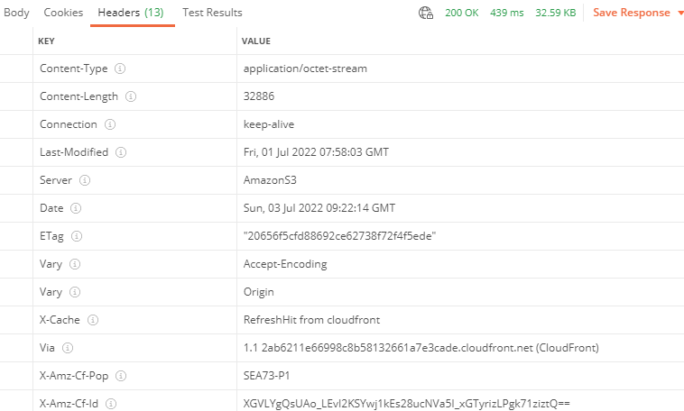
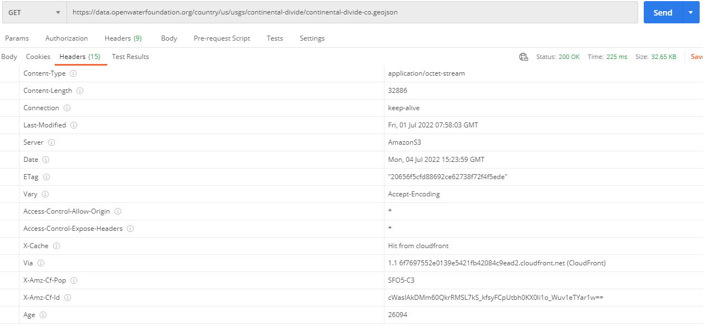
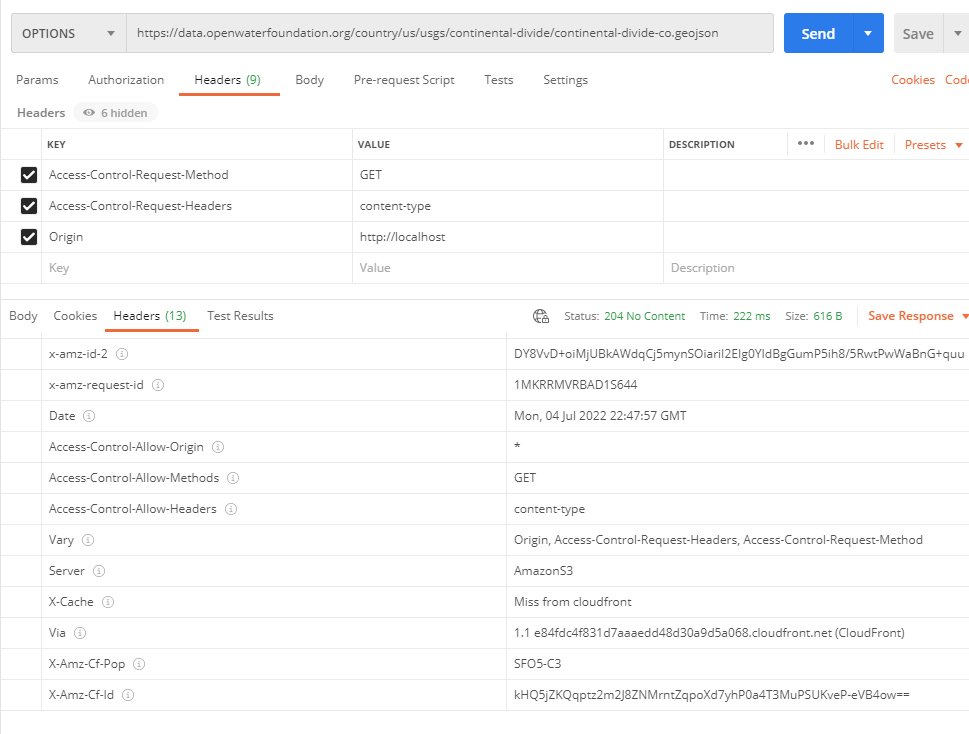
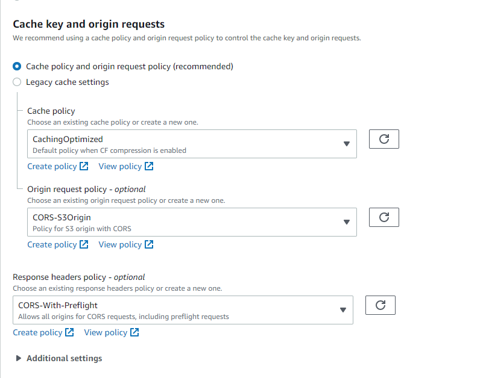
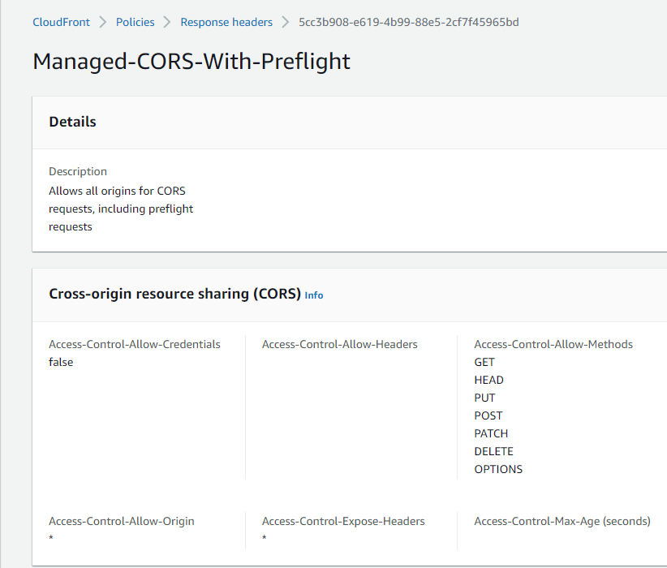

# AWS / Troubleshooting CORS

This documentation provides troubleshooting information for CORS (Cross-Origin Resource Sharing) issues.

*   [Background](#background)
*   [Troubleshooting CloudFront/S3 Example](#troubleshooting-cloudfronts3-example)

-------

## Background ##

CORS issues can be an issue for web browsers because they implement same-origin policy and the CORS protocol.
Other software, for example to automate data processing run on desktop or command line software
does not have this issue.

Cross-origin requests for public APIs and content delivery networks should typically be allowed for all network addresses.

See the following information:

*   [Cross-origin resource sharing](https://en.wikipedia.org/wiki/Cross-origin_resource_sharing) Wikipedia article.

## Troubleshooting CloudFront/S3 Example ##

A web application served from one domain may access data on another domain.
The following example illustrates a case where the [poudre.openwaterfoundation.org](https://poudre.openwaterfoundation.org)
web application accesses data served from the [data.openwaterfoundation.org](https://data.openwaterfoundation.org) website.
CORS applies even with sub-domains within a parent domain.

*   [How CloudFront delivers content](https://docs.aws.amazon.com/AmazonCloudFront/latest/DeveloperGuide/HowCloudFrontWorks.html) - background on CloudFront
*   [How do I resolve the "No 'Access-Control-Allow-Origin' header is present on the requested resource" error from CloudFront?](https://aws.amazon.com/premiumsupport/knowledge-center/no-access-control-allow-origin-error/)

The initial implementation resulted in the following error being shown in the Chrome web browser:

```
Access to XMLHttpRequest at 'https://data.openwaterfoundation.org/country/us/usgs/continental-divide/continental-divide-co.geojson'
from origin 'https://poudre.openwaterfoundation.org' has been blocked by CORS policy:
No 'Access-Control-Allow-Origin' header is present on the requested resource.
```

For this example, the web application works OK on some computers but not others.

The response headers for the requested URL can be displayed using Postman or another tool.
In this example, the following is returned.
Note that there is no `Access-Control-Allow-Origin=*` header.

**<p style="text-align: center;">

</p>**

**<p style="text-align: center;">
Response Headers in Postman for Site with CORS Error (<a href="../images/cors-1-get-headers-postman.png">see full-size image</a>)
</p>**

The TSTool software, written in Java, uses the `HttpURLConnection` class to make requests,
and the [TSTool `WebGet`](https://opencdss.state.co.us/tstool/latest/doc-user/command-ref/WebGet/WebGet/)
command writes the following to the log file.
Note that there is no **`Access-Control-Allow-Origin`** response header set.

```
Status[2](WebGet_Command.runCommand): Response header Age = [63]
Status[2](WebGet_Command.runCommand): Response header Connection = [keep-alive]
Status[2](WebGet_Command.runCommand): Response header Content-Length = [32886]
Status[2](WebGet_Command.runCommand): Response header Content-Type = [application/octet-stream]
Status[2](WebGet_Command.runCommand): Response header Date = [Sun, 03 Jul 2022 07:45:32 GMT]
Status[2](WebGet_Command.runCommand): Response header ETag = ["20656f5cfd88692ce62738f72f4f5ede"]
Status[2](WebGet_Command.runCommand): Response header Last-Modified = [Fri, 01 Jul 2022 07:58:03 GMT]
Status[2](WebGet_Command.runCommand): Response header Server = [AmazonS3]
Status[2](WebGet_Command.runCommand): Response header Vary = [Origin]
Status[2](WebGet_Command.runCommand): Response header Via = [1.1 28390a4d24ed4fdccd685d99cd06cf4e.cloudfront.net (CloudFront)]
Status[2](WebGet_Command.runCommand): Response header X-Amz-Cf-Id = [bplAOQLQtv6RjiKjENi0cwsLforuwmQuIHA7rqW3bLAPA_rDDL2slg==]
Status[2](WebGet_Command.runCommand): Response header X-Amz-Cf-Pop = [SEA73-P1]
Status[2](WebGet_Command.runCommand): Response header X-Cache = [Hit from cloudfront]
Status[2](WebGet_Command.runCommand): Response header null = [HTTP/1.1 200 OK]
```

After some experimentation, the `Access-Control-Allow-Origin` header is found to only
be returned in Postman if the `Origin` request header is specified.
The `Origin` is the address of the machine that makes the request,
in other words the origin of the request,
such as the address of the machine running a web browser
(e.g., `http://localhost`).

The `Access-Control-Allow-Origin` header is not returned by TSTool in any case.
Is this due to Postman mimicking the browser,
which uses `Access-Control-Allow-Origin`,
and TSTool, written in Java, not using that header?
Does the `HttpURLConnection` class control some headers under the hood?

The Postman output on a computer where the application works is as follows,
with `Origin = http://localhost` specified in the request headers.

**<p style="text-align: center;">

</p>**

**<p style="text-align: center;">
`GET` Response Headers from CloudFront (<a href="../images/cors-2-get-headers-postman.png">see full-size image</a>)
</p>**

The similar `curl` output is as follows, which indicates `access-control-allow-origin=*`.

```
curl -H "Origin: openwaterfoundation.org" -v https://data.openwaterfoundation.org/country/us/usgs/continental-divide/continental-divide-co.geojson

> GET /country/us/usgs/continental-divide/continental-divide-co.geojson HTTP/2
> Host: data.openwaterfoundation.org
> User-Agent: curl/7.60.0
> Accept: */*
> Origin: openwaterfoundation.org
>
{ [5 bytes data]
* Connection state changed (MAX_CONCURRENT_STREAMS == 128)!
} [5 bytes data]
< HTTP/2 200
< content-type: application/octet-stream
< content-length: 32886
< last-modified: Fri, 01 Jul 2022 07:58:03 GMT
< server: AmazonS3
< date: Mon, 04 Jul 2022 15:16:33 GMT
< etag: "20656f5cfd88692ce62738f72f4f5ede"
< vary: Accept-Encoding
< access-control-allow-origin: *
< access-control-expose-headers: *
< x-cache: RefreshHit from cloudfront
< via: 1.1 95ab38d462185df6df78ba1102868640.cloudfront.net (CloudFront)
< x-amz-cf-pop: DEN52-C1
< x-amz-cf-id: KI6b0VTR7Jtp57oXHWxwUC69yXmhjulSECVuDBeSXPOkz0UNOyuEig==
```

To diagnose why the application does not work on some computers,
an `OPTIONS` request was attempted on a working configuration.
The request results in a `204 No Content` status,
meaning that the server successfully fulfilled the request but there is no content in the response payload.
This is appropriate for an `OPTIONS` request.
Note that `Access-Control-Allow-Origin = *` is set in the response headers.

**Need to try this request on a computer that was initially failing.
Initial attempts failed because of bad input and were removed from this documentation.**

**<p style="text-align: center;">

</p>**

**<p style="text-align: center;">
`OPTIONS` Request and Response Headers (<a href="../images/cors-3-options-headers-postman.png">see full-size image</a>)
</p>**

**It is not clear that the following troubleshooting steps did solve the problem
given that some of the screen shots were taken after some success was achieved.**

Reviewing the CloudFront configuration shows that the ***Cache Key and Origin Requests*** configuration was set to `SimpleCORS`,
which apparently does not allow `OPTIONS` requests.
Change to the `CORS-With-Preflight` (see below) to allow preflight requests (`OPTIONS`) and the web application displays as expected with no error.

**<p style="text-align: center;">

</p>**

**<p style="text-align: center;">
CloudFront Origin Request Configuration (<a href="../images/cors-3b-options-cloudfront.png">see full-size image</a>)
</p>**

The policy details are as follows.  Note that the value of `Access-Control-Allow-Origin` is `*`.

**<p style="text-align: center;">

</p>**

**<p style="text-align: center;">
CloudFront Origin Request `CORS-With-Preflight` Policy (<a href="../images/cors-3c-options-cloudfront-policy.png">see full-size image</a>)
</p>**

The following questions remain to be resolved the next time a CORS problem occurs:

*   Why did the application properly display the data on some computers before changing the CloudFront origin request configuration?
*   Why does the TSTool `WebGet` not return the `Access-Control-Allow-Origin` header for the `GET` request
    or successfully run `OPTIONS` request?
    The command line `curl` works OK for the `GET` request.
