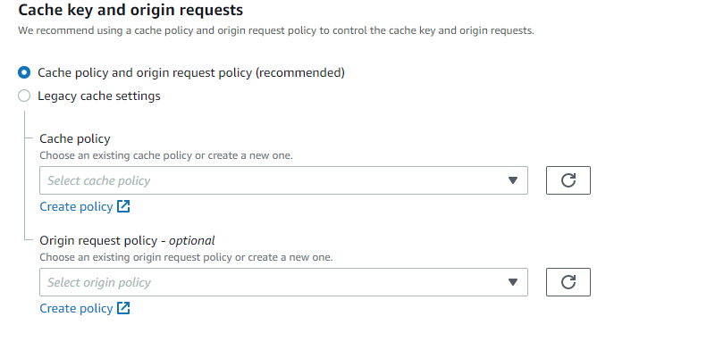
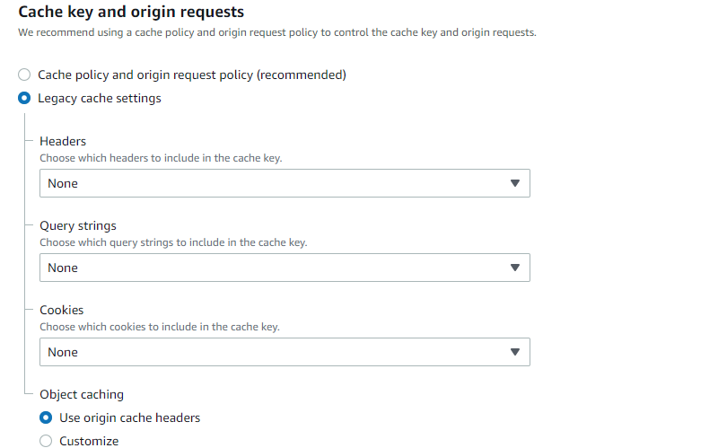

# AWS / Troubleshooting

The following problems and solutions have been identified:

* [`aws` Script not Working with Windows Git Bash](#aws-script-not-working-with-windows-git-bash)
* [CloudFront/S3 website URLs do not return content](#cloudfronts3-website-urls-do-not-return-content)

-------

# `aws` Script not Working with Windows Git Bash ##

The `aws` script is typically installed in the `Scripts` folder of Python.
The first line of the script indicates the Python to run.
If Python is installed in the main system location, the line may look like the following:

```
#!c:\program files\python35\python.exe
```

Trying to run `aws` from Git Bash may display a warning similar to the following:

```
./copy-to-owf-amazon-s3.sh: /c/Program Files/Python35/Scripts/aws: 'c:\program: bad interpreter: No such file or directory
```

This occurs because of the space in the path.  A work-around is to edit the `aws` script and change to old-style path notation without a space:
```
#!c:\progra~1\python35\python.exe
```

The above will not impact running `aws` with Cygwin if a separate Cygwin copy of Python has been installed.
Another work-around would be to create a symbolic link `ProgramFiles -> Program Files` and change the script to use `ProgramFiles` in the path.

## CloudFront/S3 website URLs do not return content ##

Implementing a CloudFront distribution that provides access to content stored on S3 may have broken links.
If the content is a web application such as an Angular application, the application may not load and will show an empty page.
To troubleshoot, check the following:

1. Confirm that the ***Origin Domain*** property for the CloudFront distribution includes the longer `website` URL,
for example `poudre.openwaterfoundation.org.s3-website-us-west-2.amazonaws.com`.
2. If the S3 bucket uses folders for versions of the web application, define a redirect.  [See documentation](../website/s3/redirect.md).
3. Define a Lambda function to append `index.html` for folder-based URLs.  [See documentation](../website/cloudfront/append-index.md).

## General AWS Help ##

Resources that describe how to redirect to S3 subfolder using CloudFront. This is a fairly common
issue, as a true hierarchy does not exist in S3 as it does in CloudFront. Therefore requesting
subfolders when using CloudFront and S3 present problems, which as discussed in the links below.

* https://stackoverflow.com/questions/49082709/redirect-to-index-html-for-s3-subfolder
* https://serverfault.com/questions/450940/why-s3-website-redirect-location-is-not-followed-by-cloudfront
* https://forums.aws.amazon.com/message.jspa?messageID=907824

## Cache key and origin requests help ##

This section presents to different radio buttons, **Cache policy and origin request policy (recommended)**,
and **Legacy cache settings**, with the former being the default choice.

The default choice should be the used. The main reason this section exists is to describe exactly
what's going on here in case a future developer gets as confused as the writer of this section.
The **Cache policy** and **Origin request policy - *optional***
choices above are actually connected to the default choice, even though they look
like they belong to **Legacy cache settings**. The following image shows the default choices,
which are desired.

**<p style="text-align: center;">

</p>**

This image displays the actual Legacy options, which is not desired.

**<p style="text-align: center;">

</p>**