# AWS / Users and Roles / Cognito

Amazon Cognito provides authentication, authorization, and user management for web
and mobile applications. OWF utilizes Cognito to take advantage of its easy setup
and built in security elements so all users accounts are protected using the most
up-to-date standards in the industry.

This documentation will describe how to set up and use Cognito's provided user pools
and identity pools. It can be considered to be a work in progress until this sentence
has been removed.

## Cognito Setup ##

Begin by signing into an Amazon account
(or signing up at [aws.amazon.com](https://aws.amazon.com/)), and use the search bar
at the top of the page to find Cognito.

### Creating a new user pool ###

* Click on the **Create user pool** button on the Cognito main page. The default
choice should be **Add user directories to your app**. If it is not selected, change
it before proceeding.

**

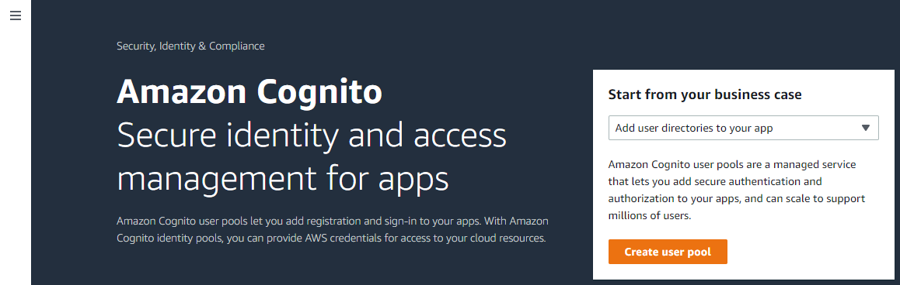

**

**

Cognito main page (<a href="../images/main-page.png">see full-size image</a>)

**

There are 5 pages of configuration and set up for the user pool, along with a last
page for reviewing everything before creating the user pool. The following sections
will go through each and describe what they do, using the InfoMapper Builder application
as an example when necessary.

----

### Authentication providers ###

This page configures the providers that are available to users when a user signs in
to the application. By default (and also mandatorily) the **Cognito user pool**
option will be chosen. Federated identity providers (IDPs) can be used such as
Facebook, Google, or Amazon for authorization, but OWF will not be using them because
of their limited usage of Amazon's free tier services.

**

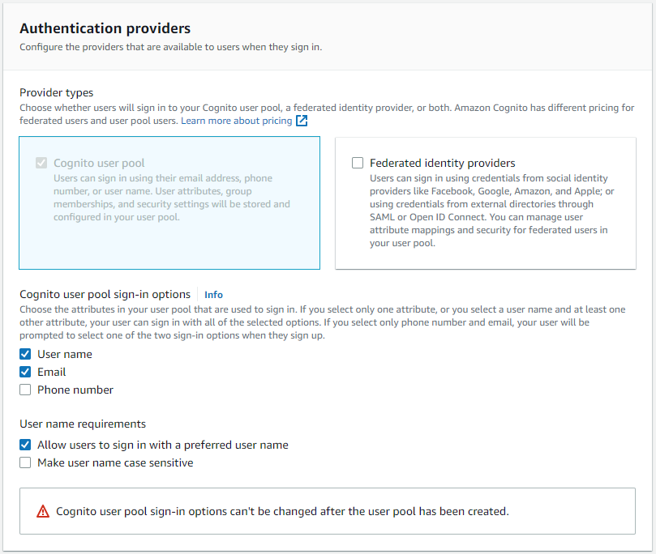

**

**

Cognito configure sign in (<a href="../images/configure-sign-in.png">see full-size image</a>)

**

A user can sign in with either a user name or email. a preferred user name can be
assigned in case a user belongs to multiple organizations with separate emails.
User names will not be case sensitive, as some users are might forget what was capitalized. 
Furthermore, this prevents any accidental 

----

### Configure security requirements ###

One reason OWF chose Cognito for application authorization and authentication was
its focus on using leading industry security standards. The following three sections
are Cognito's methods of achieving this.

#### Password policy ####

Cognito's default password requirements seem to be quite robust and secure, and will
be used for OWF applications.

**

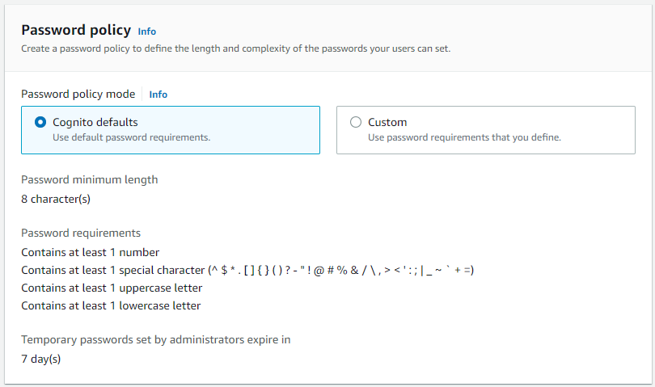

**

**

Cognito password policy (<a href="../images/password-policy.png">see full-size image</a>)

**

#### Multi-factor authentication ####

Multi-factor authentication (MFA) has become a common occurrence when confirming identity
for apps. OWF will not require MFA or its apps, but strongly recommends doing so
to add another layer of protection to an account.

**Will add more here and update picture if SMS messages are added.**

**

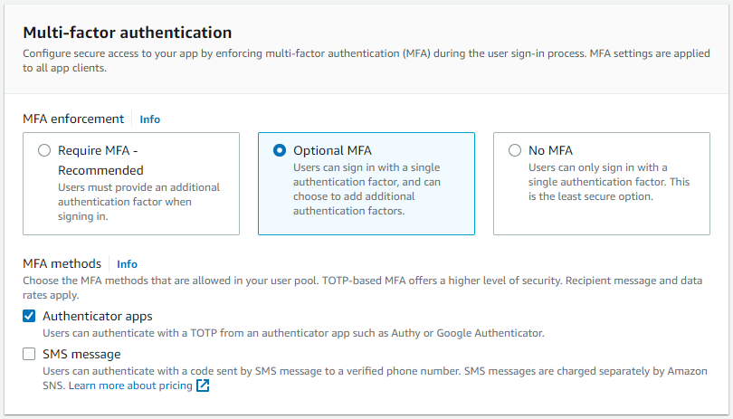

**

**

Cognito multi-factor authentication (<a href="../images/mfa.png">see full-size image</a>)

**

#### User account recovery ####

This sets up how users will recover their account if their password has been forgotten.
OWF will reset any passwords using an admin with the necessary access.

**

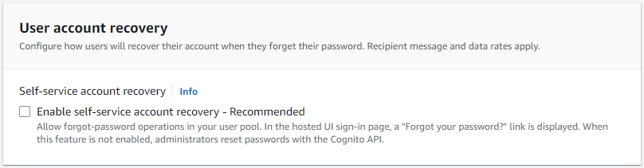

**

**

Cognito user account recovery (<a href="../images/account-recovery.png">see full-size image</a>)

**

----

### Configure sign-up experience ###

This section determines how new users will verify their identities when signing up
and which attributes should be required or optional during the user sign-up flow.

#### Self-service sign-up ####

OWF will use administrative API operations to sign up any users.

**

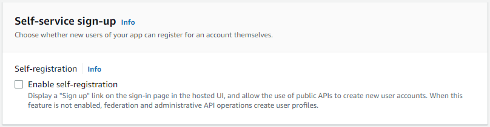

**

**

Cognito self-service sign-up (<a href="../images/self-service-sign-up.png">see full-size image</a>)

**

#### Attribute verification and user account confirmation ####

This section offers Cognito-assisted or self-managed account attribute verification.
OWF apps will send an email message and have the user verify said email address as
an attribute. If a user changes their original email address, the old one will still
be able to be used until the new email has been verified.

**

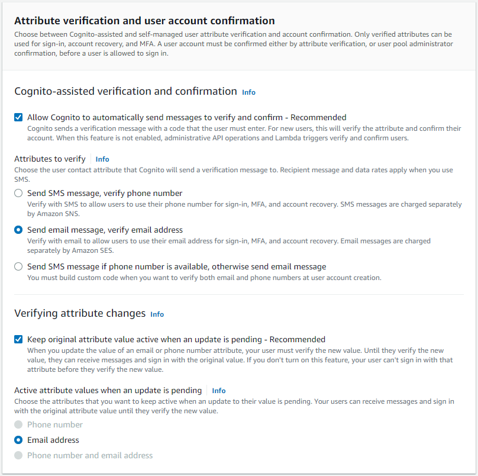

**

**

Cognito attribute verification
(<a href="../images/attr-verify-and-account-confirmation.png">see full-size image</a>)

**

#### Required attributes ####

More required attributes can be added to the account when it is created other than
the email address if desired. The email will be the only required attribute used
for accounts, including both required and optional attributes.

**

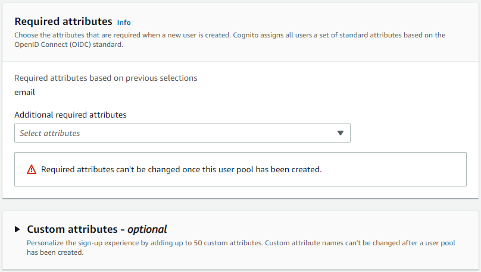

**

**

Cognito required and custom attributes
(<a href="../images/required-and-custom-attributes.png">see full-size image</a>)

**

----

### Configure message delivery ###

This section configures how to send messages to the app users.

#### Email ####

OWF has decided to use Amazon SES (Simple Email Service) for sending messages to
users for its ease of use and high volume of emails that can be sent and received
(62,000). This sections will be filled out with a production friendly setup in the
future using SES, but for testing purposes, sending email with Cognito will be chosen.

**

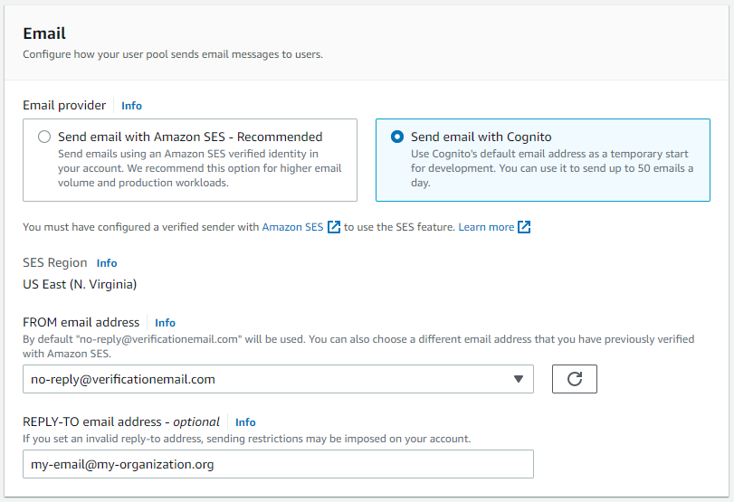

**

**

Cognito email (<a href="../images/email.png">see full-size image</a>)

**

----

### Integrate your app ###

This section sets up app integration for the user pool with Cognito's built-in
authentication and authorization flows.

#### User pool name ####

Give a good, verbose, unique name for this user pool so its functionality can be
easily deduced, as there can be many user pools.

**

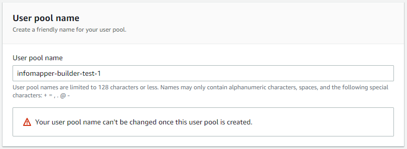

**

**

Cognito user pool name (<a href="../images/user-pool-name.png">see full-size image</a>)

**

#### Hosted authentication pages ####

OWF will supply its own login page instead of using the built-in Cognito page.

**

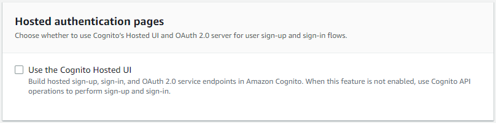

**

**

Cognito hosted authentication page
(<a href="../images/hosted-authentication-page.png">see full-size image</a>)

**

#### Initial app client ####

Configure an app client. App clients are single-app platforms in your user pool
that have permissions to call unauthenticated API operations.

**

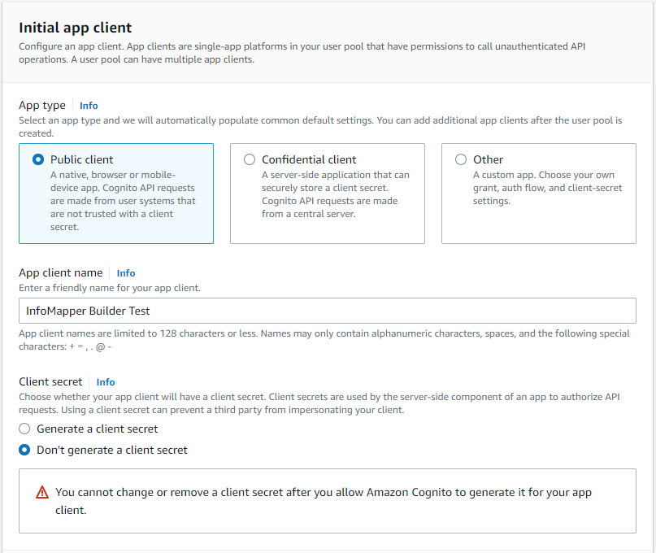

**

**

Cognito initial app-client (<a href="../images/initial-app-client.png">see full-size image</a>)

**

