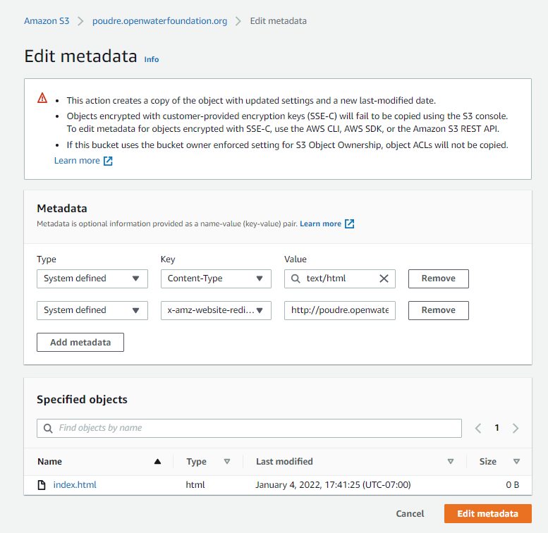
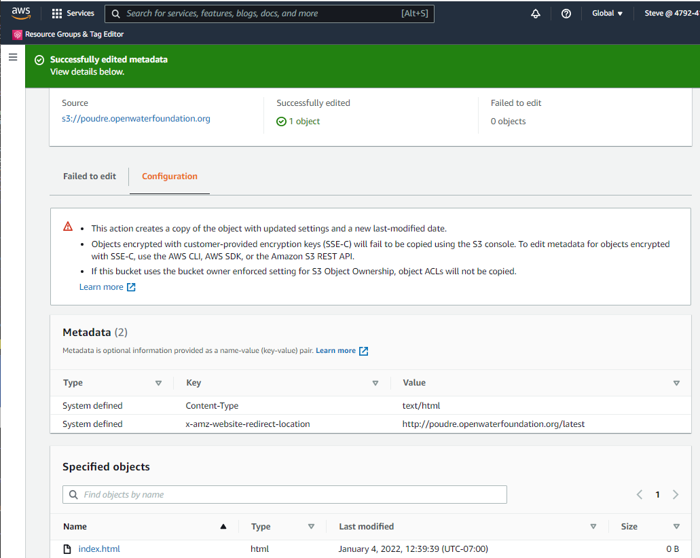

# Website / Redirect an S3 URL

*   [Introduction](#introduction)
*   [Define a Redirect using Object Metadata](#define-a-redirect-using-object-metadata)

--------------

## Introduction ##

This documentation describes how to implement a redirect for a website URL for a resource stored on a
S3 public static website.
Examples of when this is needed include:

*   URL for a website that corresponds to a sub-domain address (e.g., `https://subdomain.openwaterfoundation.org`)
    needs to redirect to a versioned folder (e.g., `https://subdomain.openwaterfoundation.org/latest`).
*   A resource has moved to a new name and old URLs need to be retained.

See the [AWS / Configuring a webpage redirect](https://docs.aws.amazon.com/AmazonS3/latest/userguide/how-to-page-redirect.html#redirect-requests-object-metadata)
documentation for options to implement a redirect.

## Define a Redirect using Object Metadata ##

The following approach uses metadata on the object (S3 file) as described in the
[AWS / Configuring a webpage redirect](https://docs.aws.amazon.com/AmazonS3/latest/userguide/how-to-page-redirect.html#redirect-requests-object-metadata#redirect-requests-object-metadata) documentation.

The following example redirects `https://poudre.openwaterfoundation.org` to `https://poudre.openwaterfoundation.org/latest`.
This is necessary because for this example, the website is implemented using Angular
and folders are used to store different versions of the web application.

If the website also uses CloudFront,
it will be necessary to implement a Lambda function to ensure that `index.html` file is found in subfolders,
including `latest` for a copy of the most recent version.
This is not necessary if S3 alone is used for a public static website.
See ...

1.  Create a zero-length `index.html` file on the local computer and upload to the main bucket folder using the AWS console.
    The purpose of the file is to allow attaching redirect metadata to the object (file),
    but the file won't have any contents that are displayed on the website.
2.  Click on the file in the S3 console to display its properties.
3.  Select the ***Object Actions / Edit metadata*** choice.
    This will show existing metadata on the object, similar to below.
    In this example, the redirect property has already been defined.
    **

    
    
**
**

Add Object Redirect Metadata (<a href="../images/redirect-add-metadata.png">see full-size image</a>)

**
4.  To define a redirect, use the ***Add metadata*** button and
    `x-amz-website-redirect-location` metadata key with value being the desired URL.

It can be difficult to read the defined metadata properties once defined if the names are long.
To view/edit existing metadata, select the ***Edit metadata*** button.
Then press ***Configuration***.  This will show the redirect property as shown below.

**

**

**

Edit Object Redirect Metadata (<a href="../images/redirect-edit-metadata.png">see full-size image</a>)

**
