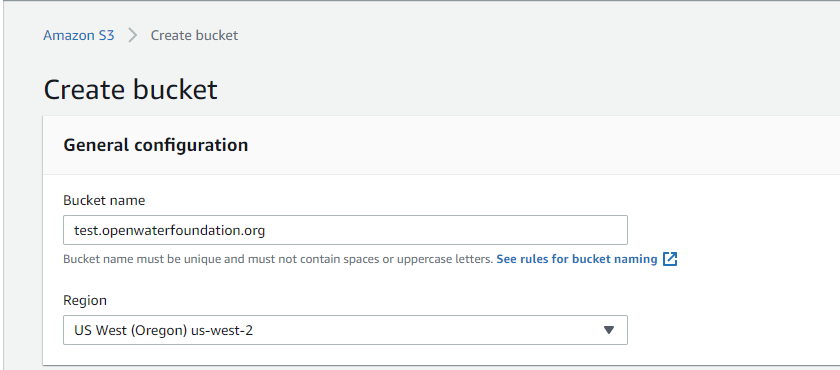
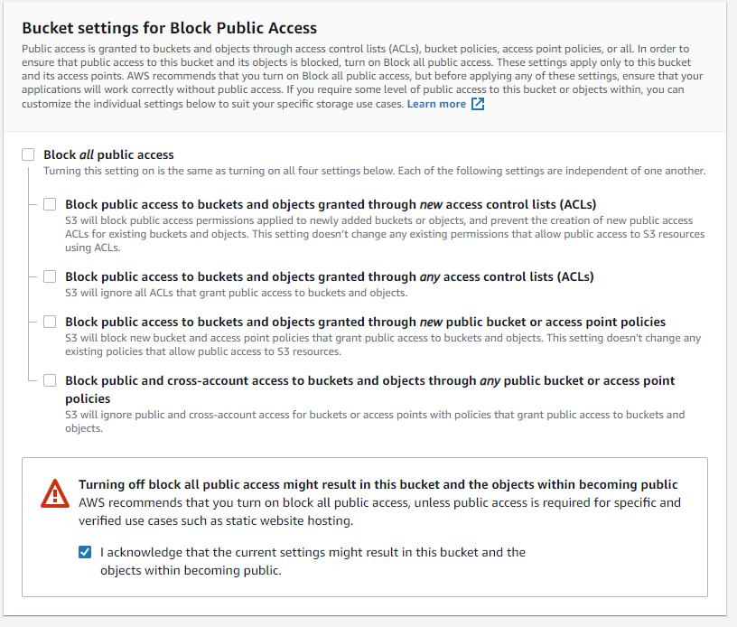
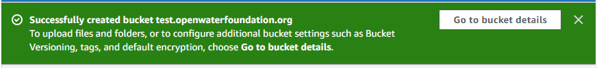
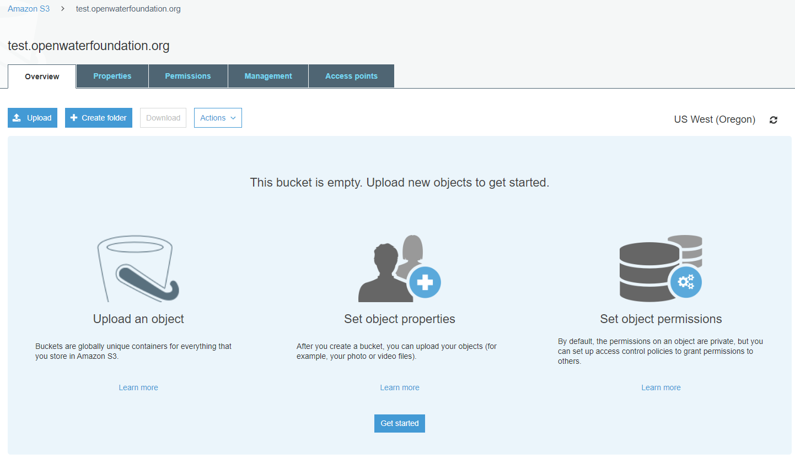
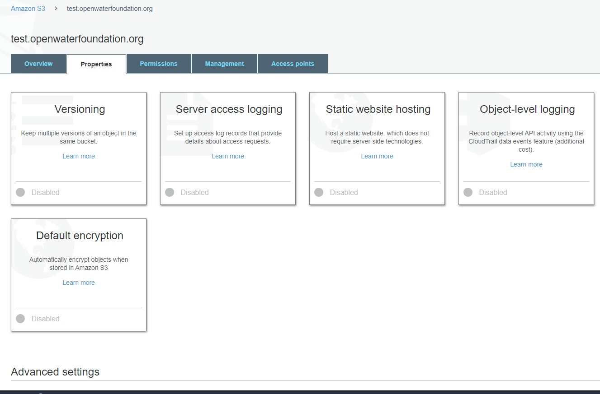
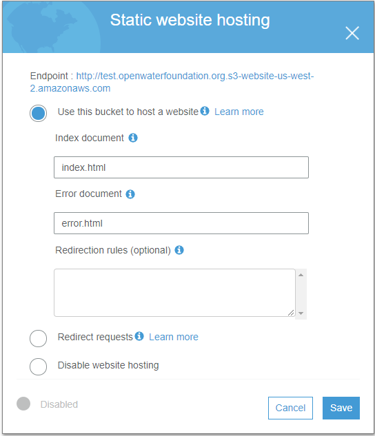
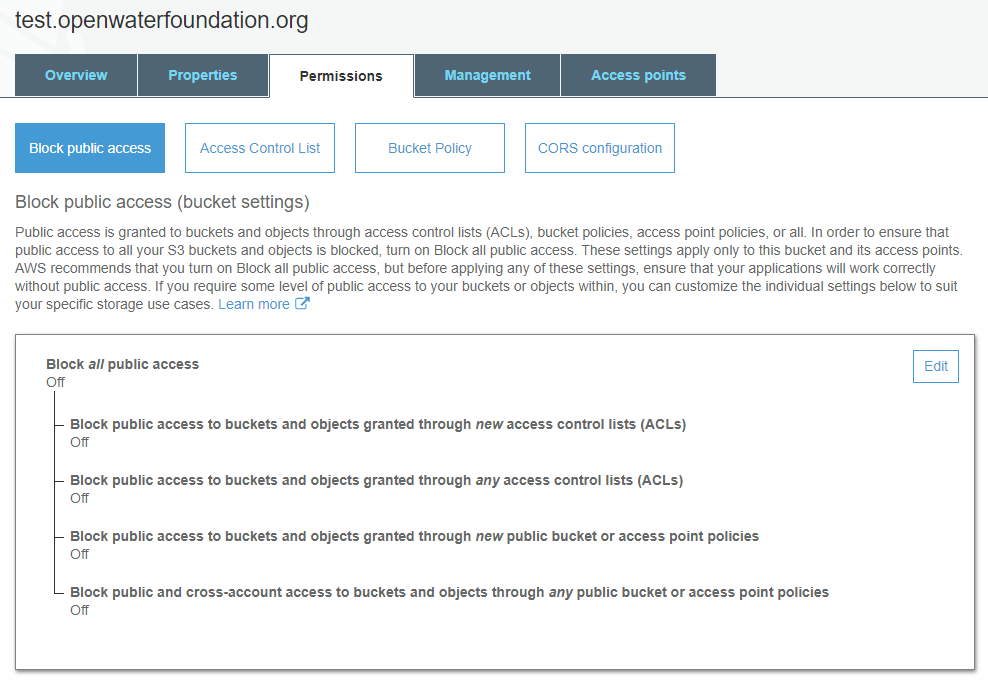
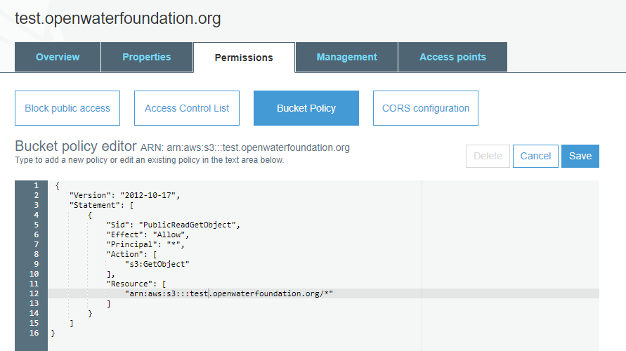
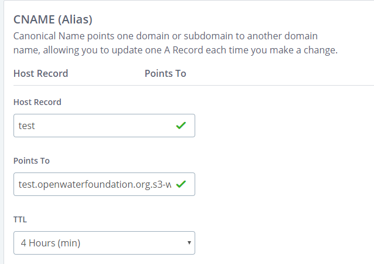
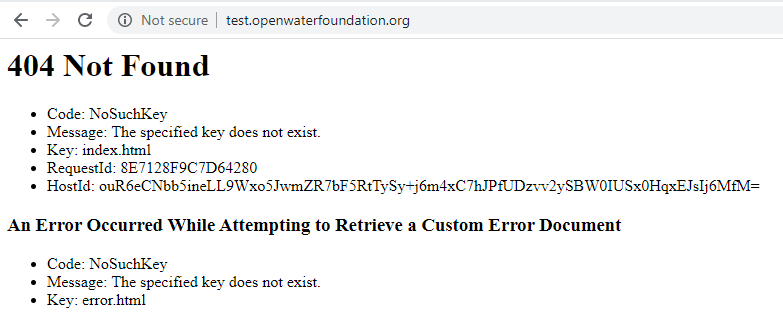

# Website / S3

This documentation describes how to use [AWS S3](https://aws.amazon.com/s3/) cloud storage
to implement a website.

* [Introduction](#itroduction)
* [Hosting a Public Static Website on S3](#hosting-a-public-static-website-on-s3)
    + [Step 1: Create S3 Bucket for Static Website](#step-1-create-s3-bucket-for-static-website)
    + [Step 2: Edit Static Website Hosting Properties](#step-2-edit-static-website-hosting-properties)
    + [Step 3: Edit Permissions for Public Access and Bucket Policy](#step-3-edit-permissions-for-public-access-and-bucket-policy)
    + [Step 4: Configure Domain Name Service (DNS)](#step-4-configure-domain-name-service-dns)
    + [Step 5: Test Accessing the Website](#step-5-test-accessing-the-website)
    + [Step 6: Upload Website Content](#step-6-upload-website-content)
    + [Step 7 (Optional): Define Redirect](#step-7-optional-define-redirect)
* [Hosting a Private Static Website on S3](#hosting-a-private-static-website-on-s3)

-------------

## Introduction ##

[AWS S3](https://aws.amazon.com/s3/) provides cloud storage at costs that are generally low compared to other options,
and S3 provides features to create public static websites.
An S3 bucket can be dedicated to a single website at the root folder
or multiple websites can be hosted in subfolders on the bucket.

A limitation is that public static websites based only on S3 only support the `http` protocol.
See the [AWS /CDN documentation](../../cdn/overview.md) for information about using CloudFront service
to implement a website that uses the `https` protocol.

## Hosting a Public Static Website on S3 ##

This documentation was updated on 2020-04-08.

S3 is useful for publishing public static websites and other content,
for example to create a public content delivery network
([see CDN on Wikipedia](https://en.wikipedia.org/wiki/Content_delivery_network)).
Using S3 leverages AWS infrastructure to provide internet access to data and information.
Using Amazon S3 for a public static website is cost-effective and simple to configure.

### Background ###

A static website consists of static HTML and other files that are accessible via a web browser and other software using a URL.
The site is static because content files are simply served based on the request,
rather than being dynamically formatted such as with server-side database and web framework.
This approach is appropriate for serving static content such as web pages and data files
that don’t change or are loaded in bulk for public access.

The term "static" does not mean that web pages are non-interactive,
but refers to the files being simple downloads.
Static web pages can use JavaScript and other dynamic browser-side technologies to provide
interactive web applications, where the work is done in the browser application.
This is also effective in offloading the computational and often personalized tasks to a web browser application
running on a local computer or device.
The application may also communicate with server-side components such as web services and databases
that are separate from the static website, as long as appropriate server addresses, authentication,
and other details have been dealt with.

Implementation of S3 static websites tends to be a part of a larger solution
but does typically replace all parts of a previous solution.
For example, at the Open Water Foundation, GitHub repositories are typically used for
static website content such as this documentation (created with MkDocs),
and web applications (created with JavaScript, Angular, etc.).
S3 is the final part of the solution to publish data, documentation, and web applications
that run in web browsers.

It is assumed that an AWS account has been created and suitable user has been defined for this work.
If necessary, see the [AWS Account / Signing Up for an AWS Account](../../account/account.md#signing-up-for-aws-account)
and [IAM](../../users/iam/iam.md) sections.
 
### Step 1: Create S3 Bucket for Static Website ###

Once logged into the AWS Console, access the S3 web service from the list of services.

Use the ***Create Bucket*** button to create an S3 bucket corresponding to the static website domain address,
for example `test.openwaterfoundation.org` for the following example
(but readers of this documentation should pick a domain for their organization).
S3 uses the concept of “buckets” as the top-level container for files.
Buckets must be unique across all of S3 and once created are associated with the organization's account.
Once a bucket is created, files can be uploaded to the bucket.

* See the following instructions provided by AWS: [Configuring a Static Website](http://docs.aws.amazon.com/AmazonS3/latest/dev/HostingWebsiteOnS3Setup.html)
* See the following instructions provided by AWS if using [AWS Route 53 for Domain Name Service](https://aws.amazon.com/route53/):
  [Configuring a Static Website Using a Custom Domain Registered with Route 53](http://docs.aws.amazon.com/AmazonS3/latest/dev/website-hosting-custom-domain-walkthrough.html).
  However, it is not necessary to use AWS Routine 53 for DNS hosting.
  An organization's existing DNS provider can be used, which is the approach described below.

**<p style="text-align: center;">

</p>**

**<p style="text-align: center;">
S3 Create a New Bucket (<a href="../images/s3-create-bucket-1.png">see full-size image</a>)
</p>**

* Specify the bucket name (in this case `test.openwaterfoundation.org`).
  Because the configuration is for a static website that will be associated with a
  Domain Name Service (DNS) entry, specify a bucket name that is appropriate as a sub-domain.
* Specify a region, typically one that is physically near the organization and/or its customers.
  Some AWS services have limitations based on region,
  presumably because the facilities at the location cannot support all services.
  This should not be an issue for simple static website hosted on S3.

Because the website will be a public static website, uncheck the ***Block all public access*** selection and
acknowledge the selection, as shown below.

**<p style="text-align: center;">

</p>**

**<p style="text-align: center;">
Grant Public Access to the Bucket (<a href="../images/s3-create-bucket-2.png">see full-size image</a>)
</p>**

Do not change any other settings.  Click ***Create bucket*** to create the bucket.
If successful, a message similar to the following is shown.

**<p style="text-align: center;">

</p>**

**<p style="text-align: center;">
Successfully Created Bucket (<a href="../images/s3-create-bucket-3.png">see full-size image</a>)
</p>**

### Step 2: Edit Static Website Hosting Properties ###
 
Press ***Go to bucket details*** in the previous status message to display the bucket's details.
A page similar to the following will be displayed
(a similar page can be accessed by clicking on the bucket in the AWS S3 console):

**<p style="text-align: center;">

</p>**

**<p style="text-align: center;">
Bucket Details (<a href="../images/s3-create-bucket-4.png">see full-size image</a>)
</p>**
 
To continue configuring the bucket for a static website, select the ***Properties*** tab.
A number of ***Properties*** categories are shown, similar to the following.

**<p style="text-align: center;">

</p>**

**<p style="text-align: center;">
Bucket Properties (<a href="../images/s3-create-bucket-5.png">see full-size image</a>)
</p>**

The following summarizes necessary edits to the properties:

* ***Versioning*** - defaults are OK
* ***Server access logging*** - defaults are OK
* ***Static Website Hosting*** - **edit as in the following image**
* ***Object-level logging*** - defaults are OK
* ***Default encryption*** - defaults are OK
* ***Advanced Settings***
    + ***Object Lock*** - defaults are OK
    + ***Tags*** - defaults are OK
    + ***Transfer acceleration*** - defaults are OK, although this may be useful in some cases to increase performance
    + ***Events*** - defaults are OK
    + ***Requester pays*** - defaults are OK, although this may be appropriate to pass on access costs

Change the ***Static Website Hosting*** properties similar to the following:

**<p style="text-align: center;">

</p>**

**<p style="text-align: center;">
Static Website Hosting Properties (<a href="../images/s3-create-bucket-6.png">see full-size image</a>)
</p>**

* Select ***Use this bucket to host a website***
* Specify the index document (`index.html` default name is OK, the file needs to be uploaded to the bucket later)
* Specify the error document (`error.html` default name is OK, the file needs to be uploaded to the bucket later)
* Note that the ***Endpoint*** that is shown at the top of the above form indicates the domain that
  will be used to register the website as a `CNAME` record in Domain Name Service ([Step 4 below](#step-4-configure-domain-name-service-dns)).

Press ***Save*** to save the properties.

### Step 3: Edit Permissions for Public Access and Bucket Policy ###

Next, select the ***Permissions*** tab for the bucket, which will display access information similar to the following.

**<p style="text-align: center;">

</p>**

**<p style="text-align: center;">
Static Website Hosting Permissions (Block all public access) (<a href="../images/s3-create-bucket-7.png">see full-size image</a>)
</p>**

The ***Block all public access*** settings were previously modified to allow public access.
If necessary change so that public access is **not** blocked, necessary for a public static website.

Next, configure the ***Bucket Policy***.
The [recommended template from AWS documentation](https://docs.aws.amazon.com/AmazonS3/latest/dev/HostingWebsiteOnS3Setup.html#step3-add-bucket-policy-make-content-public)
is as follows:

```
{
    "Version": "2012-10-17",
    "Statement": [
        {
            "Sid": "PublicReadGetObject",
            "Effect": "Allow",
            "Principal": "*",
            "Action": [
                "s3:GetObject"
            ],
            "Resource": [
                "arn:aws:s3:::example.com/*"
            ]
        }
    ]
}
```

The above can be copy and pasted into the ***Bucket Policy*** area shown below.
Change `example.com` to match bucket name, for example:

**<p style="text-align: center;">

</p>**

**<p style="text-align: center;">
Static Website Hosting Permissios (Bucket Policy) (<a href="../images/s3-create-bucket-8.png">see full-size image</a>)
</p>**

Press ***Save*** to save the policy.  A warning will be shown to remind that the bucket has public access,
which is OK since a public static website.
The above bucket policy limits "gets" on the website, but files are writeable only by the organization users with permissions.

### Step 4: Configure Domain Name Service (DNS) ###

The bucket can be accessed using the long URL generated by AWS (`http://test.openwaterfoundation.org.s3-website-us-west-2.amazonaws.com`).
However, a DNS record is typically added to allow internet users and applications to refer to the website using the bucket name,
in this case `http://test.openwaterfoundation.org`.
Static websites hosted on S3 do not support `https` - to use `https`,
use [Cloudfront](../../cdn/cloudfront/cloudfront.md) or another solution.

To configure DNS, log into the website of the company that is providing DNS for the domain.
If unsure of the DNS provider, the provider can be determined by using the `nslookup` command for the domain name.
Sometimes an organization will use one provider for its website (e.g., Wordpress) and another for DNS.

The administrative login for the DNS provider will need to be used.

#### Bluehost Example ####

The following example uses Bluehost for DNS.
Other providers will use similar web interfaces.

Login to the account and then select ***Domains*** from the sidebar.
Then select the ***DNS*** menu.
Then in the ***CNAME (Alias)*** section select ***Add Record***.
Fill in information similar to the following.

**<p style="text-align: center;">

</p>**

**<p style="text-align: center;">
`CNAME` DNS Record for Static Website (<a href="../images/s3-create-bucket-9.png">see full-size image</a>)
</p>**

* The ***Host Record*** is the subdomain under the organization domain
* The URL for the Amazon site from the ***Static Web Hosting*** properties for this example is:
  `http://test.openwaterfoundation.org.s3-website-us-west-2.amazonaws.com`
  Therefore, the ***Points To*** address is: `test.openwaterfoundation.org.s3-website-us-west-2.amazonaws.com`
* The **TTL** is time-to-live, which is an indication of when the change can e expected to go into effect,
  although it usually happens faster

In the past Bluehost required that the ***Points To*** address end in a period but the current form accepts address without trailing period.

It may take several hours for the record to propagate through the internet given that the minimum
***TTL*** (time-to-live) value that can be selected is 4 hours in this case.

### Step 5: Test Accessing the Website ###

The website can be accessed in a browser using the URL `http://test.openwaterfoundation.org`.
An error similar to the following indicates that the DNS alias is not yet recognized or may occur if content has not been loaded
(both of which will be the case for a new website).

**<p style="text-align: center;">

</p>**

**<p style="text-align: center;">
`CNAME` DNS Record for Static Website (<a href="../images/s3-create-bucket-10.png">see full-size image</a>)
</p>**

An `error.html` file can be uploaded to the website bucket using the AWS S3 console, for example containing:

```
<!DOCTYPE html>
<html>
<!-- This is the error page for test.openwaterfoundation.org. -->
<head>
<title>Error</title>
</head>
<body>

Error opening the page.

</body>
</html>
```

Accessing any URL, including `http://test.openwaterfoundation.org`, will generate the above error
because no content pages exist.

Uploading a basic `index.html` file will cause the above URL to return the index.
An example `index.html` file is:

```
<!DOCTYPE html>
<html>
<!-- This is the index.html page for test.openwaterfoundation.org. -->
<head>
<title>index.html</title>
</head>
<body>

Test index.html page.

</body>
</html>
```

Once the domain is recognized and a root level `index.html` file is uploaded,
any of the following URL's will work.

* `http://test.openwaterfoundation.org`
* `http://test.openwaterfoundation.org/`
* `http://test.openwaterfoundation.org/index.html`
* `https://s3-us-west-2.amazonaws.com/test.openwaterfoundation.org/index.html` (bucket URL)
* `http://test.openwaterfoundation.org.s3-website-us-west-2.amazonaws.com/` (virtual hosted bucket)

For general use, the first two options are the cleanest, and additional folders and
files can be added to the URL as content is uploaded.


### Step 6: Upload Website Content ###

Content for the website can be uploaded manually through the AWS Console or
using the [command line interface (CLI)](../../cli/cli.md)
and credentials from the [Amazon Identity and Access Management (IAM)](../../users/iam/iam.md).

A benefit of static websites hosted on S3 is that any folder that contains
an `index.html` file is essentially a static website below that point.
The Open Water Foundation uses this approach by implementing top-level landing page `index.html` files for each
static website subdomain such as [http://data.openwaterfoundation.org](http://data.openwaterfoundation.org).
Child folders on the bucket each contain `index.html` file and related content
to provide self-contained static websites.

The Amazon S3 static website configuration allows a default
index document and error document and these are typically `index.html` and `error.html`, respectively.
The `index.html` file will be used if a URL ends in '/'.
The `error.html` file will be used if a requested URL does not match a file.
The top-level website `index.html` should be created with appropriate landing page content,
such as organization branding and list of resources on the webpage.
Create an error.html file that is appropriate, such as providing an IT contact.

All content files can be maintained in traditional fashion,
for example using a Git repository, and then loaded to the Amazon S3 static web page using a script.

Uploading files to Amazon S3 requires using the Amazon S3 online console or
configuring and using the Amazon command line interface (CLI) tool.
The following links illustrate using a Linux bash script that can
be used to upload a folder to an Amazon S3 static website bucket using CLI,
in this case copying a MkDocs static website.
The Open Water Foundation often uses Cygwin or Git Bash shells to run such scripts.

* [Learn / Amazon Web Services (AWS)](http://learn.openwaterfoundation.org/owf-learn-aws/) - the content for this website
* [Script to upload the static website to Amazon S3](https://github.com/OpenWaterFoundation/owf-learn-aws/blob/master/build-util/copy-to-owf-amazon-s3.sh)

## Step 7 (Optional): Define Redirect

It may be necessary to define a redirect for the top-level website URL to a subfolder,
for example folders are used for versions of an application.

See the [Redirect an S3 URL](redirect.md) documentation.

Also see an example of the currently used [AWS Lambda function](../cloudfront/append-index.md)
that deals with server-side routing and URL manipulation.

## Hosting a Private Static Website on S3 ##

It is often necessary to add authentication to a website to ensure that only
certain users are able to access the content.
This is not possible only with S3.
A cost-effective solution is to use AWS CloudFront to implement authentication.
A CloudFront "distribution" can be configured to use an S3 bucket (or folder in a bucket)
to provide content for the distribution.
The CloudFront distribution by default has an auto-generated URL.
However the domain can be assigned a domain name service (DNS) alias to provide a "nice" URL.

* See:  [AWS / CDN / CloudFront](../../cdn/cloudfront/cloudfront.md)

Another option is to configure a cloud virtual machine,
for example using [AWS EC2](https://aws.amazon.com/ec2/),
with typical web server installation for authentication, such as ussing Apache,
However, this solution tends to be more expensive and is not needed for simple content delivery.
